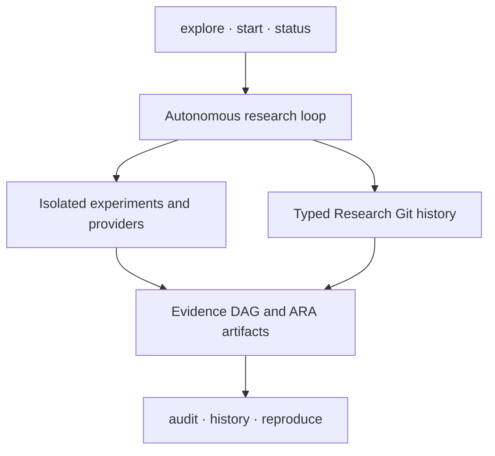

<p align="center">
  
</p>

<h1 align="center">XScientist</h1>

<p align="center"><strong>From one idea to a Git-like research history: inspectable, reproducible, and reversible.</strong></p>

<p align="center">
  Bring one idea—even if you do not know models or API keys. XScientist helps
  test it without hiding uncertainty, failed attempts, or contrary evidence.
</p>

<p align="center">
  <a href="https://pypi.org/project/xscientist/"></a>
  <a href="https://pypi.org/project/xscientist/"></a>
  <a href="https://github.com/smileformylove/XScientist/actions/workflows/smoke.yml"></a>
  <a href="https://github.com/smileformylove/XScientist/blob/main/LICENSE"></a>
  <a href="https://arxiv.org/abs/2607.12301"></a>
</p>

<p align="center">
  <a href="#start-with-your-own-idea--no-api-key">Quick start</a> ·
  <a href="#run-an-autonomous-study">Autonomous study</a> ·
  <a href="#inspect-and-reproduce">Audit</a> ·
  <a href="#installation">Install</a> ·
  <a href="https://github.com/smileformylove/XScientist/tree/main/docs">Docs</a> ·
  <a href="https://zhuanlan.zhihu.com/p/2027818800238666075">Build notes (中文)</a> ·
  <a href="https://github.com/smileformylove/XScientist/blob/main/docs/README.zh.md">中文</a>
</p>

XScientist is a local-first research system and an open scientific protocol. It
can explore competing explanations, choose informative experiments, execute
them behind an isolation boundary, criticize its own results, and preserve the
whole path as typed, machine-readable research objects. A completed run is
never presented as a verified scientific claim unless its evidence and review
gates actually pass.

> [!IMPORTANT]
> XScientist is alpha research software, not an oracle. Autonomous runs may use
> paid models. Generated code requires the configured isolated executor.
> Machine-generated claims remain unverified until their evidence and
> independent review gates are complete.

This README describes the published `0.1.3` release. Pin the package version or
a source commit when an experiment must remain exactly reproducible.

## Choose the shortest path

| Your starting point | Run first | Provider or cost | Immediate result |
| --- | --- | --- | --- |
| An idea, but no model or API key | `xscientist explore ./my-study` | None | A local, versioned, falsifiable research start |
| You want to see the system before using your idea | `xscientist demo ./first-study --autopilot --open` | None; `$0.00` | A complete but deliberately contested evidence history |
| You have a local Ollama model | `xscientist provider list` | Local compute; no hosted key | Detected models and the next setup command |
| You have a hosted-model key | `xscientist start ./my-study` | May incur provider cost | A guarded autonomous study in the same history |

If you are unsure, start with `explore`. It records what you know and leaves
unknown fields honestly incomplete.

## Start with your own idea — no API key

Requirements: Python 3.10+ and Git. No API key, model, Docker, or network call
is needed after installation.

```bash
python -m pip install \
  "xscientist==0.1.3"
xscientist explore ./my-study
```

The guided flow uses ordinary questions instead of provider or protocol terms:

- What idea do you want to investigate?
- What observable change do you expect?
- What result would make you change your mind?
- What fair comparison or test could you run first?

You may stop after the first answer and run the same command later. XScientist
versions the exact state as `idea saved`, `falsifiable`, or `planned`; it never
fills a blank with invented science. This path uses no provider, makes no model
call, executes no generated code, and creates no evidence or conclusion.

For a scripted start, the same path is explicit:

```bash
xscientist explore ./my-study \
  --idea "Does daily walking improve sleep quality?" \
  --expect "Daily walking improves a preregistered sleep score." \
  --disprove "The score is unchanged or worse." \
  --test "Compare walking and usual-activity periods." \
  --non-interactive
```

The workspace is understandable without reading internal logs:

- `question.md` is the human-readable research framing;
- `research.yaml` records local policy and workspace identity;
- `.xscientist/objects/` and `checkpoints/` preserve typed decisions and history;
- the local Git repository has no remote and never pushes itself.

Use `status` and `history` to inspect these records; new users should not need
to edit the internal object store directly.

To see what a complete but contested evidence history looks like, run the
bundled `$0.00` example:

```bash
xscientist demo ./first-study --autopilot --open
xscientist status ./first-study
```

The demo intentionally ends with “more evidence needed”: held-out evidence
challenges an over-broad claim. Preserving that conflict is a successful
scientific outcome, not a software failure.

Use `xscientist status ./first-study --verbose` only when you need branch,
pipeline, token, or background-run details. Use `--json` for automation.

## Run an autonomous study

Offline guidance can structure user-supplied reasoning, but it cannot honestly
invent domain knowledge, data, or findings. For AI-assisted exploration, add a
model only after the research question is safely recorded. The same workspace
can be upgraded without replacing its history.

First discover usable models. This works before a workspace exists and detects
a running local Ollama service before suggesting hosted services.

```bash
xscientist provider list
```

### Local model

[Install Ollama](https://ollama.com/download), download a local model, and make
sure its local service is running. The desktop app starts the service; a
headless setup can use `ollama serve`. No hosted API key is needed. The current
[official CLI reference](https://docs.ollama.com/cli) uses `ollama pull` to
download and `ollama ls` to list local models:

```bash
ollama pull gemma3
ollama ls

python -m pip install \
  "xscientist[research,openai-compatible]==0.1.3"
xscientist provider list
xscientist start ./my-study
```

The interactive flow asks only for missing choices: question, provider/model,
evidence source, local research identity, and optional budget. If one usable
provider is detected, it is selected automatically. For an `explore` workspace,
the saved question is reused and existing research files are preserved. A local
model removes hosted API cost, but it still uses your machine's compute and
does not remove Docker isolation requirements for generated experiment code.

### Hosted model

Install the research runtime plus one provider client:

```bash
python -m pip install \
  "xscientist[research,openai]==0.1.3"
export OPENAI_API_KEY="..."
xscientist start ./hosted-study
```

Available client extras are `openai`, `anthropic`, `zhipu`, `bedrock`,
`vertex`, and `openai-compatible`. The last covers local Ollama and compatible
services such as DeepSeek, Gemini, OpenRouter, and custom endpoints.

For any OpenAI-compatible service, configure the endpoint explicitly. `custom`
is a friendly alias for the generic `openai_compat` provider; the URL and key
stay in the workspace's permission-restricted, Git-ignored `.env` file:

```bash
python -m pip install "xscientist[research,openai-compatible]"
export OPENAI_COMPAT_API_KEY="..."
xscientist provider add custom \
  --model gpt-5.6-luna \
  --base-url "https://your-compatible-service.example/v1" \
  --non-interactive
xscientist provider test custom --json
```

`provider test` makes one explicit minimal request and compares the model sent
to the model reported by the endpoint. A mismatch (for example a gateway
silently selecting a smaller model) is reported as unverified; the response
content is never stored by the test.

For scripts and CI, make every consequential choice explicit:

```bash
xscientist start ./ood-study \
  --question "Why does retrieval-guided reflection fail out of distribution?" \
  --provider openai \
  --model openai/gpt-4.1 \
  --user YOUR_NAME \
  --autopilot discovery \
  --data-dir ./data \
  --max-cost-usd 10 \
  --non-interactive
```

Use `--allow-synthetic-data` instead of `--data-dir` only for an explicitly
exploratory study. Input data is content-hashed and mounted read-only. Unknown
model pricing fails closed when a cost limit is active.

### Isolation and readiness

Generated experiment code never runs silently in the host Python process. A
model-backed experiment needs Docker and a version-matched executor:

```bash
xscientist executor prepare --workspace ./ood-study
xscientist provider check --workspace ./ood-study --max-cost-usd 10
xscientist doctor --workspace ./ood-study --deep
```

The commands distinguish missing clients, credentials, local models, Docker
CLI, Docker daemon, and executor-image mismatches. They print ordered repair
commands without making a paid provider request. If you explicitly want one
minimal remote verification, opt in separately:

```bash
xscientist provider check --workspace ./ood-study --live --timeout 30 --json
```

`--live` may incur provider cost and reports transport/model identity only;
response content is never recorded. The default check remains configuration
only.

### Long-running studies

```bash
xscientist start ./ood-study \
  --question "Where does the mechanism break?" \
  --allow-synthetic-data --max-cost-usd 10 --detach

xscientist runs list --workspace ./ood-study
xscientist runs watch RUN_ID --workspace ./ood-study
xscientist runs logs RUN_ID --workspace ./ood-study --tail 100
xscientist runs cancel RUN_ID --workspace ./ood-study
xscientist runs resume RUN_ID --workspace ./ood-study
```

`xscientist status ./ood-study` shows a failed or active background run before
lower-priority scientific follow-ups. A failed state returns a non-zero exit
code while preserving a complete JSON report for automation.

## What remains autonomous

The simple entry point does not reduce the research loop. Depending on the
selected profile, XScientist can:

1. propose rival and null hypotheses instead of defending the first idea;
2. lock predictions and rank experiments by expected information value;
3. execute bounded experiments and retain failed or negative attempts;
4. scan anomalies, contradictions, evidence quality, and transfer boundaries;
5. run independent review roles, repair bounded defects, and stop at hard gates;
6. package the paper, evidence DAG, provenance, and exact continuation context.

Autonomy does not bypass scientific authority. XScientist does not silently
invent missing user answers, label synthetic data as empirical, run generated
code on the host, promote an unreviewed claim, publish research, or push a
workspace remote.

Profiles expose one meaningful trade-off:

| Profile | Use it for | Emphasis |
| --- | --- | --- |
| `balanced` | A first end-to-end study | Bounded search and standard review |
| `discovery` | Mechanism and boundary finding | Rival hypotheses, refutation, branch diversity |
| `publication` | A manuscript candidate | Independent reviews and stricter hold gates |

Deep strategy commands remain available under `xscientist research`, but new
users do not need to learn them before the first result. See the
[deep-research protocol](https://github.com/smileformylove/XScientist/blob/main/docs/DEEP_RESEARCH_PROTOCOL.md)
and [method-discovery protocol](https://github.com/smileformylove/XScientist/blob/main/docs/METHOD_DISCOVERY_PROTOCOL.md).

## Inspect and reproduce

Research Git versions scientific objects rather than asking users to infer
meaning from a folder of logs. Git is the current local storage adapter; no
GitHub account or remote is required, and XScientist never pushes research by
itself.

If you know GitHub, the mental model is deliberately familiar:

| GitHub | XScientist |
| --- | --- |
| Repository | One local research workspace |
| Commit and activity | Hash-checked checkpoint and `history list` |
| Files changed | Scientific `history diff`, including claim/object changes |
| Branch and pull request | Competing research line and semantic merge preview |
| Required checks | `trace → replay → verify` scientific gates |
| Revert and Actions artifacts | Append-only rollback, reproducible run, and bundle |

```bash
xscientist status ./first-study
xscientist history list ./first-study
xscientist history show ./first-study --commit HEAD
xscientist history diff ./first-study
xscientist audit ./first-study --level trace
xscientist audit ./first-study --level replay
xscientist audit ./first-study --level verify
```

Audit answers three different questions and never conflates them:

- `trace`: can every claim be traced to recorded evidence and decisions?
- `replay`: are code, data, environment, seed, and command sufficient to rerun it?
- `verify`: was the result independently checked under the required gates?

These levels form a one-way ladder: a recorded claim may be traceable without
being replayable, and replayable without being independently verified. A
blocked audit is an actionable scientific gap, not necessarily a software
failure.

### Paper quality status

The writing pass separates a readable manuscript from a verified result. A
`quality_gate_passed` result requires a locked preregistration, completed
confirmatory records for every registered task, independent seeds, persisted
result artifacts, numeric candidate-versus-baseline comparisons with
uncertainty, deterministic hashes, a task → metric → claim path, and a
clean-room verification report covering every required criterion. Prose,
figures, or an LLM score cannot substitute for missing evidence.

Until that chain is complete, XScientist labels the output
`exploratory_draft` or `manuscript_draft`; it does not call it
`submission_ready`. Result JSON also includes
`scientific_evidence_failures` and short `scientific_evidence_next_actions`, so
a blocked run tells you what to fix next instead of silently lowering a score.
See the [research integrity contract](docs/RESEARCH_INTEGRITY.md) for the exact
record fields and replay requirements.

Save a meaningful manual change before trying a risky alternative. Rollback is
preview-only unless `--apply` is explicit. Applying it appends a reversal
checkpoint: it never deletes or rewrites the original result.

```bash
xscientist history save ./first-study -m "record corrected measurement rule"
xscientist history rollback ./first-study --commit HEAD
# Review the target, impact, blockers, and generated apply command first.
xscientist history rollback ./first-study --commit HEAD --apply
```

Unsaved tracked, staged, selected, or research-eligible changes and the first
checkpoint block rollback. Policy-excluded generated views are preserved and do
not block it; after a reversal, `status` marks an older DAG as stale and prints
the exact refresh command. Reverting an older checkpoint can still conflict
with newer work, in which case `--apply` stops without discarding current
history.

For reproduction, bundles, object inspection, context snapshots, deep diffs,
and branches, use the advanced protocol surface:

```bash
xscientist research reproduce HEAD --repo ./first-study --execute --record \
  --reproduces @latest:claim --verifier human:REPRODUCER

xscientist research bundle --repo ./first-study --dest ./study-backup
xscientist research export --repo ./first-study --dest ./exchange
```

A generated DAG is a disposable view, not scientific source data. Regenerating
it does not dirty a research checkpoint or prevent a bundle. Eligible research
changes, tracked edits, or staged changes still block bundling until reviewed.

To challenge a conclusion without erasing its history:

```bash
xscientist research branch challenge/boundary --repo ./first-study --switch
xscientist research plan @latest:hypothesis --repo ./first-study \
  "Search for a counterexample" \
  --test "A reproducible failure refutes the current mechanism"
xscientist research switch main --repo ./first-study
xscientist research merge challenge/boundary --repo ./first-study --preview
```

## A small surface over inspectable layers



The everyday surface stays small: `explore`, `start`, `status`, `audit`, and
`history`. Readiness repair lives under `doctor`, detached execution under
`runs`, and the complete scientific protocol under `research`. The first table
in this README is the only decision tree a new user needs.

The public orchestration surface lives in `xscientist/`, the experiment
workflow in `ai_scientist/`, and versioned schemas in
`ai_scientist/protocol/`. See [Architecture](https://github.com/smileformylove/XScientist/blob/main/docs/ARCHITECTURE.md).

## Installation

| Channel | Command |
| --- | --- |
| Published 0.1.3 | `python -m pip install "xscientist==0.1.3"` |
| Development `main` | `python -m pip install "xscientist @ git+https://github.com/smileformylove/XScientist.git@main"` |
| Contributor | `python -m pip install -e ".[research,openai,dev]" -c requirements/constraints-ci.txt` |

Pin a commit rather than `main` for an exactly repeatable experiment.

Install optional capabilities only when a study needs them:

| Extra | Purpose |
| --- | --- |
| `research` | End-to-end autonomous research runtime |
| provider extra | Exactly one model client or compatible route |
| `plot`, `pdf`, `pdf-layout`, `ml` | Specialist experiment capabilities |
| `service` | FastAPI/Uvicorn service |
| `trust` | Optional signing primitives |
| `full` | Backward-compatible all-in-one environment |

Core protocol and CLI support Python 3.10–3.13. Autonomous execution also
depends on the selected provider, Docker, and the study's experiment stack.

## Outputs and boundaries

An autonomous project keeps configuration, ideas, experiments, papers, logs,
and ARA handoff artifacts separate. The exact layout is documented in
[Output directories](https://github.com/smileformylove/XScientist/blob/main/docs/guides/OUTPUT_DIRECTORIES.md).

| Boundary | Default |
| --- | --- |
| Generated code | Isolated executor; strict setups fail closed |
| Experiment network | Disabled in strict isolation |
| Secrets | Private env, Git ignore, and redacted diagnostics |
| Remote publication | Never automatic |
| Claims | Draft until evidence and independent gates qualify them |
| Negative results | Preserved as first-class history |
| Self-evolution | Shadow → sealed evaluation → canary → signed promotion |

For sensitive domains, use XScientist as research infrastructure—not as a
substitute for domain experts, ethics review, or regulated validation.

## SDK and documentation

```python
from xscientist import ProjectRequest, XScientist

client = XScientist(output_root="./research-output")
result = client.run_project(
    ProjectRequest(
        project="retrieval-study",
        question="When does retrieval-guided reflection fail?",
        autopilot="discovery",
        allow_synthetic_data=True,
        max_cost_usd=10,
    )
)
print(result.returncode)
```

| Need | Guide |
| --- | --- |
| First project and recovery | [Getting started](https://github.com/smileformylove/XScientist/blob/main/docs/GETTING_STARTED.md) · [Long-running guide](https://github.com/smileformylove/XScientist/blob/main/docs/LONG_RUNNING_GUIDE.md) |
| Research history and protocol | [Local Research Git](https://github.com/smileformylove/XScientist/blob/main/docs/LOCAL_RESEARCH_GIT.md) · [Protocol v2](https://github.com/smileformylove/XScientist/blob/main/docs/RESEARCH_PROTOCOL_V2.md) |
| Integrity and scientific strategy | [Research integrity](https://github.com/smileformylove/XScientist/blob/main/docs/RESEARCH_INTEGRITY.md) · [Science constitution](https://github.com/smileformylove/XScientist/blob/main/docs/SCIENCE_CONSTITUTION.md) |
| Current limitations and audit | [2026 project audit](https://github.com/smileformylove/XScientist/blob/main/docs/PROJECT_AUDIT_2026-08.md) · [Onboarding audit](https://github.com/smileformylove/XScientist/blob/main/docs/ONBOARDING_AUDIT.md) |
| SDK, HTTP API, and adapters | [SDK/API](https://github.com/smileformylove/XScientist/blob/main/docs/guides/SDK_AND_API.md) · [DAG/adapters](https://github.com/smileformylove/XScientist/blob/main/docs/RESEARCH_DAG_AND_ADAPTERS.md) |
| Configuration and operations | [Configuration](https://github.com/smileformylove/XScientist/blob/main/docs/CONFIG_REFERENCE.md) · [Operations](https://github.com/smileformylove/XScientist/blob/main/docs/OPERATIONS_CHECKLIST.md) |

Run `xscientist --help` for the small everyday command set and
`xscientist research --help` for the complete scientific protocol surface.

## Project status

XScientist is under active alpha development. Contributions should include a
test, preserve protocol/schema compatibility, and avoid weakening provenance,
isolation, cost, or scientific gates. Read [CONTRIBUTING.md](https://github.com/smileformylove/XScientist/blob/main/.github/CONTRIBUTING.md)
and [CHANGELOG.md](https://github.com/smileformylove/XScientist/blob/main/CHANGELOG.md).

Paper: [XScientist: Towards an AI-Driven Scientific Research Ecosystem](https://arxiv.org/abs/2607.12301).

Apache-2.0 licensed. See [LICENSE](https://github.com/smileformylove/XScientist/blob/main/LICENSE).
