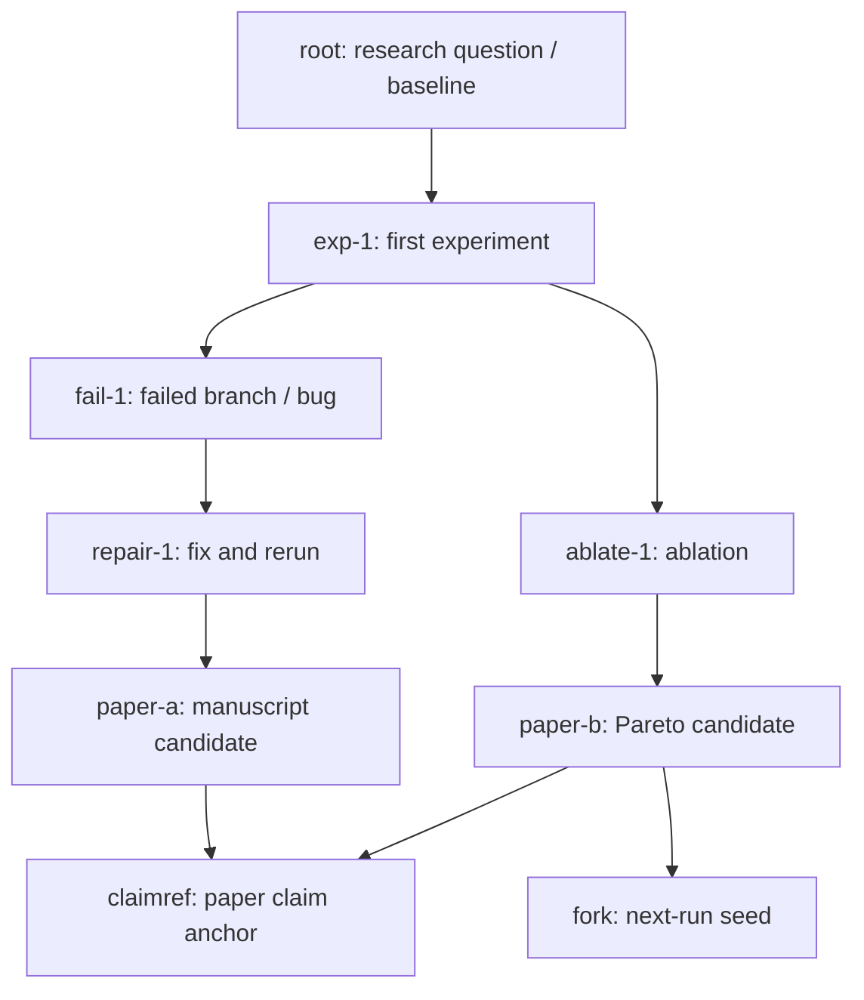

# XScientist

[](https://pypi.org/project/xscientist/)
[](https://pypi.org/project/xscientist/)
[](https://pypi.org/project/xscientist/)
[](LICENSE)
[](https://github.com/smileformylove/XScientist/actions/workflows/smoke.yml)

Chinese README: [docs/README.zh.md](docs/README.zh.md)

**Install:** `python -m pip install xscientist`, then add one provider profile ·
[PyPI package](https://pypi.org/project/xscientist/) ·
[Latest release](https://github.com/smileformylove/XScientist/releases/latest) ·
[Documentation](docs/)

> A sustainable, self-improving autonomous research system: idea generation, experiment execution, paper writing, self-review loops, strategy scheduling, and long-running daemon ops.
> Going a step further — we're not just building "better autonomous research"; we're building a **git-like protocol for research**, expanding outward along an automation tech tree whose root nodes are mathematics and physics.

XScientist is not built to "generate one paper once". It is designed as an operational research pipeline that can run continuously, stay observable, and produce handoff-ready artifacts (plans, evidence, reviews, repair tasks, quality gates, and reports) for iterative improvement and collaboration. Those artifacts conform to a standalone protocol (`ai_scientist/protocol/`, ARA v1), so any other implementation can read, write, diff, or fork them.

System report:

- arXiv: [2607.12301](https://arxiv.org/abs/2607.12301) — *XScientist: A Git-Like Research Protocol for Long-Running Autonomous Scientific Discovery*
- Source: [`paper/xscientist_arxiv/`](paper/xscientist_arxiv/)

Important notes:

- Release status: `0.1.0` is the first public PyPI release. Use the `main`
  branch only when you intentionally want unreleased development changes.
- Cost: running the system calls LLMs / retrieval services and may incur API fees and long runtimes.
- Reliability: model outputs may contain errors or hallucinations; verify key claims, data, and citations yourself.
- Output isolation: by default, run outputs are written outside this git repo (to avoid polluting an open-source repository).

---

## Contents

- [Vision: a git-like protocol for research](#vision-a-git-like-protocol-for-research)
- [Overview](#overview)
- [Key Features](#key-features)
- [Public Interfaces](#public-interfaces)
- [Repository Layout](#repository-layout)
- [Quick Start](#quick-start)
- [Configuration](#configuration)
- [Usage](#usage)
- [Native Research Version Control (no server required)](#native-research-version-control-no-server-required)
- [Outputs & Observability](#outputs--observability)
  - [Integrity Forensics](#integrity-forensics)
  - [ARA bundles (agent-facing artifact)](#ara-bundles-agent-facing-artifact)
    - [Science Exploration Tree View](#science-exploration-tree-view)
- [Example Papers](#example-papers)
- [Docs](#docs)
- [Development](#development)
- [Roadmap](#roadmap)
- [System Architecture](#system-architecture)
- [Contributing & Community](#contributing--community)
- [License](#license)
- [Acknowledgements](#acknowledgements)
- [Citation and References](#citation-and-references)

---

## Vision: a git-like protocol for research

We don't just want a better "fully automated researcher" — we want a **git-like protocol for research** that makes doing science diffable, forkable, reviewable, and rebasable, just like code:

- **Protocol before system.** `ai_scientist/protocol/` (ARA v1) pins down what a research run looks like on disk through a versioned JSON Schema suite and a `content_hash` normalisation rule. Any third-party producer or consumer can implement the same protocol without depending on the rest of XScientist — the same way git is not the only tool that reads a git object database.
- **Every run is a commit.** An ARA archives the exploration graph, per-node `code / term_out / metrics / plots`, failed branches, the repair trajectory, the Pareto pool, and an environment fingerprint. Every manuscript claim is pinned back to its evidence node via `\claimref{node_id}`.
- **Fork-continue, not cold-start.** Any node can be forked with `xscientist ara fork` into a directory that is itself a conformant ARA. The next run seeds from it, and provenance lands automatically in the child ARA — across systems, teams, or long time gaps.
- **An automation tech tree with maths and physics at the root.** We believe the parts of science that are automatable form a *tree*: **mathematics and physics are the root nodes**, where "protocol / evidence / verification" signals are strongest and machines can safely go furthest; the further out you go toward engineering, human factors, or social science, the more indispensable human judgment becomes. XScientist starts near the root — automate what is verifiable, reproducible, and forkable, and surface the rest to human reviewers explicitly.

In one line: **make research a protocol; make the system one implementation of that protocol.**<br/>
See [`ai_scientist/protocol/SPEC.md`](ai_scientist/protocol/SPEC.md) and the [ARA bundles](#ara-bundles-agent-facing-artifact) / [fork-continue](#fork-continue-from-an-ara) sections below for the concrete surface.

---

## Overview

Think of XScientist as a "research operating system":

- Input: topics / sources / constraints (budget, stop conditions, quality gates)
- Process: ideation -> experiments -> writing -> self-review -> repair/rewrite -> packaging
- Output: reusable research assets (reports, paper drafts, review/repair queues, run index, handoff briefs)

Core loop (simplified):


---

## Key Features

- Self-review loop: multi-round self-review produces structured issues + repair plans, and enforces regression/coverage gates.
- Measurable experiment TODO closure: turns "missing evidence" into explicit TODOs and tracks closure progress.
- Long-running daemon: continuous execution, failure protection, source scheduling, trend reports, handoff briefs, and strategy feedback.
- Enhanced feedback system: multi-source feedback collection, real-time health monitoring, trend analysis, automated action generation.
- Observability and replay: critical stage artifacts are written as structured files (JSON/MD) for comparison and post-mortems.
- Engineering safeguards: login guard, preflight/repo validation, config schemas, output directory isolation.
- Native Research VCS: a project can record typed objects, stage semantic changes, fork research lines, inspect provenance, merge compatible findings, create offline bundles, and reproduce checkpoints without GitHub or any server. Git is the current replaceable persistence adapter, not the user-facing research model.
- Agent-Native Research Artifact (ARA) export: every finished run also writes a machine-readable bundle under `<project_dir>/ara/`, containing the full exploration graph, per-node `code.py` / `term_out.log` / `metrics.json` / `plots.json`, the Pareto pool, repair history, an environment fingerprint, and a scan of `\claimref{node_id}` markers from the LaTeX source. Companion command `xscientist ara` can inspect / re-execute / fork any node so a downstream AI scientist can continue or verify prior work without decoding the PDF; `exploration_graph.html` presents each paper's process as a browser-viewable science exploration tree.

## Public Interfaces

- `xscientist`: unified CLI available from the PyPI wheel or a source checkout
- `xscientist init`: installed-package-first workspace and configuration scaffold
- `xscientist provider`: secure provider setup, readiness inspection, and switching
- `xscientist research`: native scientific version control and offline backup
- `from xscientist import XScientist, ProjectRequest`: stable Python SDK
- `from xscientist import create_app`: optional FastAPI application factory

| Use case | Recommended interface |
|---|---|
| Create a configured workspace | `xscientist init` |
| Add or switch an LLM provider | `xscientist provider` |
| Run one project | `xscientist project` |
| Batch paper generation | `xscientist batch` |
| Long-running research | `xscientist daemon` |
| Inspect outputs and boards | `xscientist manager` |
| Inspect/fork ARA artifacts | `xscientist ara` |
| Version hypotheses, evidence, and claims | `xscientist research` |
| Embed in Python | `XScientist` + `ProjectRequest` |
| Expose an HTTP service | `xscientist serve` / `create_app()` |

Source checkouts can also use `python -m xscientist ...`. The implementations
live in `ai_scientist/apps/`. Built wheels retain the former top-level module
names as compatibility aliases, but new integrations should use the public
CLI, SDK, or HTTP API.

## Repository Layout

```text
xscientist/             Public SDK, CLI, models, and optional HTTP API
ai_scientist/           Internal research workflow implementation
configs/                BFTS, daemon, source, and environment examples
scripts/                Source-checkout operational helpers
docs/                   Architecture, guides, and Chinese README
requirements/           CI-specific dependency sets and constraints
tests/                   Unit, distribution, compatibility, and smoke tests
tools/                   Repository-only validation helpers
```

The repository root intentionally keeps only standard project-discovery files
(`pyproject.toml`, `MANIFEST.in`, `.gitignore`), the primary README/license,
the main dependency file, Make targets, and two backward-compatible shell
operations entrypoints.

---

## Quick Start

### 0) Prerequisites

- Python: 3.10+ (3.11 recommended)
- Git: required by the current local Research VCS adapter; run
  `xscientist git doctor` after installation to verify the exact capabilities
- System deps (recommended):
  - LaTeX toolchain (to compile paper PDFs, e.g., TeX Live / MacTeX)
  - `poppler` (PDF processing/extraction)
  - `chktex` (optional LaTeX lint)

> GPU/CUDA is optional. If you need GPU acceleration, install the matching PyTorch build following the official PyTorch instructions.

### 1) Install

Install the stable release from PyPI:

| Install target | Command | What it includes |
|---|---|---|
| SDK and ARA protocol tools | `python -m pip install xscientist` | Public Python API, CLI, schemas, and artifact tooling |
| OpenAI research runtime | `python -m pip install "xscientist[research,openai]"` | Common research capabilities plus only the OpenAI client |
| Zhipu research runtime | `python -m pip install "xscientist[research,zhipu]"` | Common research capabilities plus only the Zhipu route |
| Anthropic research runtime | `python -m pip install "xscientist[research,anthropic]"` | Common research capabilities plus only the Anthropic client |
| All-in-one compatibility profile | `python -m pip install "xscientist[full]"` | Every provider and specialist capability; retained for existing deployments |

```bash
# Lightweight SDK and protocol surface
python -m pip install xscientist

# Typical project: common research tools plus exactly one provider
python -m pip install "xscientist[research,openai]"

# Add only capabilities this study needs
python -m pip install "xscientist[research,openai,ml,pdf-layout,service]"
```

Provider extras are `openai`, `anthropic`, `zhipu`, `bedrock`, `vertex`, and
`openai-compatible`. The last profile covers DeepSeek, Gemini, OpenRouter,
Hugging Face inference, Ollama, and generic OpenAI-compatible endpoints.
Capability extras are `plot`, `pdf`, `pdf-layout`, `ml`, and `service`.
`research` is the recommended common end-to-end profile; `full` remains a
backwards-compatible way to install everything.

Pin a published release when you need an identical environment:

```bash
python -m pip install "xscientist[full]==0.1.0"
```

To test unreleased development changes, install the current `main` branch:

```bash
python -m pip install "xscientist[research,openai,service] @ git+https://github.com/smileformylove/XScientist.git@main"
```

For a local clone or repository development:

```bash
git clone https://github.com/smileformylove/XScientist.git
cd XScientist
conda create -n xscientist python=3.11 -y
conda activate xscientist

python -m pip install -e ".[research,openai,service,dev]"
```

More reproducible (CI-style) install (optional):

```bash
python -m pip install -r requirements.txt
```

Verify the installation:

```bash
xscientist --version
xscientist info --json
xscientist --help
xscientist git doctor
python -c "from xscientist import XScientist, ProjectRequest; print('ready')"
```

Create a self-contained starter workspace without cloning this repository:

```bash
xscientist init my-research
cd my-research
xscientist provider add zhipu
xscientist provider list
```

`provider add` prompts for missing secrets without echoing them and stores them
in a Git-ignored `.env` with user-only permissions. Provider metadata contains
only model IDs and environment-variable names. The selected model automatically
becomes the default for ideation, plots, writing, citations, review, and BFTS;
explicit per-role CLI arguments still take precedence.

The scaffold also contains a research-question template, `.env.example`, a
packaged BFTS profile, and a Dockerfile pinned to the installed XScientist
version. It does not write API keys, does not overwrite existing files unless
`--force` is explicitly passed, and keeps AI-generated experiment code isolated
by default. Use `xscientist init --help` to select another provider, model, or
deep profile. For example:

```bash
xscientist init my-openai-study \
  --provider openai \
  --model "openai/your-model-id"
cd my-openai-study
xscientist provider add openai
```

### 2) Configure API keys (as needed)

The guided command supports Zhipu, OpenAI, Anthropic, DeepSeek, Gemini,
OpenRouter, Hugging Face, Ollama, generic OpenAI-compatible endpoints, Amazon
Bedrock, and Vertex AI. Add more than one provider and switch without retyping
model arguments:

```bash
xscientist provider add openai \
  --model "openai/your-model-id" \
  --no-activate
xscientist provider activate openai
xscientist provider list
```

For automation, set credentials in the process environment and use
`--non-interactive`; environment values take precedence and are never copied to
disk implicitly. Manual environment configuration remains supported:

```bash
export OPENAI_API_KEY="..."
export ZHIPU_API_KEY="..."
export GEMINI_API_KEY="..."
export S2_API_KEY="..."

xscientist provider add openai \
  --model "openai/your-model-id" \
  --non-interactive
```

Use `openai_compat/<model-id>` with `OPENAI_COMPAT_API_KEY` and
`OPENAI_COMPAT_BASE_URL` for another OpenAI-compatible API. `provider remove`
removes metadata only and deliberately leaves stored credentials untouched.

Before committing, sharing an ARA, or opening a pull request, run the
location-only privacy audit:

```bash
xscientist privacy audit .
xscientist privacy audit . --history   # also checks reachable Git blobs
```

The audit never prints matched values. It reports only a rule name, scope, and
relative file name. Persistent LLM traces always redact credentials, emails,
machine identifiers, and host-local paths; the legacy
`AI_SCIENTIST_LLM_REDACT=0` setting cannot disable this storage boundary.
Research checkpoints apply the same gate before staging files.

### 3) Login (required)

```bash
xscientist auth login --user <your_name>
xscientist auth status
```

Login guard doc: `docs/LOGIN_GUARDRAIL.md`

### 4) Preflight (recommended)

```bash
xscientist preflight --strict
xscientist preflight --strict --bfts-config ./bfts_config.yaml
xscientist validate
```

The config-aware form also checks the selected model credentials/client and
the exact Docker isolation image before the first paid call.

From a source checkout, contributors can additionally run `make smoke`.

### 5) Isolate AI-generated experiment code

The BFTS executor supports `process`, `docker`, and `auto` backends under the
`exec:` section of `bfts_config*.yaml`. `auto` prefers Docker and records any
fallback to the non-isolated process backend in each node/ARA. For trusted,
submission-grade runs, set `require_isolation: true` so execution fails closed
when Docker is unavailable. The Docker policy drops capabilities, disables
network access by default, uses a read-only root filesystem, and applies CPU,
memory, and PID limits. The bundled image installs the CPU PyTorch build; GPU
runs should use a CUDA-specific image and an explicit device policy. Build or
provide an image containing the experiment dependencies and pin `docker_image`
by digest for reproducible runs. Metric parsing and plotting remain offline.
The experiment phase may use bridge networking when
`allow_experiment_network: true` is enabled for dataset/model downloads;
it is disabled by default and should be turned off again after inputs are
cached. `require_isolation: true` rejects networked
experiment execution, so strict runs must place required inputs in the run
workspace before execution. Container downloads are cached inside that
workspace rather than writing to shared host caches. Only the run workspace is
writable; configured data and run-log directories are mounted read-only.

```bash
make executor-image
```

---

## Configuration

### Output directory (do not write into the repo by default)

To keep the repo clean, outputs are written to a sibling directory by default:

- Default output root: sibling `<repo-name>_outputs`; for this repo that is `../XScientist_outputs`
- Priority: `RESEARCH_OUTPUT_DIR` > `AI_SCIENTIST_OUTPUT_DIR` > default sibling dir
- Fallback: if the sibling dir is not writable, use a system data dir (e.g., `~/.local/share/ai_scientist/research`)

Recommended: set an explicit output root.

```bash
export RESEARCH_OUTPUT_DIR="/path/to/my_xscientist_outputs"
```

### Strict fallback policy (debugging note)

Most scripts support stricter quality gates. During local debugging you may choose to relax strict fallbacks via `--override-strict-fallbacks` (not recommended for serious runs).

---

## Usage

Create a local topic file such as `topic.md` before running the examples below.
It can start with a plain-language research question:

```markdown
# Research topic

Evaluate whether retrieval-guided reflection improves the factual accuracy of
long-form scientific synthesis, and design an ablation that isolates the effect.
```

Repository checkouts may instead use `examples/example_topic.md`. Run
`xscientist <command> --help` whenever you need the full option list.

### A) Run a single project from a topic

```bash
xscientist project my_project \
  --output-root "$RESEARCH_OUTPUT_DIR" \
  --topic topic.md
```

More usage: `docs/guides/PROJECT_USAGE.md`

### B) Continuous/batch generation

```bash
xscientist batch \
  --research-dir "$RESEARCH_OUTPUT_DIR" \
  --topic topic.md \
  --paper-types icbinb
```

### C) Long-running daemon (recommended for continuous iteration)

```bash
xscientist daemon \
  --topic topic.md \
  --duration-hours 24 \
  --enable-rewrite-followup \
  --auto-source-quality-feedback \
  --auto-quality-strategy-feedback \
  --auto-quality-governor \
  --auto-evidence-strategy-feedback \
  --auto-export-submission-dossier \
  --auto-failure-guard \
  --serve-dashboard \
  -- --submission-mode --num-ideas 3
```

Python SDK:

```python
from xscientist import ProjectRequest, XScientist

client = XScientist(output_root="./research-output")
result = client.run_project(
    ProjectRequest(project="my_project", topic="topic.md")
)
print(result.returncode, result.stdout)
```

HTTP API:

```bash
xscientist serve --host 0.0.0.0 --port 8000 --output-root ./research-output
curl http://127.0.0.1:8000/health
curl -X POST http://127.0.0.1:8000/v1/projects \
  -H 'content-type: application/json' \
  -d '{"project":"demo","topic":"topic.md"}'
```

Interactive API documentation is available at `http://127.0.0.1:8000/docs`;
the OpenAPI document is exposed at `/openapi.json`.

Set `XSCIENTIST_API_KEY` and send it as `X-API-Key` when exposing the service
beyond localhost.

See [`docs/guides/SDK_AND_API.md`](docs/guides/SDK_AND_API.md) for the public
package structure, SDK contract, API endpoints, and deployment guidance.

The public SDK and HTTP service also expose read-only paper lists/details, shortlist,
submission-board, and rewrite-board views bound to the configured output root.

Submission-grade and high-quality runs enable deterministic integrity forensics by default. You can also control it explicitly:

```bash
# Force integrity forensics for the final manuscript.
xscientist project my_project \
  --output-root "$RESEARCH_OUTPUT_DIR" \
  --topic topic.md \
  --integrity-forensics

# Temporarily disable it during high-quality debugging.
xscientist batch \
  --research-dir "$RESEARCH_OUTPUT_DIR" \
  --topic topic.md \
  --paper-types icbinb \
  --high-quality-mode \
  --no-integrity-forensics
```

Common ops commands:

The shell operations below are available from a source checkout or sdist, not
from the wheel-only installation.

```bash
bash run_stable_daemon.sh status
bash run_stable_daemon.sh brief
bash run_stable_daemon.sh handoff
bash run_stable_daemon.sh report-trends
bash run_stable_daemon.sh source-plan
```

### D) Feedback system monitoring

```bash
# Check system health
xscientist feedback --feedback-dir ./feedback status

# View recommended actions
xscientist feedback --feedback-dir ./feedback actions

# Analyze trends
xscientist feedback --feedback-dir ./feedback trends \
  --metrics quality_score success_rate error_rate

# Export report
xscientist feedback --feedback-dir ./feedback report
```

More usage: `docs/guides/FEEDBACK_QUICKSTART.md`

---

## Native Research Version Control (no server required)

XScientist exposes research-native objects and operations; users do not need to
operate Git or connect a GitHub repository. Initialize a standalone repository
and record only scientifically meaningful progress:

```bash
xscientist git doctor
```

For everyday research, the high-level commands record the object, select only
that change, and create one checkpoint automatically:

```bash
xscientist research hypothesis \
  "Retrieval reflection improves factual accuracy" \
  --falsifier "accuracy does not exceed the fixed baseline"

xscientist research preregister <hypothesis-object-id> \
  --dataset benchmark-v1 --metric accuracy --baseline baseline-a \
  --split-file ./splits/benchmark-v1.json --registered-by lead-researcher

xscientist research experiment \
  "Seed 7 exceeded the fixed wall-clock budget" \
  --status timeout --failure-class budget_exhausted \
  --metric elapsed_seconds=600 --seed 7

xscientist research evidence \
  "The timeout reproduced under the sealed environment" \
  --attempt <experiment-object-id> --verified

xscientist research review \
  "Independent replication and leakage checks passed" \
  --evaluates <evidence-object-id> --verifier independent-reviewer \
  --decision pass

xscientist research claim \
  "The method is not evaluable within the fixed budget" \
  --evidence <evidence-object-id>
```

Failed and timed-out experiments are committed as first-class history. The
`preregister` command creates and locks the confirmatory plan before execution;
`review` creates an independent review and deterministic gate. A confirmatory
experiment must bind that preregistration, and a `--verified` claim must bind a
passing gate decision. Use `--no-commit` only when assembling several objects
into a later manual checkpoint. `--split-file` stores only its SHA-256 digest,
never the source path or contents; automated workflows may pass `--split-hash`.

```bash
xscientist research init ./my-research \
  --question "Does retrieval-guided reflection improve factual accuracy?"

cd my-research

# Record and selectively commit a typed hypothesis.
xscientist research record hypothesis \
  --data '{"statement":"H1","falsifier":"no improvement over baseline"}'
xscientist research stage --all
xscientist research checkpoint --staged \
  --stage ideation --subject "record H1 and its falsifier"

# Fork and inspect an independent research line.
xscientist research branch challenge/h1 --switch
xscientist research branch

xscientist research log
xscientist research diff HEAD~1 HEAD --deep
xscientist research blame <research-object-id>
xscientist research fsck
```

The equivalent Git-style interface uses the same Research VCS safety rules and
does not pass arbitrary commands through to Git:

```bash
xscientist git add -A
xscientist git commit --stage ideation -m "record H1 and its falsifier"
xscientist git branch challenge/h1 --switch
xscientist git log
```

The same semantics are available as a stable Python API:

```python
from xscientist import ResearchLifecycle, ResearchRepository

repository = ResearchRepository("./my-research")
lifecycle = ResearchLifecycle(repository)

# Failed and timed-out work is first-class history, not discarded noise.
lifecycle.experiment_attempt(
    {"status": "timeout", "failure_class": "budget_exhausted"},
    commit=True,
)
```

`ResearchEvolution` applies the same model to the agent itself: candidates live
on `evolve/*` lines and require hash-bound independent evaluation, canary work,
human approval, and a verified rollback receipt before entering `main` or
`stable`.

Large datasets, models, and binary evidence stay in the local content-addressed
store; Git receives only a small immutable pointer:

```bash
xscientist research object add ./raw/results.parquet \
  --logical-path data/results.parquet
xscientist research checkpoint \
  --stage evidence \
  --subject "register immutable result table"
```

Create a complete offline backup containing normal Git history and the CAS
reproduction closure:

```bash
xscientist research bundle \
  --profile reproduce \
  --dest ../my-research-backup.tar.gz
xscientist research bundle verify ../my-research-backup.tar.gz
xscientist research bundle restore ../my-research-backup.tar.gz \
  --dest ../restored-research
```

An end-to-end project enables local milestone versioning by default:

```bash
xscientist project my_project \
  --topic topic.md \
  --checkpoint-policy milestone
```

Use `--research-vcs off` only when a caller explicitly does not want local
history. XScientist creates no remote and enforces `auto_push: false`. It uses a
deny-first privacy policy, excludes secrets and large blobs, validates typed
objects and relations, records negative outcomes, preserves independent gate
decisions, and can materialize a selected checkpoint with `xscientist research
reproduce`. Use `--environment-policy strict` when a runtime or dependency
mismatch must fail closed. See
[`docs/LOCAL_RESEARCH_GIT.md`](docs/LOCAL_RESEARCH_GIT.md) for checkpoint
semantics, policies, branches, backup profiles, and later GitHub synchronization.

---

## Outputs & Observability

XScientist writes structured artifacts under the output root (directory names may evolve across versions):

- `projects/`: full per-project directories
- `experiments/`: experiment outputs and logs
- `ideas/`: idea artifacts
- `papers/`: per-paper directories from batch generation
- `batches/`: continuous-generator batch progress and reports
- `cache/`: HuggingFace / Torch / wandb runtime caches
- `reports/`: trends/handoff reports (daemon)
- `knowledge_base/`: cross-project memory (e.g., self-evolution history/playbook)

Common index/board commands (see `xscientist manager --help` for more):

```bash
xscientist manager rebuild-index
xscientist manager submission-board --top 5 --require-gate
xscientist manager rewrite-board --top 10
xscientist manager repair-board --top 20 --priority-tier p0
xscientist manager evolution-board --top 20
xscientist manager process-board --status blocked --top 30
```

### Integrity Forensics

XScientist runs deterministic integrity forensics near the final-manuscript stage to catch hard submission risks before the submission gate, including evidence/claim consistency and anomalous signals surfaced in structured reports. This is not a replacement for human review or factual verification; it is a reproducible machine check that writes artifacts other agents can inspect.

Default behavior:

- Enabled automatically when `--submission-mode` or `--high-quality-mode` is active.
- Disabled by default for ordinary runs, but `--integrity-forensics` forces it on.
- `--no-integrity-forensics` explicitly disables it for debugging or cost-sensitive runs.
- Supported by `xscientist project`, `xscientist batch`, `xscientist bfts`, and `xscientist zhipu`.

Per-manuscript artifacts are written under that run's `integrity_forensics/` directory, usually including a JSON report and a Markdown summary. Project and batch summaries record `integrity_forensics_status`, `integrity_forensics_verdict`, finding counts, and report paths, and shortlists surface the same signal. `HARD_FLAGS` blocks submission-ready acceptance; `SOFT_FLAGS` is reported but does not block by itself.

### ARA bundles (agent-facing artifact)

Every successful `xscientist project` run also emits a machine-readable "Agent-Native Research Artifact" under `<project_dir>/ara/<timestamp>_<idea>/`. The goal: another AI scientist can fork or re-execute prior work directly, without having to decode the PDF.

Typical layout:

```
<project_dir>/ara/<timestamp>_<idea>/
├── manifest.json              # top-level pointer to everything below
├── exploration_graph.json     # tree-search DAG: nodes + parent/child edges
├── exploration_graph.html     # browser-viewable exploration-tree visualization
├── exploration_graph.summary.json # DAG summary (roots / leaves / topological order)
├── nodes/<node_id>/
│   ├── code.py                # exact code the node ran
│   ├── term_out.log           # untrimmed stdout/stderr
│   ├── metrics.json           # metric + analysis + is_buggy
│   ├── plots.json             # plot paths + VLM analyses
│   ├── env.json               # python version / expected cwd
│   └── run.sh                 # one-shot re-runner
├── claims/                    # `\claimref{node_id}` markers scanned from the .tex
├── repair_history.jsonl       # repair reflection / verifier / attempts
├── pareto_pool.json           # non-dominated manuscript candidates
├── env/
│   ├── bfts_config.yaml
│   └── model_fingerprint.json
└── README.md                  # agent-facing entry point
```

#### Science Exploration Tree View

Every ARA records a paper run as a directed acyclic graph (DAG): the root is usually the initial plan or baseline, while child nodes are experiments, ablations, repairs, failed branches, or manuscript candidates. Users can open `exploration_graph.html` directly to browse this science exploration tree, or run `xscientist ara graph --json` to read the same graph as structured data.

Conceptually:



This tree shares provenance with the git-like record, CLI logs, and node diffs: `exploration_graph.json` is the source of truth, while `exploration_graph.html`, `exploration_graph.summary.json`, `xscientist ara log`, `xscientist ara diff --only-node`, and `xscientist ara fork` are different views over the same graph. If the ARA directory is committed to git, git captures the file-level snapshot of that graph; XScientist's log/diff/fork commands expose the node-level history. So if a paper claim comes from `candidate2`, you can trace back through its parent experiment, failed repair path, ablation evidence, and the node that can seed the next fork.

The `xscientist ara` CLI ships `inspect` / `exec` / `fork` / `freeze` / `validate` / `verify` / `graph` / `catalog` / `context` and related sub-commands:

```bash
# Print a node's metric / analysis / code size.
xscientist ara inspect \
  --ara <project_dir>/ara/<timestamp>_<idea> \
  --node-id <node_id>

# Re-execute a node and write a verify report (fresh vs recorded metric).
xscientist ara exec \
  --ara <project_dir>/ara/<timestamp>_<idea> \
  --node-id <node_id>

# Fork a node into a fresh directory that is itself a valid ARA
# (own manifest, single-node exploration graph, provenance to parent).
xscientist ara fork \
  --ara <project_dir>/ara/<timestamp>_<idea> \
  --node-id <node_id> \
  --dest /path/to/fork_seed

# Snapshot the current interpreter's pip freeze into env/.
xscientist ara freeze --ara <project_dir>/ara/<timestamp>_<idea>

# Run conformance validation against ai_scientist/protocol/SPEC.md.
xscientist ara validate --ara <project_dir>/ara/<timestamp>_<idea>

# Check the DAG invariant and regenerate the visualization if needed.
xscientist ara graph \
  --ara <project_dir>/ara/<timestamp>_<idea> \
  --write-html

# Batch re-execute a handful of nodes and write verify/reexec_batch_*.json.
xscientist ara verify \
  --ara <project_dir>/ara/<timestamp>_<idea> \
  --limit 3
```

`exploration_graph.json` is the exploration DAG behind each paper: nodes are concrete experiments, repairs, or failed branches, and edges are parent -> child evolution links. `validate` checks that the graph is directed and acyclic; `graph --json` reports roots, leaves, topological order, and structural issues; `exploration_graph.html` is the human-facing visualization. `xscientist ara log --node <id>`, `xscientist ara diff --only-node <id>`, and the browser view all read the same graph data.

During writing, the LLM is prompted to append `\claimref{<node_id>}` after each quantitative claim. The macro renders as nothing in the PDF, but `ai_scientist/utils/claim_registry.py` scans the LaTeX source and drops each claim into `ara/.../claims/<claim_id>.json` — giving downstream agents a two-way link between paper assertions and the tree-search nodes that produced them. `ai_scientist/utils/claim_coverage.py` aggregates those markers into a `coverage_score` and a severity band (`ok` / `sparse` / `unresolved` / `insufficient` / `none`), persisted at `ara/.../claims/coverage.json` for quality gating, ranking, and dossier scoring.

Optional: batch re-execution verification. Set the env flag and `xscientist project` will re-run a handful of top-metric nodes at the end and save a verify report:

```bash
export AI_SCIENTIST_ARA_REEXEC=1
```

Off by default because re-executing arbitrary code can hit external APIs / GPUs.

For long-lived projects, `xscientist ara storage-report`, `pin`, `gc`,
profile-aware `bundle`, and non-destructive `compact` keep artifact growth
bounded without discarding claim/evidence lineage. See
[`docs/ARA_STORAGE_LIFECYCLE.md`](docs/ARA_STORAGE_LIFECYCLE.md).

Complete storage is not injected wholesale into agents. Before node expansion,
writing, review, or reproduction, XScientist compiles an intent-specific
ContextPack and records its hash on the resulting node, claim, or verify report.
Inspect the derived index with `xscientist ara catalog --ara <ara>` or compile a
view explicitly with `xscientist ara context --ara <ara> --intent continue
--node <id>`.

### Fork-continue from an ARA

Any ARA produced by an XScientist run can seed the next run — the very first BFTS draft reuses the code from the chosen node instead of paying for an LLM cold start, and `provenance` is written into the child ARA's `manifest.json` automatically:

```bash
# Seed from a fork directory (recommended workflow).
xscientist project <B_project> \
  --seed-from-ara /path/to/fork_seed \
  --topic topic.md

# Or seed directly from a node inside an existing ARA (fork + seed in one step).
xscientist project <B_project> \
  --seed-from-ara <A_project>/ara/<timestamp>_<idea> \
  --seed-node-id <node_id> \
  --topic topic.md
```

Under the hood the seed manifest is passed through the `AI_SCIENTIST_ARA_SEED_PATH` env var, so the short-circuit also applies inside parallel workers. Protocol details in [`ai_scientist/protocol/SPEC.md`](ai_scientist/protocol/SPEC.md) §7.

### Protocol package

`ai_scientist/protocol/` is a standalone, portable protocol package (`ara.v1`): a versioned JSON Schema suite, a `content_hash` normalisation algorithm, and a minimal conformance validator. Third-party producers / consumers can implement the same protocol without depending on the rest of XScientist — useful for letting another agent consume our ARAs, for cross-system provenance tracking, or as a `--strict` gate in CI. The engineering check derives the schema inventory from the registry so documentation does not depend on a hand-maintained count. Full spec: [`ai_scientist/protocol/SPEC.md`](ai_scientist/protocol/SPEC.md).

### A/B evidence harness

To check that the ARA seed actually accelerates the next run (rather than just feeling like it does), run `ai_scientist/experiments/ara_ab/`:

```bash
# CI-safe: no real LLM calls, only verifies that the seed short-circuits.
python -m ai_scientist.experiments.ara_ab.harness stub \
    --seed-manifest <project>/.ara_seed/ara_seed.json \
    --out-dir /tmp/ab_out

# Full run: invokes `xscientist project` twice (baseline vs seeded). Needs API keys.
python -m ai_scientist.experiments.ara_ab.harness real \
    --project-dir-baseline /tmp/ab_baseline \
    --project-dir-seeded   /tmp/ab_seeded \
    --seed-from-ara /path/to/fork \
    --out-dir /tmp/ab_out \
    -- --topic mytopic.md   # everything after `--` is forwarded to xscientist project
```

The resulting `ab_report.json` (schema `ara.ab_report.v1`) records wall-clock, LLM call counts, node counts, and content-hash overlap for both arms, plus a verdict (`seed_saved_llm_calls` / `seed_wall_clock_faster` / `seed_did_not_short_circuit` / `seed_inconclusive`).

---

## Example Papers

Example papers and related submission artifacts are collected in `example/` for checking paper formatting, supplementary material organization, and final delivery structure.

Currently organized example files:

- [example/XScientist_Board.pdf](example/XScientist_Board.pdf): XScientist Board paper/report PDF.
- [example/icml_submitted_gravitation_paper.pdf](example/icml_submitted_gravitation_paper.pdf): ICML-submitted gravitation manuscript PDF.

---

## Docs

- [Project usage](docs/guides/PROJECT_USAGE.md): project workflow usage and flags
- [SDK and API](docs/guides/SDK_AND_API.md): installation, Python SDK, CLI, and HTTP API
- [Native Research Version Control](docs/LOCAL_RESEARCH_GIT.md): typed scientific objects, semantic branches/merge, local CAS, offline backup, and checkpoint-scoped reproduction
- [Research Version Control specification](docs/RESEARCH_VCS_SPEC.md): native research objects, branches, semantic merge, promotion, and agent-evolution invariants
- [Feedback quick start](docs/guides/FEEDBACK_QUICKSTART.md): feedback system operations
- [Configuration reference](docs/CONFIG_REFERENCE.md): detailed configuration and parameters
- [Source orchestration](docs/SOURCE_ORCHESTRATION.md): source queues and recommended run postures
- [Long-running guide](docs/LONG_RUNNING_GUIDE.md): daemon operations and maintenance
- [Login guardrail](docs/LOGIN_GUARDRAIL.md): login and session management
- [Output directories](docs/guides/OUTPUT_DIRECTORIES.md): output policy (if it diverges from code, follow `ai_scientist/config/paths.py`)
- [Architecture](docs/ARCHITECTURE.md): system boundaries and components
- [Research integrity protocol](docs/RESEARCH_INTEGRITY.md): preregistration, blind verification, and claim-promotion gates
- [Open-ended research discovery](docs/RESEARCH_DISCOVERY.md): hypothesis lineage, literature grounding, Pareto diversity, and judge consensus
- [Constitution-bound self-evolution](docs/EVOLUTION_GATE.md): mutation boundaries, ablation, prospective tests, real-work canaries, and verified rollback
- [Controlled self-evolution architecture](docs/SELF_EVOLUTION_ARCHITECTURE.md): L0/L1/L2 adaptation, fixed-utility epochs, diverse portfolios, and outcome feedback
- [Science constitution](docs/SCIENCE_CONSTITUTION.md): immutable research principles, protected assets, and amendment governance
- [Epistemic graph](docs/EPISTEMIC_GRAPH_SPEC.md): cumulative questions, claims, refutations, and evidence-state transitions
- [Independent evaluation governance](docs/EVALUATION_GOVERNANCE.md): disjoint authorities, sealed/prospective/external tests, and high-confidence promotion gates
- [Performance regression gates](docs/PERFORMANCE_GATES.md): cold-import, memory, lazy-loading, and behavior-equivalence budgets for simplification work
- [Engineering guide](docs/ENGINEERING.md): supported environments, dependency policy, CI lanes, packaging contract, and release checklist
- [Optimization summary](docs/guides/OPTIMIZATION_SUMMARY.md): prior optimization work

---

## Development

- Unit tests: `make test`
- Coverage regression gate: `make coverage` (45% branch-aware whole-repository baseline)
- Metadata/dependency/protocol consistency: `make engineering`
- Syntax/import/validation smoke: `make smoke`
- Stricter local doctor: `make doctor` (requires a valid login session)
- Formatting: `make format`
- Build and inspect both wheel and sdist: `make package-check`

Engineering policy, CI lanes, dependency rules, and the release checklist are
documented in [`docs/ENGINEERING.md`](docs/ENGINEERING.md).

---

## Roadmap

XScientist aims to move autonomous research from "one-shot paper generation" toward long-running, reproducible, reviewable, submission-ready infrastructure. Issues and PRs welcome (see `.github/CONTRIBUTING.md`).

- **Near term**: ship a reproducible submission-ready example; harden preflight and delivery checklists; wire TODO closure into quality gates.
- **Mid term**: bidirectional evidence↔figure/table/metric binding; dossier consistency/regression checks; multi-reviewer aggregation.
- **Long term**: daemon adapts strategy from historical metrics; cross-project knowledge base; standard benchmarks / leaderboards; fuller English docs and plugin API.

---

## System Architecture

For detailed architecture documentation, see: [docs/ARCHITECTURE.md](docs/ARCHITECTURE.md)

Core components:
- **Ideation Engine**: Idea generation and ranking
- **Experiments Engine**: Experiment execution and evidence collection
- **Writeup Engine**: Paper writing and compilation
- **Self-Review Engine**: Self-review and repair
- **Autonomous Evolution Engine**: Autonomous evolution and strategy optimization
- **Adaptive Learning Engine**: Adaptive learning and recommendations
- **Enhanced Feedback System**: Enhanced feedback and monitoring

## Contributing & Community

- Contributing guide: `.github/CONTRIBUTING.md`
- Code of conduct: `.github/CODE_OF_CONDUCT.md`
- Security policy: `.github/SECURITY.md`
- Architecture docs: `docs/ARCHITECTURE.md`

---

## License

Apache-2.0. See `LICENSE`.

---

## Acknowledgements

Thanks to the open-source projects that inspired parts of this work:

- [Sakana AI: AI Scientist](https://github.com/SakanaAI/AI-Scientist)
- [karpathy/autoresearch](https://github.com/karpathy/autoresearch)
- [awesome-ai-research-writing](https://github.com/Leey21/awesome-ai-research-writing)
- [AIDE](https://github.com/WecoAI/aideml)
- [DeepReviewer-v2](https://github.com/ResearAI/DeepReviewer-v2)

---

## Citation and References

If you use XScientist in research, please cite this project and the generated paper you used. For papers or reports, include the commit hash, experiment configuration, model versions, and output directory for reproducibility.

### XScientist

XScientist (software / repository):

```bibtex
@software{xscientist,
  title        = {XScientist},
  author       = {Luo, Jixiang},
  year         = {2026},
  url          = {https://github.com/smileformylove/XScientist}
}
```

XScientist arXiv system report:

```bibtex
@misc{xscientist_arxiv_2607_12301,
  title        = {XScientist: A Git-Like Research Protocol for Long-Running Autonomous Scientific Discovery},
  author       = {Luo, Jixiang},
  year         = {2026},
  eprint       = {2607.12301},
  archivePrefix = {arXiv},
  primaryClass = {cs.SE},
  doi          = {10.48550/arXiv.2607.12301},
  url          = {https://arxiv.org/abs/2607.12301}
}
```

XScientist Board (paper or report authored/refined with this system):

```bibtex
@misc{xscientist_board,
  title        = {XScientist Board: Artifact-Routed Submission Hardening for Autonomous Research Systems},
  author       = {{XScientist}},
  year         = {2026},
  url          = {https://github.com/smileformylove/XScientist/blob/main/example/XScientist_Board.pdf}
}
```

ICML-submitted gravitation example paper:

```bibtex
@misc{xscientist_icml_submitted_gravitation,
  title        = {A Gravitational Field Theory for Deep Networks},
  author       = {{XScientist}},
  year         = {2026},
  url          = {https://github.com/smileformylove/XScientist/blob/main/example/icml_submitted_gravitation_paper.pdf}
}
```

### Citation Notes

- When citing papers generated by XScientist, cite both this repository and the specific generated paper.
- Clearly describe any human review, filtering, rewriting, or post-processing applied to generated results.
