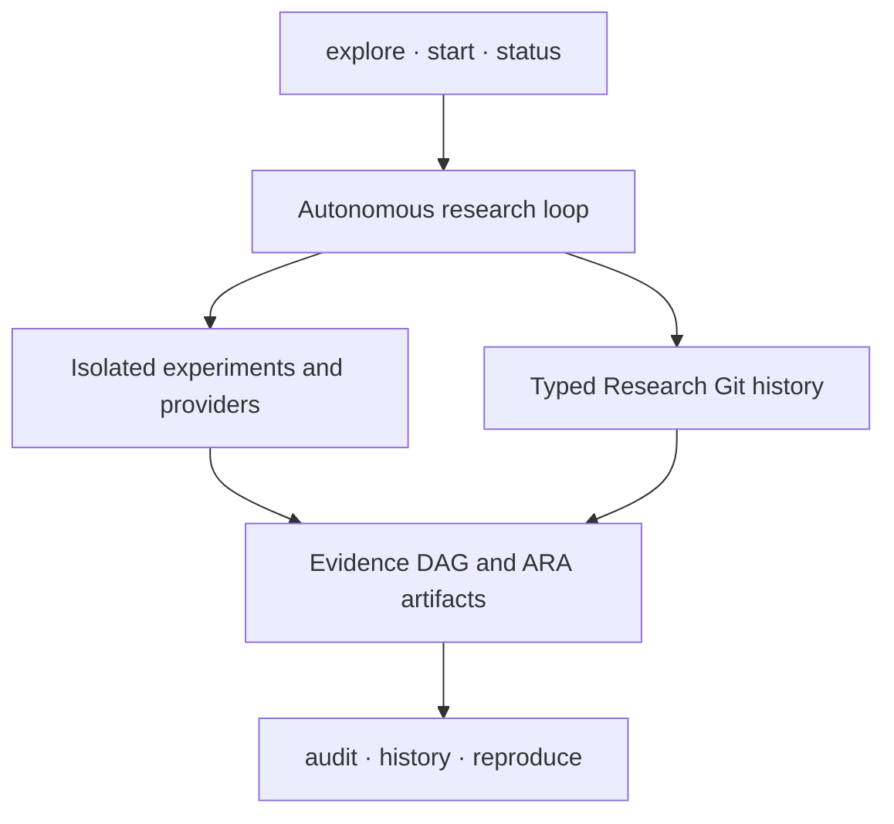

<p align="center">
  
</p>

<h1 align="center">XScientist</h1>

<p align="center"><strong>From one idea to a Git-like research history: inspectable, reproducible, and reversible.</strong></p>

<p align="center">
  Bring one idea—even if you do not know models or API keys. XScientist helps
  test it without hiding uncertainty, failed attempts, or contrary evidence.
</p>

<p align="center">
  <a href="https://pypi.org/project/xscientist/"></a>
  <a href="https://pypi.org/project/xscientist/"></a>
  <a href="https://github.com/smileformylove/XScientist/actions/workflows/smoke.yml"></a>
  <a href="https://github.com/smileformylove/XScientist/blob/main/LICENSE"></a>
  <a href="https://arxiv.org/abs/2607.12301"></a>
</p>

<p align="center">
  <a href="#start-with-your-own-idea--no-api-key">Quick start</a> ·
  <a href="#run-an-autonomous-study">Autonomous study</a> ·
  <a href="#far-inspired-opportunity-funnel">Opportunity funnel</a> ·
  <a href="#belief-context-projection-bcg-inspired">Belief context</a> ·
  <a href="#inspect-and-reproduce">Audit</a> ·
  <a href="#installation">Install</a> ·
  <a href="https://github.com/smileformylove/XScientist/tree/main/docs">Docs</a> ·
  <a href="https://zhuanlan.zhihu.com/p/2027818800238666075">Build notes (中文)</a> ·
  <a href="https://github.com/smileformylove/XScientist/blob/main/docs/README.zh.md">中文</a>
</p>

XScientist is a local-first research system and an open scientific protocol. It
can explore competing explanations, choose informative experiments, execute
them through a configured executor boundary, criticize its own results, and
preserve the whole path as typed, machine-readable research objects. A
completed run is never presented as a verified scientific claim unless its
evidence and review gates actually pass.

> **Important:** XScientist is alpha research software, not an oracle.
> Autonomous runs may use
> paid models. Generated code requires the configured isolated executor.
> Machine-generated claims remain unverified until their evidence and
> independent review gates are complete.

PyPI currently serves the published `0.1.4` release; the `main` README also
documents the changelog's explicitly Unreleased protocol hardening. Version
0.1.4 added a FAR-inspired,
source-audited opportunity funnel while keeping the existing provenance,
isolation, and scientific review gates. Pin the package version or a source
commit when an experiment must remain exactly reproducible.

## Choose the shortest path

| Your starting point | Run first | Provider or cost | Immediate result |
| --- | --- | --- | --- |
| An idea, but no model or API key | `xscientist explore ./my-study` | None | A local, versioned, falsifiable research start |
| You want to see the system before using your idea | `xscientist demo ./first-study --autopilot --open` | None; `$0.00` | A complete but deliberately contested evidence history |
| You have a local Ollama model | `xscientist provider list` | Local compute; no hosted key | Detected models and the next setup command |
| You have a hosted-model key | `xscientist start ./my-study` | May incur provider cost | A guarded autonomous study in the same history |

If you are unsure, start with `explore`. It records what you know and leaves
unknown fields honestly incomplete.

## Start with your own idea — no API key

Requirements: Python 3.10+ and Git. No API key, model, Docker, or network call
is needed after installation.

```bash
python -m pip install \
  "xscientist==0.1.4"
xscientist explore ./my-study
```

The guided flow uses ordinary questions instead of provider or protocol terms:

- What idea do you want to investigate?
- What observable change do you expect?
- What result would make you change your mind?
- What fair comparison or test could you run first?

Once one falsifiable hypothesis exists and no plan has been locked, the guided
next action is deliberately rival-first: record a falsifiable competitor, then
lock the competing hypotheses into a portfolio before choosing the study mode.
The lower-level APIs remain available, but the beginner guide no longer makes
“plan the favored idea” its primary recommendation.

You may stop after the first answer and run the same command later. XScientist
versions the exact state as `idea saved`, `falsifiable`, or `planned`; it never
fills a blank with invented science. This path uses no provider, makes no model
call, executes no generated code, and creates no evidence or conclusion.

For a scripted start, the same path is explicit:

```bash
xscientist explore ./my-study \
  --idea "Does daily walking improve sleep quality?" \
  --expect "Daily walking improves a preregistered sleep score." \
  --disprove "The score is unchanged or worse." \
  --test "Compare walking and usual-activity periods." \
  --non-interactive
```

The workspace is understandable without reading internal logs:

- `question.md` is the human-readable research framing;
- `research.yaml` records local policy and workspace identity;
- `.xscientist/objects/` and `checkpoints/` preserve typed decisions and history;
- the local Git repository has no remote and never pushes itself.

Initializing inside an existing project is non-destructive. Existing
`.gitignore` rules keep their text and order; if the complete safety policy is
not already present, one canonical ordered XScientist block is appended. A
different pre-existing `question.md` or
`.xscientist/README.md`, any staged Git work, or tracked dirt in managed files
causes initialization to stop. In an existing Git repository, the first
checkpoint contains only the XScientist-managed paths, leaving unrelated dirty
project files uncommitted.

`init`, `setup`, and `start` publish checkpoints only after their privacy,
provider, and diagnostic checks complete without an execution error. A
structured “runtime not ready” result may be retained as an explicit blocked
preparation state so the user does not need to re-enter valid choices. If an
exception or write fails, rollback removes
only unchanged files created by that invocation; concurrent scientific files,
Git configuration, refs, index intent, and history are preserved and an
incomplete rollback is reported instead of silently deleting them. Unsafe Git
control paths, special managed files, and credential-shaped model metadata are
rejected before persistence, and structured errors pass through the same
redaction boundary as successful JSON.

Use `status` and `history` to inspect these records; new users should not need
to edit the internal object store directly.

To see what a complete but contested evidence history looks like, run the
bundled `$0.00` example:

```bash
xscientist demo ./first-study --autopilot --open
xscientist status ./first-study
```

The demo intentionally ends with “more evidence needed”: held-out evidence
challenges an over-broad claim. Preserving that conflict is a successful
scientific outcome, not a software failure.

Use `xscientist status ./first-study --verbose` only when you need branch,
pipeline, token, or background-run details. Use `--json` for automation.

Portable JSON never embeds the inspected host path. Each suggested
`primary_action` or `next_steps[]` row includes an `action` contract with an
`argv_template`, exact `rso-...` object IDs when those objects already exist,
and explicit `workspace_binding`, `cwd_binding`, and `input_binding` metadata.
Bind `{workspace}` to the workspace supplied to the invocation. If human
placeholders remain, `input_binding.required=true` and
`executable_after_binding=false`; automation must not execute that template
until those values have been supplied by a person.

## Run an autonomous study

Offline guidance can structure user-supplied reasoning, but it cannot honestly
invent domain knowledge, data, or findings. For AI-assisted exploration, add a
model only after the research question is safely recorded. The same workspace
can be upgraded without replacing its history.

First discover usable models. This works before a workspace exists and detects
a running local Ollama service before suggesting hosted services.

```bash
xscientist provider list
```

### Local model

[Install Ollama](https://ollama.com/download), download a local model, and make
sure its local service is running. The desktop app starts the service; a
headless setup can use `ollama serve`. No hosted API key is needed. The current
[official CLI reference](https://docs.ollama.com/cli) uses `ollama pull` to
download and `ollama ls` to list local models:

```bash
ollama pull gemma3
ollama ls

python -m pip install \
  "xscientist[research,openai-compatible]==0.1.4"
xscientist provider list
xscientist start ./my-study
```

The interactive flow asks only for missing choices: question, provider/model,
evidence source, local research identity, and optional budget. If one usable
provider is detected, it is selected automatically. For an `explore` workspace,
the saved question is reused and existing research files are preserved. A local
model removes hosted API cost, but it still uses your machine's compute and
does not remove Docker isolation requirements for generated experiment code.

### Hosted model

Install the research runtime plus one provider client:

```bash
python -m pip install \
  "xscientist[research,openai]==0.1.4"
export OPENAI_API_KEY="..."
xscientist start ./hosted-study
```

Available client extras are `openai`, `anthropic`, `zhipu`, `bedrock`,
`vertex`, and `openai-compatible`. The last covers local Ollama and compatible
services such as DeepSeek, Gemini, OpenRouter, and custom endpoints.

For any OpenAI-compatible service, configure the endpoint explicitly. `custom`
is a friendly alias for the generic `openai_compat` provider; the URL and key
stay in the workspace's permission-restricted, Git-ignored `.env` file:

```bash
python -m pip install "xscientist[research,openai-compatible]"
export OPENAI_COMPAT_API_KEY="..."
xscientist provider add custom \
  --model gpt-5.6-luna \
  --base-url "https://your-compatible-service.example/v1" \
  --non-interactive
xscientist provider test custom --json
```

`provider test` makes one explicit minimal request and compares the model sent
to the model reported by the endpoint. A mismatch (for example a gateway
silently selecting a smaller model) is reported as unverified; the response
content is never stored by the test.

For scripts and CI, make every consequential choice explicit:

```bash
xscientist start ./ood-study \
  --question "Why does retrieval-guided reflection fail out of distribution?" \
  --provider openai \
  --model openai/gpt-4.1 \
  --user YOUR_NAME \
  --autopilot discovery \
  --data-dir ./data \
  --max-cost-usd 10 \
  --non-interactive
```

Use `--allow-synthetic-data` instead of `--data-dir` only for an explicitly
exploratory study. Input data is content-hashed and mounted read-only. Unknown
model pricing fails closed when a cost limit is active.

### Isolation and readiness

Generated experiment code never runs silently in the host Python process. A
model-backed experiment needs Docker and a version-matched executor:

```bash
xscientist executor prepare --workspace ./ood-study
xscientist provider check --workspace ./ood-study --max-cost-usd 10
xscientist doctor --workspace ./ood-study --deep
```

The commands distinguish missing clients, credentials, local models, Docker
CLI, Docker daemon, and executor-image mismatches. They print ordered repair
commands without making a paid provider request. If you explicitly want one
minimal remote verification, opt in separately:

```bash
xscientist provider check --workspace ./ood-study --live --timeout 30 --json
```

`--live` may incur provider cost and reports transport/model identity only;
response content is never recorded. The default check remains configuration
only.

### Long-running studies

```bash
xscientist start ./ood-study \
  --question "Where does the mechanism break?" \
  --allow-synthetic-data --max-cost-usd 10 --detach

xscientist runs list --workspace ./ood-study
xscientist runs watch RUN_ID --workspace ./ood-study
xscientist runs logs RUN_ID --workspace ./ood-study --tail 100
xscientist runs cancel RUN_ID --workspace ./ood-study
xscientist runs resume RUN_ID --workspace ./ood-study
```

`xscientist status ./ood-study` shows a failed or active background run before
lower-priority scientific follow-ups. A failed state returns a non-zero exit
code while preserving a complete JSON report for automation.

## What remains autonomous

The simple entry point does not reduce the research loop. Depending on the
selected profile, XScientist can:

1. propose rival and null hypotheses instead of defending the first idea;
2. lock predictions and rank experiments by expected information value;
3. execute bounded experiments and retain failed or negative attempts;
4. scan anomalies, contradictions, evidence quality, and transfer boundaries;
5. run independent review roles, repair bounded defects, and stop at hard gates;
6. package the paper, evidence DAG, provenance, and exact continuation context.

Autonomy does not bypass scientific authority. XScientist does not silently
invent missing user answers, label synthetic data as empirical, run generated
code on the host, promote an unreviewed claim, publish research, or push a
workspace remote.

Profiles expose one meaningful trade-off:

| Profile | Use it for | Emphasis |
| --- | --- | --- |
| `balanced` | A first end-to-end study | Bounded search and standard review |
| `discovery` | Mechanism and boundary finding | Rival hypotheses, refutation, branch diversity |
| `publication` | A manuscript candidate | Independent reviews and stricter hold gates |

Deep strategy commands remain available under `xscientist research`, but new
users do not need to learn them before the first result. See the
[deep-research protocol](https://github.com/smileformylove/XScientist/blob/main/docs/DEEP_RESEARCH_PROTOCOL.md)
and [method-discovery protocol](https://github.com/smileformylove/XScientist/blob/main/docs/METHOD_DISCOVERY_PROTOCOL.md).

### FAR-inspired opportunity funnel

For literature-to-open-problem discovery, the [FAR-inspired opportunity
funnel](https://github.com/smileformylove/XScientist/blob/main/docs/OPPORTUNITY_FUNNEL.md) records a complete, bounded path from
direction to candidate pool, attempt, independent judgment, importance grade,
and resource allocation. Every candidate—including `known`, `none`, failed,
and not-yet-attempted rows—remains auditable. Allocation is fail-closed until
the pool is complete and every candidate is explicitly `source_status=open`.
Declared probabilities and calibration status are retained as inputs; they are
not silently imputed or presented as a scientific success rate.

The CLI uses the same typed contract (all writes stay local unless you
explicitly push your Git remote):

Run the [Quick start](#start-with-your-own-idea--no-api-key) first if
`./first-study` does not exist yet; the commands below extend that workspace.

```bash
# Lock the direction, then provide a bounded JSON candidate set.
xscientist research opportunity direction mechanism-search-v1 \
  "Which mechanism explains the held-out anomaly?" \
  "Produce a falsifiable and reproducible result." \
  --repo ./first-study
xscientist research opportunity pool mechanism-search-v1 ./candidates.json \
  --repo ./first-study

# Record outcomes, independent gates, and a transparent allocation plan.
xscientist research opportunity attempt POOL_ID CANDIDATE_ID none \
  "No resolution in the recorded attempt." --repo ./first-study
xscientist research opportunity judge ATTEMPT_ID pass evaluator-independent \
  "Evidence supports a new result." --repo ./first-study
xscientist research opportunity grade JUDGMENT_ID substantial evaluator-grader \
  "Potentially important if independently reproduced." --repo ./first-study
xscientist research opportunity allocate POOL_ID --objective artifact_yield \
  --max-attempts 5 --repo ./first-study
xscientist research opportunity inspect POOL_ID --repo ./first-study --json
```

Use `--no-commit` for a batch and create one explicit checkpoint after review.
Stage overrides require both `--allow-stage-override` and a non-empty
`--override-reason`; the reason is hash-bound. Evidence object IDs create
auditable `derived_from` relations, while external URLs remain explicit but do
not count as complete local lineage. This is an XScientist process and
allocation integration inspired by [FAR](https://arxiv.org/abs/2608.16977),
not a reproduction of [FAR's repository](https://github.com/zeyu-zheng/FAR),
its corpus-wide importer, its solver, its three-judge rule, or its reported
pilot counts. It does not produce a human-performance score or claim global
novelty.

## Inspect and reproduce

Research Git versions scientific objects rather than asking users to infer
meaning from a folder of logs. Git is the current local storage adapter; no
GitHub account or remote is required, and XScientist never pushes research by
itself.

If you know GitHub, the mental model is deliberately familiar:

| GitHub | XScientist |
| --- | --- |
| Repository | One local research workspace |
| Commit and activity | Hash-checked checkpoint and `history list` |
| Files changed | Scientific `history diff`, including claim/object changes |
| Branch and pull request | Competing research line and semantic merge preview |
| Required checks | `trace → replay → verify` scientific gates |
| Revert and Actions artifacts | Append-only rollback, reproducible run, and bundle |

```bash
xscientist status ./first-study
xscientist history list ./first-study
xscientist history show ./first-study --commit HEAD
xscientist history diff ./first-study
xscientist audit ./first-study --level trace
xscientist audit ./first-study --level replay
xscientist audit ./first-study --level verify
```

Audit answers three different questions and never conflates them:

- `trace`: can every claim be traced to recorded evidence and decisions?
- `replay`: are code, data, environment, seed, and command sufficient to rerun it?
- `verify`: was the result independently checked under the required gates?

These levels form a one-way ladder: a recorded claim may be traceable without
being replayable, and replayable without being independently verified. A
blocked audit is an actionable scientific gap, not necessarily a software
failure.

Verification evaluates the complete active claim closure, not a hand-picked
support subset. One independent verified review must itself cover every active
evidence and reasoning object, plus any challenge/refutation and its immutable
resolution; several partial reviews cannot be unioned into a passing review.
An active `refutes`, `qualified_refutes`, `contradicts`, or
`challenges_inference` signal blocks `verify` even when `trace` and `replay`
remain complete. Superseding a challenge is not enough by itself: a fresh
review and gate must cover both the challenge and the resolution.

Literature evidence follows an equally explicit chain: a locked search plan
constrains provider and exact query; its retrieval receipt commits the complete
candidate set; a source snapshot must match exactly one selected candidate and
bind that receipt. Retraction/withdrawal events are append-only and remain
active through later positive status checks. Reinstatement requires a later
notice from the same provider and explicitly supersedes the active retraction.
For historical decisions, `--as-of` excludes evidence, source-lineage roots,
retractions, and reinstatements created after the boundary rather than letting
today's knowledge rewrite the earlier context.

### Exact checkpoints and one-command saves

Checkpoint-sensitive operations use the exact target commit. They do not walk
back to an ancestor checkpoint when `HEAD` or a selected ref is an ordinary raw
Git commit. `show`, `fsck`, reproduction, tags, bundles, exports, and semantic
merge therefore fail closed for an unbound tip; copied trailers also fail when
the checkpoint JSON, parent, hash, or exact `changed_paths` binding disagrees.
Raw Git history is not deleted, but it is not granted Research VCS authority.

Commit-enabled one-command recorders such as `research hypothesis` first
require an empty native stage and a clean set of Git-staged, tracked, and
research-eligible paths. The resulting checkpoint includes only the newly
created object paths plus its checkpoint records, so an unrelated edit cannot
be absorbed accidentally. `--no-commit` is an explicit batch-building mode;
the caller must later stage and checkpoint those paths deliberately.

### Paper quality status

The writing pass separates a readable manuscript from a verified result. A
`quality_gate_passed` result requires a locked preregistration, completed
confirmatory records for every registered task, independent seeds, persisted
result artifacts, numeric candidate-versus-baseline comparisons with
uncertainty, deterministic hashes, a task → metric → claim path, and a
clean-room verification report covering every required criterion. Prose,
figures, or an LLM score cannot substitute for missing evidence.

Until that chain is complete, XScientist labels the output
`exploratory_draft` or `manuscript_draft`; it does not call it
`submission_ready`. Result JSON also includes
`scientific_evidence_failures` and short `scientific_evidence_next_actions`, so
a blocked run tells you what to fix next instead of silently lowering a score.
See the [research integrity contract](https://github.com/smileformylove/XScientist/blob/main/docs/RESEARCH_INTEGRITY.md) for the exact
record fields and replay requirements.

Save a meaningful manual change before trying a risky alternative. Rollback is
preview-only unless `--apply` is explicit. Applying it appends a reversal
checkpoint: it never deletes or rewrites the original result.

```bash
xscientist history save ./first-study -m "record corrected measurement rule"
xscientist history rollback ./first-study --commit HEAD
# Review the target, impact, blockers, and generated apply command first.
xscientist history rollback ./first-study --commit HEAD --apply
```

Unsaved tracked, staged, selected, or research-eligible changes and the first
checkpoint block rollback. Policy-excluded generated views are preserved and do
not block it; after a reversal, `status` marks an older DAG as stale and prints
the exact refresh command. Reverting an older checkpoint can still conflict
with newer work, in which case `--apply` stops without discarding current
history.

For reproduction, bundles, object inspection, context snapshots, deep diffs,
and branches, use the advanced protocol surface:

```bash
xscientist research reproduce HEAD --repo ./first-study --execute --record \
  --reproduces @latest:claim --verifier human:REPRODUCER

xscientist research bundle --repo ./first-study --dest ./study-backup
xscientist research export --repo ./first-study --dest ./exchange
```

A generated DAG is a disposable view, not scientific source data. Regenerating
it does not dirty a research checkpoint or prevent a bundle. Eligible research
changes, tracked edits, or staged changes still block bundling until reviewed.

Reproduction materializes the exact checkpoint in a detached worktree, verifies
and copies bound CAS objects, compares the recorded environment, and executes a
single parsed command without a shell only after explicit `--execute`. The
command receives a reduced variable set and a private HOME, but this control is
variables-only: the host filesystem remains visible. Retained output is bounded
and a timeout is applied. On POSIX, timeout cleanup signals the process group on
a best-effort basis; children can escape it. On Windows, only the parent process
is terminated, with no process-tree guarantee. A newly generated v2 receipt
persists `isolated=false`, `security_boundary=false`,
`environment_scope=variables_only`, `filesystem=host_visible`, and
`network=host_unrestricted`; audit rejects stronger claims. A reproduction
command can access host files and the host's available network unless an
external runtime restricts them. An upgraded historical v1 receipt uses
explicit `legacy_unknown` environment/process fields instead of inventing
controls that the old format did not record. Output hashes cover the retained
bounded tail, and the receipt records its limit plus separate stdout/stderr
truncation flags; legacy v1 output scope remains `legacy_unknown`.

When `--record --verified` is requested, the lifecycle stores a v2 receipt that
binds the resolved source checkpoint, the exact reproduced objects, the active
claim closure at that same audit checkpoint, and the execution-result fields. The
auditor recomputes those bindings from Git and immutable research objects. A
valid locally generated v1 receipt is upgraded before the reproduction object
is written; historical v1 records remain readable but cannot satisfy `verify`.
These hashes establish repository consistency, not the real-world identity or
independence of the declared verifier.

Semantic merge requires both source and target tips to be exact checkpoints.
Its preflight detects file conflicts, incompatible locked registrations,
redefined metrics, and newly introduced support/refutation pairs even when one
side of the pair already existed at the merge base. The final staged merge set
must exactly match the declared paths. Before scanning those working-tree
paths, the checkpoint gate verifies that staged and working-tree content agree;
it repeats that agreement check after the scan. This prevents drift without
claiming that the scanner reads Git index blobs directly. `--preserve-conflicts`
can retain only opposing evidence under a deterministic hold; it does not
resolve or promote the contested claim.

Research bundles capture all advertised refs in the embedded Git bundle and
derive the reachable pointer closure across their full history. Consequently,
`reproduce`/`audit` profiles include CAS objects reachable only from an old tag
or non-current branch, even if the pointer disappeared from current `HEAD`
(`index` intentionally omits CAS payloads). Verification imports the embedded
Git bundle into a temporary local repository and independently recomputes that
closure before checking pointer bytes and CAS hashes/sizes. This is local
integrity recomputation, not an external signature, custody, or trust proof.

### Research-policy rollout audit (Faraday-inspired)

The [Faraday paper](https://arxiv.org/abs/2608.13331) is a trained outer
research policy that delegates coding to a stronger tool on the authors'
Replica benchmark. XScientist does not ship those weights, run that benchmark,
or claim its scores. Our local contract records the transferable system
boundary: policy decisions and budget continuity, tool execution hashes,
five-dimension rubric observations, turn credit, and an explicit independent
evaluator receipt. A completed rollout is not verification-eligible unless a
known evidence hash resolver confirms that the evaluator actually references a
successful executor artifact and a local trust store verifies the evaluator's
signed actor-disjoint binding. For a completed episode, the audit also requires
complete, contiguous budget accounting inside the declared boundary. A required
failure response counts as recovered only after a successful repair/delegation
or an explicit terminal stop; a failed repair does not silently pass the gate.

For a fair tool swap, add the optional `comparison_boundary` with a harness
identity, resource fingerprint, evaluator-protocol hash, starting-artifact
hash, network policy, and seed policy. Missing or mismatched boundary metadata
is reported as a comparison reason; it is never silently treated as parity.

```bash
xscientist research rollout episode.json \
  --repo ./first-study --json > rollout.json
xscientist research rollout-audit rollout.json \
  --evidence-hash sha256:... \
  --trust-store trust-store.json --json
```

The JSON emitted by `rollout --json` includes the canonical `rollout` payload,
so the captured wrapper is accepted directly by `rollout-audit`. Programmatic
strict tool-swap checks additionally require the union
`audit_evidence_hashes` resolver and an `audit_trust_store` that verifies both
rollouts; either missing input fails closed.

The audit is payload-free and fail-closed. It reports blockers and warnings,
never trusts the legacy `identity_verified` boolean by itself, never turns an
LLM judge into ground truth, and keeps both quality and causal claims disabled.
See the [rollout contract](https://github.com/smileformylove/XScientist/blob/main/docs/RESEARCH_ROLLOUTS.md)
for the boundary and schema details.

### Belief-context projection (BCG-inspired)

The [Belief Context Graph project](https://github.com/bigai-nlco/belief-context-graph)
shows why an agent needs explicit support, conflict, provenance, and temporal
context rather than retrieval alone. XScientist adopts that system lesson
without adding another mutable graph store or copying BCG's heuristic
confidence formula. It derives one deterministic, read-only projection from
the immutable Research VCS closure and keeps every state ordinal—not a
calibrated probability.

The projection deduplicates evidence by root source family, preserves support
and challenge together, and maps `claim -> depends_on -> evidence/passage` to a
typed support binding without treating arbitrary lineage as support. An
explicit historical `as_of` excludes evidence, lineage roots, invalidation
events, and reinstatements created later; an unavailable future lineage is
reported instead of being replaced with a convenient actor identity. Expired,
malformed, retracted, invalidated, or superseded signals cannot provide active
support, and incomplete endpoints, graph cycles, or hard node/relation limits
fail closed. The projection is hash-bound into the v4 research-context receipt;
every ordinal state is non-probabilistic context and can never serve as a
sufficient or sole promotion gate.

```bash
xscientist research belief @latest:hypothesis \
  --repo ./first-study --ref HEAD --json > belief.json
xscientist research belief-audit belief.json --json
```

These commands audit context integrity, not scientific truth, and never inherit
BCG's self-reported benchmark numbers. See the full
[belief-context boundary](https://github.com/smileformylove/XScientist/blob/main/docs/BELIEF_CONTEXT.md).

### Process benchmark comparison (offline and reproducible)

The [linked WeChat article](https://mp.weixin.qq.com/s/pRPBg5RE1a6jWdO8LdP89A)
points to [AutoResearchEval](https://arxiv.org/abs/2608.14905): a six-stage, artifact-aware
diagnostic benchmark with 100 tasks and 800 trajectories. XScientist does not
claim to reproduce its model score: the official rollout service and annotated
trajectories are external. Instead, the repository includes an explicit,
zero-cost conformance pilot that checks task framing and the evidence exposed by
one local workspace:

```bash
# Optional, explicit one-time export/download from the official dataset page;
# save one JSON/JSONL task manifest locally. The pilot itself stays offline.
# (The published dataset layout may evolve; do not hard-code a remote path.)

xscientist benchmark autoresearch \
  --tasks ./open-ended_tasks.jsonl \
  --workspace ./first-study \
  --limit 20 --kind open-ended --json
```

The pilot never downloads data, reads gold conclusions, calls a provider, or
executes a model rollout. It reports `official_comparable: false` and keeps
three measurements separate: task-contract validity, A–F artifact coverage, and
XScientist's `trace → replay → verify` plus metacognitive repair signals. See
[the benchmark protocol](https://github.com/smileformylove/XScientist/blob/main/docs/BENCHMARKS.md) for the exact boundary and the
[official task dataset](https://huggingface.co/datasets/PrentisAI/AutoResearchEval).
The benchmark-driven completion status and explicit blockers are in the
[optimization status](https://github.com/smileformylove/XScientist/blob/main/docs/OPTIMIZATION_ROADMAP.md); it contains no dated
delivery plan or unverified completion promise.

The report also contains a bounded `diagnostics` backlog. `P0` means a fair
quality claim is blocked, `P1` is evidence/lifecycle debt, and `P2` is an
exploration or usability improvement. `stage_coverage` is explicitly a
structural measure (`score_semantics: structural_stage_coverage_only`), never a
scientific quality score; even 83.3% coverage keeps
`quality_claim_allowed: false`.

For workspaces, the report includes a read-only `evidence_index` covering the
allowlisted Research VCS, ARA/CAS, and generated-view surfaces. It records
bounded counts and aggregate SHA-256 digests, with an explicit `digest_scope`
(`observed_files` or `bounded_prefix`), truncation, and read-error fields, but
never filenames, paths, or raw payloads. The same
report exposes `workspace.exploration` when an ARA exploration graph exists;
missing graphs are `unavailable`, not zero failed or unattempted candidates.
Its `ara_contract` record counts manifests, locks, graphs, and verify reports;
`fsck_run` and `bundle_created` stay false in this redacted index: the benchmark
does not attest that an external `fsck` or bundle command was run. Retain and
verify those command outputs separately when a full audit package is required.
The index also exposes `walk_entries_observed`, `walk_truncated`, and
`source_count_complete`; when a scan is truncated, source counts describe a
bounded prefix and are not complete totals. Exploration is versioned as
`xscientist.exploration-audit.v1`; malformed nodes are surfaced as unknown/read
errors rather than counted as successful or failed work.
Use `xscientist benchmark verify --report <report.json> --json` to validate a
saved report offline. Its `reproducibility.fingerprint` excludes timestamps and
runtime noise while binding the manifest, task slice, workspace head, and
bounded source totals.

Feedback self-evolution uses the same conservative semantics: `health_score`
is an `observational_heuristic`, not a scientific-quality or causal-effect
score. `independence_status: "independence_unverified"` records an evaluator
link without proving evaluator independence; paired observations remain
traceability signals only. `causal_claim_allowed` and
`promotion_signal_allowed` stay `false` until a fixed independent evolution
gate is recorded, so feedback cannot silently label its own change as an
improvement. The persisted history is also bounded and JSON-portable: oversized
files, deep/cyclic metric trees, and non-finite values are rejected or surfaced
as load errors rather than silently merged.

#### Evidence and ARA retention boundary

The pilot is read-only. It does not create a trajectory, copy the task
manifest, or silently write an ARA. The Python API returns the report in
memory; the CLI persists the report only when `--output` or stdout redirection
is explicitly used. Any
Research VCS objects, checkpoints, Git refs, ARA directories, or CAS payloads
already present in the workspace remain in their original locations, but the
benchmark report is a bounded, redacted index—not a full evidence archive.

For a safer one-command summary export, use the explicit atomic `--output`
option. It writes the redacted report and diagnostics, but never raw prompts,
model responses, ARA files, or CAS payloads:

```bash
xscientist benchmark autoresearch \
  --tasks ./open-ended_tasks.jsonl --workspace ./first-study \
  --limit 20 --kind open-ended --json \
  --output ./benchmark-evidence/autoresearch-report.json
```

| Source | What remains on disk | What the pilot report contains |
| --- | --- | --- |
| Task manifest | The caller's original JSON/JSONL file | SHA-256, counts, and redacted contract failures; no gold/task prose |
| Research VCS / typed evidence | `.xscientist/objects/`, `checkpoints/`, Git history, and local pointers | Bounded artifact/decision rows, hashes, signals, source totals, and truncation flags; payloads omitted |
| ARA / CAS | Existing `ara/` roots and `.ara-store/`/local CAS remain untouched | Closure and binding summary only; no automatic full ARA snapshot or payload copy |
| ARFT coverage | Nothing is written by `build_arft_coverage()` | Embedded structural summary; `save_arft_coverage()` is an explicit write |

To preserve a complete review package, opt in explicitly and treat the result
as potentially sensitive:

```bash
# Persist the bounded benchmark report itself.
xscientist benchmark autoresearch \
  --tasks ./open-ended_tasks.jsonl --workspace ./first-study \
  --limit 20 --kind open-ended --json > benchmark-report.json

# Verify checkpoint, ARA-manifest, pointer, and CAS bindings.
xscientist research fsck --repo ./first-study

# Full ARA audit bundle (includes every non-GC ARA file).
xscientist ara bundle --ara ./first-study/ara/<run> \
  --dest ./benchmark-evidence/ara-audit.tar.gz --profile audit

# Research VCS interoperability export; payloads require an explicit flag.
xscientist research export --repo ./first-study --ref HEAD \
  --dest ./benchmark-evidence/research-export --include-payloads
```

Inspect and redact these bundles before sharing: they may contain prompts,
tool output, datasets, or model responses. `--show-process` and
`workspace.process` intentionally remain summaries and never claim to contain
all raw evidence.

One local run on 2026-08-21 (macOS, Python 3.13, bundled balanced demo) produced:

| Measurement | Result | Interpretation |
| --- | ---: | --- |
| Open-ended task contracts (first 20) | 20/20 | Manifest framing is structurally valid; no gold was used |
| Optimization task contracts (first 20) | 20/20 | Same structural check on the separate task family |
| Demo six-stage coverage | 5/6 (83.3%) | Retrieval artifacts are intentionally absent from the offline fixture |
| Demo closure | `trace` pass · `replay` pass · `verify` blocked | A held-out conflict and missing independent reproduction remain visible |
| Demo metacognitive status | `contained` · 2 issues · 0 shipped | The gate holds the conclusion instead of hiding review debt |
| Demo process trail | 3 commits · 1 branch · 16 typed artifacts | Intermediate objects and checkpoint boundaries remain inspectable; no hidden transcript is exported |
| Branch conformance fixture | 2 branches · 3 commits · per-commit branch membership | Divergence is visible; fairness stays `NOT VERIFIED` until budget/evaluator/base are evidenced |
| Network / provider / model cost | none / none / $0 | This is a conformance measurement, not an autonomous-agent score |

The table is a baseline for improving the harness and evidence contracts; it
must not be compared numerically with published model leaderboard values. In
the JSON report, `stage_coverage` counts stages meeting the minimum evidence
bar; each stage also exposes `complete` for the stricter all-criteria result.
Review debt without an explicit hold/reject gate is reported as `open`, never
silently upgraded to `contained`.

This historical table is a checked-in summary, not a claim that its raw task
manifests, ARA files, or reports are stored in this repository. Rerun the
commands above with `--output` and the explicit evidence-export commands when
a reproducible bundle is required.

For orientation, the paper's headline measurements and this pilot sit on
different layers:

| Layer | AutoResearchEval paper | XScientist local pilot |
| --- | --- | --- |
| Scale | 100 tasks, 800 model/harness trajectories | 20 open-ended + 20 optimization manifest rows checked; 0 rollouts |
| Diagnosis | Artifact-aware judge; κ 0.75 (pattern) / 0.83 (root cause) | No judge; typed-artifact coverage and closure only |
| Metacognitive signal | F.4 in 660/800 analyses (82.5%) | Bundled demo: 2 unresolved issues, `contained`, 0 shipped; not the same statistic |
| Cost / comparability | External rollout/evaluation budget | $0, `official_comparable: false` |

The paper figures are reported for context, not as a score that this repository
claims to match; see the [paper](https://arxiv.org/abs/2608.14905) for its
artifact-aware judge and full trajectory protocol.

#### Compare the other systems in the talk (without inventing a ranking)

The attached Expo Talk names systems that operate at different layers: full
research agents (ScientistOne, AI Scientist v2, AutoResearchClaw, DeepScientist,
AI-Researcher), adaptive search components (AdaEvolve, EvoX, MARS), a review
component (ScholarPeer), a paper-writing component (PaperOrchestra), and a
figure component (PaperBanana). FAR (Find–Attempt–Recommend) is an adjacent
primary-source discovery/allocation reference, while MLE-STAR and DS-STAR are
adjacent primary-source execution references added for coverage; these three
are not claimed to be named in the attached 107-page talk.
The report also keeps talk-only references (Deep Researcher Agent and the AST
role diagram) visible without pretending they have a matched benchmark. A
figure or writing score is not an end-to-end discovery score, so the project
keeps these scopes separate.
FAR's reported expert/judge review is not a recruited human task-performance
arm, and its combinatorics counts are not local XScientist measurements.
Context-only mentions and future concepts (for example ScientistTwo) remain
listed with their slide number in `talk_inventory` rather than being promoted
to evaluated competitors.

Generate the source-audited matrix locally:

```bash
# No network, provider, external rollout, or cross-system score aggregation.
xscientist benchmark systems --json > system-comparison.json

# Add the bounded Git-like process view for one local workspace.
xscientist benchmark systems --workspace ./first-study --show-process
```

See the [English comparison](https://github.com/smileformylove/XScientist/blob/main/docs/SYSTEM_COMPARISON.md) and
[中文对比](https://github.com/smileformylove/XScientist/blob/main/docs/SYSTEM_COMPARISON.zh.md). Each row records its primary paper or
official repository, the benchmark layer it actually measures, and an explicit
status (`reported_primary`, `local_observed`, `scoped_component`, or
`not_measured_here`). The report hard-codes
`official_comparable: false`, `score_claim_allowed: false`, and
`quality_claim_allowed: false`; external numbers are never copied into
`workspace.score`. Its `rollout_scope` and `cost_scope` are explicitly
`this_audit_only`, while historical trajectory cost remains `unobserved`.
With `--workspace`, branch topology, intermediate artifact counts, fairness
blockers, and `artifact_scope: current_checkout_only` remain visible without
exporting prompts or hidden free-form reasoning.
The report also records the attached 107-page talk's filename and SHA-256, so a
future audit can tell exactly which slide source was used.

The fair next experiment is a registered matched rollout: same task slice,
starting artifact, model/backbone, hardware, budget, evaluator, retry rule,
seed count, and canonical rerun. Until that exists, this is a capability and
evidence comparison—not a claim that XScientist beats any system or person.

#### Can this be compared with people?

Yes, but the current pilot does not yet produce a human-vs-agent scientific
score. A defensible human arm must use the same task manifest and slice,
starting artifact, tools/data/network policy, wall-clock and cost budget,
output format, verifier/evaluator, and number of attempts. Randomize task
order, pre-register the stopping rule, use more than one participant/run, and
report uncertainty rather than a single best result.

The same process contract can then record human checkpoints, evidence,
failures, repairs, and gates without collecting private free-form thoughts.
Comparable measures should be the evaluator's final score (when the official
verifier is available), artifact-aware process diagnosis, time/cost, evidence
completeness, auditability, and failure/recovery coverage. Until those controls
and a real human trajectory set exist, this repository must keep
`official_comparable: false`; it can compare process observability and
usability, not claim that XScientist beats or matches researchers.

#### External human baselines (source-audited)

We also maintain a [source-audited inventory of public human baselines](https://github.com/smileformylove/XScientist/blob/main/docs/HUMAN_BASELINES.md),
updated 2026-08-23. It separates real participant runs from leaderboard/SOTA
references, expert validation, human judge calibration, and human+agent
workflow studies. The strongest directly measured rows include RE-Bench (61
experts, 71 attempts), PaperBench (8 ML PhDs on a four-paper subset), and
DiscoveryWorld (11 scientists on 16 tasks). For a biology-specific reference,
BAISBench v1 reports a human arm on its own frozen 198-question/31-dataset
release; the later v2 changes the task and only plots the aggregate human score,
so the inventory deliberately does not transfer or approximate it. DSBench is
listed separately as a small, incompletely documented sample rather than an
expert baseline. Every score is reported only with its original task slice and
budget; these numbers are not pooled into a “human average” or pasted into the
XScientist report.
For retrieval and research-engineering context it also records BrowseComp,
BrowseComp-V³ (including its published human process score), VeriWeb, Mind2Web
2, WebArena, and MLRC-Bench. A separately labelled human ideation study covers
research-idea generation only. Adjacent GPQA, GAIA, and H-ARC human/annotator
reference measurements remain outside the scientific-research comparison.
Mind2Web 2 is a 30-task
human subset of a 130-task suite; WebArena samples 170 templated intents with
five CS graduate participants. Neither number is a human score for XScientist.
ScholarPeer’s existing human reviews and PaperOrchestra’s 11-researcher
side-by-side judgments are retained as judge-calibration/reference evidence,
not as human task-performance arms.

For a compact, source-scoped comparison (not a leaderboard), the directly
reported figures are:

| External human arm | Reported result | Scope that must stay attached |
| --- | ---: | --- |
| RE-Bench | 82% non-zero; 24% matched/exceeded the strong reference | 61 experts, 71 attempts, 7 ML research-engineering environments, 8h |
| PaperBench | 41.4% human best@3 after 48h | 3-paper subset of the human study; paper reproduction, not open research |
| DiscoveryWorld | completion 0.66; knowledge 0.55 | 11 MSc/PhD scientists, 16 simulated-world tasks, 1h/task |
| [Research ideation study](https://arxiv.org/abs/2409.04109) | Human ideas: novelty 4.86 ± 1.26; feasibility 6.53 ± 1.50; overall 4.69 ± 1.16 | 49 NLP idea writers, one proposal each in a 10-day window; ideation-only, not end-to-end research |
| [PaperQA2 / LitQA2](https://arxiv.org/abs/2409.13740) | Human precision 73.8% ± 9.6%; accuracy 67.7% ± 11.9% | 9 biology/science PhD or PhD-student evaluators; literature QA only, roughly one week per quiz |
| [VeriWeb](https://arxiv.org/abs/2508.04026) | Human completion L1→L5: 47% / 40% / 15% / 6% / 1%; full success 0% under 12 min/task | 5 annotators, 10 random tasks per level; web information seeking, not scientific-code execution |
| BAISBench v1 | BAIS-SD 0.762; CellTypist 0.437 ± 0.014 | Frozen v1: 198 questions/31 datasets; do not transfer to v2 |
| BrowseComp | 29.2% solved; 86.4% agreement conditional on solved | 1,255 attempted of 1,266 questions, human trainers, 2h cap; 29.2% is solve rate, not accuracy |
| Mind2Web 2 | partial 0.79; success 0.54; Pass@3 0.83 (cross-participant) | Random Subset-30 of 130 long-horizon web tasks; 7 participants, 3 different people per task |

These rows are external measurements with different tasks, tools, metrics, and
budgets. They state the design requirements for a matched arm, not numbers
that can be substituted into `workspace.score`.

For the linked AutoResearchEval paper, the honest status is
`human_task_performance_baseline: not_reported_in_audited_source`: its human
work is trajectory annotation and judge calibration, not a task-performance
arm. XScientist itself currently has zero human runs and zero model rollouts,
so it reports no human-vs-agent scientific score. “Not reported” is preserved
as a first-class result rather than replaced with zero or an invented estimate.
The JSON report makes this machine-checkable with
`human_baseline.status: "not_reported"`, `matched_arm: false`, and `score: null`.
The same record reports `local_runs: 0` and `external_scores_injected: false`.
Its `evidence_retention` field also states, machine-readably, that the pilot
does not copy raw trajectories, ARA snapshots, or CAS payloads; complete audit
bundles require the explicit export commands documented above.

To inspect the git-like process rather than only the endpoint, add
`--show-process` to the pilot command:

```bash
xscientist benchmark autoresearch \
  --tasks ./open-ended_tasks.jsonl \
  --workspace ./first-study \
  --limit 20 --kind open-ended --show-process
```

The JSON `workspace.process` section
contains bounded commits, branches, parent/checkpoint counts, typed intermediate
artifact IDs/hashes, relation types, failure/recovery signals, and a fairness
contract tied to the manifest SHA-256. It deliberately excludes prompts,
completions, held-out conclusions, and free-form payloads; it is an
artifact-backed reasoning trail, not hidden chain-of-thought. Commit membership
is retained for each visible branch, but artifact rows are explicitly scoped to
the current checkout (`artifact_scope: current_checkout_only`); the pilot does
not fabricate per-branch artifact outcomes. Branch comparison
is only called fair when the report can verify the same task manifest, budget,
evaluator, and base; otherwise the corresponding field stays unverified.
Shareable output also replaces free-form branch names and commit subjects with
stable aliases/digests, so Git metadata cannot become a covert gold or local
text channel. The process payload is versioned as
`xscientist.process-audit.v1`; its JSON schema validates both an available
Research VCS workspace and an explicit unavailable/empty state.

To challenge a conclusion without erasing its history:

```bash
xscientist research branch challenge/boundary --repo ./first-study --switch
xscientist research plan @latest:hypothesis --repo ./first-study \
  "Search for a counterexample" \
  --test "A reproducible failure refutes the current mechanism"
xscientist research switch main --repo ./first-study
xscientist research merge challenge/boundary --repo ./first-study --preview
```

## A small surface over inspectable layers



The everyday surface stays small: `explore`, `start`, `status`, `audit`, and
`history`. Readiness repair lives under `doctor`, detached execution under
`runs`, and the complete scientific protocol under `research`. The first table
in this README is the only decision tree a new user needs.

The public orchestration surface lives in `xscientist/`, the experiment
workflow in `ai_scientist/`, and versioned schemas in
`ai_scientist/protocol/`. See [Architecture](https://github.com/smileformylove/XScientist/blob/main/docs/ARCHITECTURE.md).

## Installation

| Channel | Command |
| --- | --- |
| Published 0.1.4 | `python -m pip install "xscientist==0.1.4"` |
| Development `main` | `python -m pip install "xscientist @ git+https://github.com/smileformylove/XScientist.git@main"` |
| Contributor | `python -m pip install -e ".[research,openai,dev]" -c requirements/constraints-ci.txt` |

Pin a commit rather than `main` for an exactly repeatable experiment.

Install optional capabilities only when a study needs them:

| Extra | Purpose |
| --- | --- |
| `research` | End-to-end autonomous research runtime |
| provider extra | Exactly one model client or compatible route |
| `plot`, `pdf`, `pdf-layout`, `ml` | Specialist experiment capabilities |
| `service` | FastAPI/Uvicorn service |
| `trust` | Optional signing primitives |
| `full` | Backward-compatible all-in-one environment |

Core protocol and CLI support Python 3.10–3.13. Autonomous execution also
depends on the selected provider, Docker, and the study's experiment stack.

## Outputs and boundaries

An autonomous project keeps configuration, ideas, experiments, papers, logs,
and ARA handoff artifacts separate. The exact layout is documented in
[Output directories](https://github.com/smileformylove/XScientist/blob/main/docs/guides/OUTPUT_DIRECTORIES.md).

| Boundary | Default |
| --- | --- |
| Generated code | Isolated executor; strict setups fail closed |
| Experiment network | Disabled in strict isolation |
| Secrets | Private env, Git ignore, and redacted diagnostics |
| Remote publication | Never automatic |
| Claims | Draft until evidence and independent gates qualify them |
| Negative results | Preserved as first-class history |
| Self-evolution | Shadow → sealed evaluation → canary → signed promotion |

For sensitive domains, use XScientist as research infrastructure—not as a
substitute for domain experts, ethics review, or regulated validation.

## SDK and documentation

```python
from xscientist import ProjectRequest, XScientist

client = XScientist(output_root="./research-output")
result = client.run_project(
    ProjectRequest(
        project="retrieval-study",
        question="When does retrieval-guided reflection fail?",
        autopilot="discovery",
        allow_synthetic_data=True,
        max_cost_usd=10,
    )
)
print(result.returncode)
```

| Need | Guide |
| --- | --- |
| First project and recovery | [Getting started](https://github.com/smileformylove/XScientist/blob/main/docs/GETTING_STARTED.md) · [Long-running guide](https://github.com/smileformylove/XScientist/blob/main/docs/LONG_RUNNING_GUIDE.md) |
| Research history and protocol | [Local Research Git](https://github.com/smileformylove/XScientist/blob/main/docs/LOCAL_RESEARCH_GIT.md) · [Protocol v2](https://github.com/smileformylove/XScientist/blob/main/docs/RESEARCH_PROTOCOL_V2.md) |
| Literature opportunities | [Opportunity funnel](https://github.com/smileformylove/XScientist/blob/main/docs/OPPORTUNITY_FUNNEL.md) · [FAR paper](https://arxiv.org/abs/2608.16977) |
| Research policy rollouts | [Rollout contract](https://github.com/smileformylove/XScientist/blob/main/docs/RESEARCH_ROLLOUTS.md) · [Faraday paper](https://arxiv.org/abs/2608.13331) |
| Belief-aware decision context | [Belief-context projection](https://github.com/smileformylove/XScientist/blob/main/docs/BELIEF_CONTEXT.md) · [BCG project](https://github.com/bigai-nlco/belief-context-graph) |
| Integrity and scientific strategy | [Research integrity](https://github.com/smileformylove/XScientist/blob/main/docs/RESEARCH_INTEGRITY.md) · [Science constitution](https://github.com/smileformylove/XScientist/blob/main/docs/SCIENCE_CONSTITUTION.md) |
| Current limitations and audit | [2026 project audit](https://github.com/smileformylove/XScientist/blob/main/docs/PROJECT_AUDIT_2026-08.md) · [Onboarding audit](https://github.com/smileformylove/XScientist/blob/main/docs/ONBOARDING_AUDIT.md) |
| SDK, HTTP API, and adapters | [SDK/API](https://github.com/smileformylove/XScientist/blob/main/docs/guides/SDK_AND_API.md) · [DAG/adapters](https://github.com/smileformylove/XScientist/blob/main/docs/RESEARCH_DAG_AND_ADAPTERS.md) |
| Configuration and operations | [Configuration](https://github.com/smileformylove/XScientist/blob/main/docs/CONFIG_REFERENCE.md) · [Operations](https://github.com/smileformylove/XScientist/blob/main/docs/OPERATIONS_CHECKLIST.md) |

Run `xscientist --help` for the small everyday command set and
`xscientist research --help` for the complete scientific protocol surface.

## Project status

XScientist is under active alpha development. Contributions should include a
test, preserve protocol/schema compatibility, and avoid weakening provenance,
isolation, cost, or scientific gates. Read [CONTRIBUTING.md](https://github.com/smileformylove/XScientist/blob/main/.github/CONTRIBUTING.md)
and [CHANGELOG.md](https://github.com/smileformylove/XScientist/blob/main/CHANGELOG.md).

Paper: [XScientist: Towards an AI-Driven Scientific Research Ecosystem](https://arxiv.org/abs/2607.12301).

Apache-2.0 licensed. See [LICENSE](https://github.com/smileformylove/XScientist/blob/main/LICENSE).
