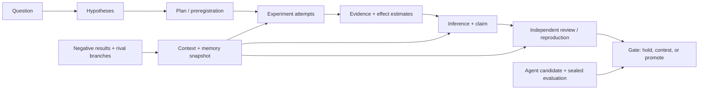
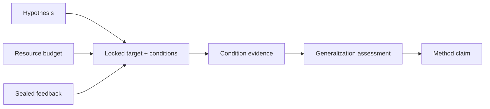
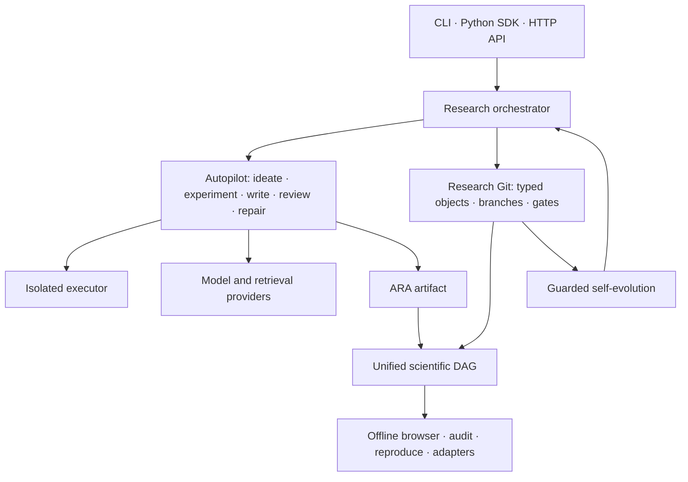

<p align="center">
  
</p>

<h1 align="center">XScientist</h1>

<p align="center"><strong>Autonomous research you can audit, fork, and reproduce.</strong></p>

<p align="center">
  Turn a falsifiable question into experiments, an evidence DAG, review gates,
  and a paper — with every decision versioned like code.
</p>

<p align="center">
  <a href="https://pypi.org/project/xscientist/"></a>
  <a href="https://pypi.org/project/xscientist/"></a>
  <a href="https://pypi.org/project/xscientist/"></a>
  <a href="https://github.com/smileformylove/XScientist/actions/workflows/smoke.yml"></a>
  <a href="LICENSE"></a>
  <a href="https://arxiv.org/abs/2607.12301"></a>
</p>

<p align="center">
  <a href="#two-minute-local-demo">Quick start</a> ·
  <a href="#run-an-autonomous-study">Autonomous run</a> ·
  <a href="#from-a-better-score-to-a-transferable-method">Method discovery</a> ·
  <a href="#research-git-for-humans-and-agents">Research Git</a> ·
  <a href="docs/RESEARCH_PROTOCOL_V2.md">Protocol</a> ·
  <a href="docs/README.zh.md">中文</a>
</p>

XScientist is a local-first research system and an open scientific protocol. It
can plan, execute, criticize, repair, and package computational studies, while
preserving the question, context, failed attempts, evidence, decisions, and
claims as a machine-readable history. Humans and agents can inspect an earlier
commit, challenge it on a branch, or continue from an exact experiment node.

> [!IMPORTANT]
> XScientist is **alpha research software**, not an oracle. Local Research Git
> is free and works without an API key. Autonomous runs use external models,
> can incur cost, and execute generated code only through the configured
> isolation boundary. Machine-generated claims remain unverified until the
> required evidence and independent gates exist.

This README tracks `main`, including features planned for the next release.
The latest stable PyPI package is `0.1.1`; see [Install and compatibility](#install-and-compatibility)
before choosing a release channel.

## Choose your path

| Goal | Time to first value | Needs an API key? | Start here |
| --- | --- | --- | --- |
| Learn the protocol and visualize a research DAG | A few minutes | No | [Two-minute local demo](#two-minute-local-demo) |
| Run a question through the autonomous pipeline | Setup plus model/experiment runtime | Yes | [Run an autonomous study](#run-an-autonomous-study) |
| Review, branch, diff, or reproduce past work | Immediate for an existing repository or ARA | No for inspection | [Research Git](#research-git-for-humans-and-agents) |
| Embed XScientist in another tool | Depends on the integration | Only for model-backed actions | [SDK, API, and adapters](#sdk-api-and-adapters) |

## Two-minute local demo

This path creates a real Research Git repository and an offline DAG browser. It
does not call a model or run an experiment.

Requirements: Python 3.10+ and Git.

```bash
# Install the current main branch documented by this README.
python -m pip install \
  "xscientist @ git+https://github.com/smileformylove/XScientist.git@main"

xscientist git doctor
xscientist research start ./retrieval-study \
  --question "Does retrieval improve factual accuracy?" \
  --hypothesis "Retrieval reduces unsupported claims." \
  --falsifier "No improvement on a held-out benchmark."

cd retrieval-study
xscientist research status
xscientist research dag --output ./research-dag
```

Open `research-dag/research-dag.html` in any browser. The initial graph contains
the question, research goal, and falsifiable hypothesis. `research start` also
prints the next valid exploratory and confirmatory commands, so a new user does
not need to know object IDs or Git internals.

Continue interactively:

```bash
xscientist research guide

# Exploratory path: compare explanations before locking a study.
xscientist research plan @latest:hypothesis \
  "Compare retrieval against a no-retrieval baseline" \
  --test "A held-out benchmark separates the explanations"

# Confirmatory path: lock the design before observing the result.
xscientist research preregister @latest:hypothesis \
  --dataset DATASET \
  --metric factual_accuracy \
  --baseline no_retrieval \
  --split-file SPLIT_FILE \
  --registered-by human:YOUR_NAME
```

Selectors such as `@latest:hypothesis` remove most ID copying. The CLI keeps
the full immutable IDs in the repository for reproducibility.

## Run an autonomous study

`xscientist start` is the guarded one-command entry point. It creates or reuses
a workspace, configures one provider, establishes a local research identity,
initializes Research Git, validates the isolated executor, and starts Autopilot
from one question.

### 1. Install one provider profile

```bash
python -m pip install \
  "xscientist[research,openai,ml,pdf-layout] @ git+https://github.com/smileformylove/XScientist.git@main"
```

Provider extras are modular: `openai`, `anthropic`, `zhipu`, `bedrock`,
`vertex`, and `openai-compatible`. The last profile covers DeepSeek, Gemini,
OpenRouter, Hugging Face inference, Ollama, and generic compatible endpoints.

### 2. Start from a question

The example below is an explicitly exploratory computational study. The CLI
prompts for a missing credential using hidden input; existing environment
variables take precedence.

```bash
xscientist start ./ood-reflection \
  --question "Why does retrieval-guided reflection fail out of distribution?" \
  --provider openai \
  --model openai/gpt-4.1 \
  --autopilot discovery \
  --allow-synthetic-data \
  --max-cost-usd 10 \
  --build-executor
```

For empirical work, replace `--allow-synthetic-data` with `--data-dir ./data`.
XScientist hashes every input before model calls and mounts the snapshot
read-only. Use `--max-project-tokens`, `--max-project-hours`, and
`--max-cost-usd` as hard project limits; unknown model pricing fails closed
when a cost limit is active.

Autopilot profiles make the main trade-off explicit:

| Profile | Best for | Behavior |
| --- | --- | --- |
| `balanced` | First complete run | Cost-bounded search and standard review/repair |
| `discovery` | Mechanism finding | More rival hypotheses, branch diversity, and refutation pressure |
| `publication` | Candidate manuscript | Multi-role review board and stricter submission gates |

If setup stops, run the same command again after following its diagnostic. The
question is pinned to the workspace and completed work is resumed instead of
silently restarted.

### What the autonomous loop produces

```text
question + constraints
        ↓
ideas + ranked alternatives
        ↓
isolated experiments + failed branches + metrics
        ↓
evidence-bound insights + hostile review + repair
        ↓
paper candidates + integrity report + release gates
        ↓
Research Git history + ARA bundle + offline scientific DAG
```

The loop is operationally end to end, but scientific roles remain separate.
Internal agents may propose, execute, criticize, and synthesize; they do not
count as independent replication. Autonomous insight reports are labeled
`machine_synthesized_unverified` and stay behind a hold gate until stronger
evidence exists.

## Why XScientist

Many research agents optimize for the last artifact: an answer or a PDF.
XScientist optimizes for the inspectable path that makes the artifact credible
and reusable.

| Capability | What XScientist records |
| --- | --- |
| Scientific reasoning | Questions, hypotheses, premises, assumptions, warrants, estimands, effect estimates, and inference decisions |
| Exact context and memory | A hash-bound snapshot of visible evidence, negative results, prior decisions, policy, source closure, and external memory refs |
| Experiments | Plans, locked preregistrations, code, environment, data hashes, attempts, failures, metrics, plots, and protocol deviations |
| Evidence and claims | Supporting, refuting, qualified, contested, superseded, reviewed, reproduced, and promoted relations |
| Collaboration | Semantic branches, diffs, blame, merge previews, conflict guidance, tags, bundles, restore, and revert |
| Agent self-evolution | Immutable candidates, sealed evaluations, bounded canaries, signed promotion, and content-verified rollback |
| Interoperability | ARA plus RO-Crate, PROV-JSON, CWL, DVC, MLflow, OpenLineage, Croissant, and Nanopublication-oriented exchange surfaces |

## One evidence DAG, not a folder of disconnected logs

The scientific DAG links the research process, its epistemic argument, and the
exact context consumed by each decision.



The offline browser distinguishes support, refutation, verification,
self-evolution, and context/memory edges. Every node carries integrity and
closure information, enabling three different claims about a result:

- **Traceable**: the provenance path exists.
- **Replayable**: the executable artifacts and environment receipts exist.
- **Verified**: an eligible independent authority has passed the required gate.

These levels are intentionally not interchangeable. See the
[protocol v2 specification](docs/RESEARCH_PROTOCOL_V2.md),
[DAG and adapter guide](docs/RESEARCH_DAG_AND_ADAPTERS.md), and
[research integrity policy](docs/RESEARCH_INTEGRITY.md).

## From a better score to a transferable method

XScientist does not treat benchmark improvement as automatic method discovery.
Before evaluation, `research discovery plan` locks the target component,
allowed and protected code scope, fixed variables, resource limits, strong
baselines, multiple conditions, and sealed feedback. After evaluation,
`research discovery assess` distinguishes a local engineering gain from a
method that survives transfer or scale.

```bash
xscientist research discovery plan \
  @latest:hypothesis discovery.json

xscientist research discovery assess \
  @latest:experiment_design results.json \
  --evidence @latest:evidence

xscientist research claim \
  "The mechanism transfers across locked conditions." \
  --evidence @latest:evidence_synthesis \
  --contribution-level method_discovery
```

The resulting DAG makes the proof obligation visible:



Claims at `method_discovery` strength are blocked unless a passing
cross-condition assessment is linked. The assessment also rejects improvements
caused by protected-file edits, resource expansion, runner changes, missing
baselines, incomplete conditions, or broken proxy-to-target ranking. See the
[method discovery protocol](docs/METHOD_DISCOVERY_PROTOCOL.md) for complete
JSON examples and verdict semantics.

## Research Git for humans and agents

Research Git exposes scientific concepts instead of raw files. Git is the
current replaceable persistence adapter; no GitHub account, remote, or server
is required, and XScientist never auto-pushes.

### Revisit an earlier decision

```bash
xscientist research log --limit 20
xscientist research show HEAD~1
xscientist research diff HEAD~1 HEAD --deep
xscientist research objects --kind evidence
xscientist research blame rso-<evidence-object-id>

# Compile exactly what an agent should see before continuing.
xscientist research context @latest:claim \
  --intent continue \
  --budget 8000 \
  --record
```

The recorded context receipt makes later review answerable: *which evidence,
negative knowledge, policy, and memory were visible when this decision was
made?* Agents can request bounded views without losing hard evidence closure.

### Challenge work on a branch

```bash
xscientist research branch challenge/retrieval --switch
xscientist research plan @latest:hypothesis \
  "Search for a counterexample" \
  --test "A reproducible failure refutes the current mechanism"

xscientist research switch main
xscientist research merge challenge/retrieval --preview
xscientist research merge challenge/retrieval
xscientist research branch -d challenge/retrieval
```

Semantic merge detects incompatible preregistrations, metric mismatches,
opposing evidence, and ungated agent changes. A challenged claim can remain
contested while both evidence paths are preserved.

### Audit, reproduce, and carry work elsewhere

```bash
xscientist research audit --level trace
xscientist research audit --level replay
xscientist research reproduce HEAD --execute --record

xscientist research bundle --dest ./study-backup
xscientist research export --dest ./exchange
```

ARA is the node-level handoff format for another agent:

```bash
xscientist ara graph --ara /path/to/ara --write-html --open
xscientist ara context --ara /path/to/ara \
  --intent continue \
  --node NODE_ID \
  --budget 8000 \
  --receipt
xscientist ara fork --help
```

An ARA contains the exploration graph, exact node code and terminal output,
metrics, plots, environment fingerprints, repair history, Pareto candidates,
claim references, and provenance. A downstream agent can inspect, re-execute,
or fork a node without reverse-engineering the manuscript.

## Architecture



The public surface lives in `xscientist/`; workflow implementation lives in
`ai_scientist/`; versioned schemas live in `ai_scientist/protocol/`. See the
[architecture document](docs/ARCHITECTURE.md) for component boundaries.

## Install and compatibility

### Release channels

| Channel | Install | Use when |
| --- | --- | --- |
| Stable `0.1.1` | `python -m pip install "xscientist==0.1.1"` | You need the published package and its release contract |
| Current `main` | `python -m pip install "xscientist @ git+https://github.com/smileformylove/XScientist.git@main"` | You want the guided start, unified DAG, context receipts, and latest protocol work documented here |
| Contributor | `python -m pip install -e ".[research,openai,dev]" -c requirements/constraints-ci.txt` | You are changing the repository |

Pin a commit instead of `main` when an experiment must be exactly repeatable.
Published releases follow semantic versioning; ARA and Research VCS schemas
have independent versioned identities.

### Optional extras

| Extra | Purpose |
| --- | --- |
| `research` | Recommended end-to-end research runtime |
| `openai`, `anthropic`, `zhipu` | One direct model client |
| `openai-compatible` | Compatible endpoints and local/server routes |
| `bedrock`, `vertex` | Managed Anthropic routes |
| `plot`, `pdf`, `pdf-layout`, `ml` | Specialist capabilities, installed only when needed |
| `service` | FastAPI/Uvicorn HTTP service |
| `trust` | Optional signing and trust primitives |
| `full` | Backward-compatible all-in-one environment |

Core CLI and protocol tests run on Python 3.10–3.12 on Linux, plus Python 3.11
on macOS and Windows. Full autonomous research additionally depends on the
chosen provider, experiment stack, Docker isolation, and optional LaTeX/PDF
tooling. GPU/CUDA is optional.

For a local clone:

```bash
git clone https://github.com/smileformylove/XScientist.git
cd XScientist
python3 -m venv .venv
source .venv/bin/activate  # Windows: .venv\Scripts\activate
python -m pip install -e ".[research,openai,dev]" \
  -c requirements/constraints-ci.txt
python -m xscientist --version
```

Use `xscientist ...` after installation. `python -m xscientist ...` is useful
inside an activated source environment; it will not follow you into another
directory unless the package is installed.

## Outputs and observability

One autonomous project typically produces:

```text
<output-root>/projects/<project>/
├── 00_config/                  pinned question and run configuration
├── 01_ideas/                   alternatives and rankings
├── 02_experiments/             code, logs, metrics, plots, reviews
├── 03_papers/                  manuscript candidates and final PDFs
├── 04_logs/                    progress, budgets, insights, gates
└── ara/                        agent-native research artifacts

<output-root>/views/<project>/research-dag/
├── research-dag.json
└── research-dag.html           offline evidence browser
```

Autonomous-run views live outside the Research Git working tree. A view written
inside a repository with `research dag --output` is excluded by the scientific
tracking policy, so regenerating it does not enter a checkpoint. Run progress is
resumable from `04_logs/progress.json` and valid experiment checkpoints.

## Safety and scientific boundaries

| Boundary | Default |
| --- | --- |
| Generated experiment code | Isolated executor; strict setups fail closed if the required image is unavailable |
| Experiment network | Disabled in strict isolation; inputs should be staged first |
| Secrets | Hidden provider input, Git-ignored private env file, redacted diagnostics |
| Remote publication | No remote is created and no automatic push occurs |
| Evidence promotion | Draft by default; verified claims require eligible evidence and independent gates |
| Negative results | Preserved as first-class history and memory, not deleted to improve a narrative |
| Self-evolution | Shadow candidate → sealed evaluation → canary → signed promotion; production mutation is opt-in |
| Human responsibility | Required for factual checking, ethics, licenses, external validity, and real-world decisions |

For sensitive domains, treat XScientist as research infrastructure, not a
substitute for institutional review, domain experts, or regulated validation.

## SDK, API, and adapters

The stable Python entry point is compact:

```python
from xscientist import ProjectRequest, XScientist

client = XScientist(output_root="./research-output")
result = client.run_project(
    ProjectRequest(
        project="retrieval-study",
        question="When does retrieval-guided reflection fail?",
        autopilot="discovery",
        allow_synthetic_data=True,
        max_cost_usd=10,
    )
)
print(result.returncode)
```

An optional FastAPI service is available through `xscientist[service]`. Tool
authors can discover platform adapters with `xscientist research adapter list`
and use the versioned `xscientist.research_adapters` entry-point contract.

See [SDK and API](docs/guides/SDK_AND_API.md),
[configuration](docs/CONFIG_REFERENCE.md), and
[DAG/adapters](docs/RESEARCH_DAG_AND_ADAPTERS.md).

## Documentation

| Need | Guide |
| --- | --- |
| First autonomous project | [Project usage](docs/guides/PROJECT_USAGE.md) |
| Understand current onboarding difficulty and targets | [Onboarding audit](docs/ONBOARDING_AUDIT.md) |
| Research Git commands and mental model | [Local Research Git](docs/LOCAL_RESEARCH_GIT.md) |
| Protocol guarantees and migration | [Research protocol v2](docs/RESEARCH_PROTOCOL_V2.md) · [migration](docs/PROTOCOL_MIGRATION_2026.md) |
| Evidence DAG and integrations | [DAG and adapters](docs/RESEARCH_DAG_AND_ADAPTERS.md) |
| Engineering gain vs. method discovery | [Method discovery protocol](docs/METHOD_DISCOVERY_PROTOCOL.md) |
| Context and memory invariants | [Epistemic graph](docs/EPISTEMIC_GRAPH_SPEC.md) · [science constitution](docs/SCIENCE_CONSTITUTION.md) |
| Scientific integrity and evaluation | [Research integrity](docs/RESEARCH_INTEGRITY.md) · [evaluation governance](docs/EVALUATION_GOVERNANCE.md) |
| Controlled self-evolution | [Self-evolution architecture](docs/SELF_EVOLUTION_ARCHITECTURE.md) · [evolution gate](docs/EVOLUTION_GATE.md) |
| ARA retention, bundles, and GC | [ARA storage lifecycle](docs/ARA_STORAGE_LIFECYCLE.md) |
| Long-running daemon operations | [Long-running guide](docs/LONG_RUNNING_GUIDE.md) |
| Architecture, engineering, and release policy | [Architecture](docs/ARCHITECTURE.md) · [engineering](docs/ENGINEERING.md) |

## Project status and roadmap

The repository is in alpha. The strongest surfaces are immutable scientific
history, provenance, safety defaults, protocol schemas, and offline handoff.
The main adoption work now is reducing provider/runtime setup, publishing a
provider-free sample ARA, adding a polished recorded demo, and measuring
time-to-first-value across clean machines. The detailed, testable strategy is
in the [onboarding audit](docs/ONBOARDING_AUDIT.md).

The project is building toward:

- one provider-free demo command with a bundled evidence DAG;
- end-to-end golden journeys in CI on all supported operating systems;
- more external adapters and protocol conformance fixtures;
- public reproducibility benchmarks and example studies;
- a hosted documentation site and searchable protocol reference.

## Contributing

Issues, protocol proposals, adapters, reproducible examples, and focused pull
requests are welcome.

- Read the [contributing guide](.github/CONTRIBUTING.md).
- Use the [issue templates](.github/ISSUE_TEMPLATE/) for bugs and features.
- Follow the [code of conduct](.github/CODE_OF_CONDUCT.md).
- Report vulnerabilities through the [security policy](.github/SECURITY.md),
  not a public issue.

Common checks:

```bash
make syntax
make engineering
make test
make coverage
make package-check
```

Changes to protocol schemas, evidence binding, context selection,
re-execution, or CAS reachability require compatibility tests.

## Papers, examples, and citation

- System report: [XScientist: A Git-Like Research Protocol for Long-Running Autonomous Scientific Discovery](https://arxiv.org/abs/2607.12301)
- Paper source: [`paper/xscientist_arxiv/`](paper/xscientist_arxiv/)
- Example system report: [`example/XScientist_Board.pdf`](example/XScientist_Board.pdf)
- Example gravitation manuscript: [`example/icml_submitted_gravitation_paper.pdf`](example/icml_submitted_gravitation_paper.pdf)

If XScientist contributes to a research result, record the software commit,
configuration, model versions, data identities, and ARA/Research Git artifact
IDs. GitHub can also read the repository's [`CITATION.cff`](CITATION.cff).

```bibtex
@misc{xscientist_arxiv_2607_12301,
  title        = {XScientist: A Git-Like Research Protocol for Long-Running Autonomous Scientific Discovery},
  author       = {Luo, Jixiang},
  year         = {2026},
  eprint       = {2607.12301},
  archivePrefix = {arXiv},
  doi          = {10.48550/arXiv.2607.12301},
  url          = {https://arxiv.org/abs/2607.12301}
}
```

## Acknowledgements

XScientist builds on ideas and open-source work from
[The AI Scientist](https://github.com/SakanaAI/AI-Scientist),
[autoresearch](https://github.com/karpathy/autoresearch),
[AIDE](https://github.com/WecoAI/aideml), and the broader reproducible-science
ecosystem. See source headers and dependency metadata for specific licenses and
attribution.

## License

Apache-2.0. See [LICENSE](LICENSE).
