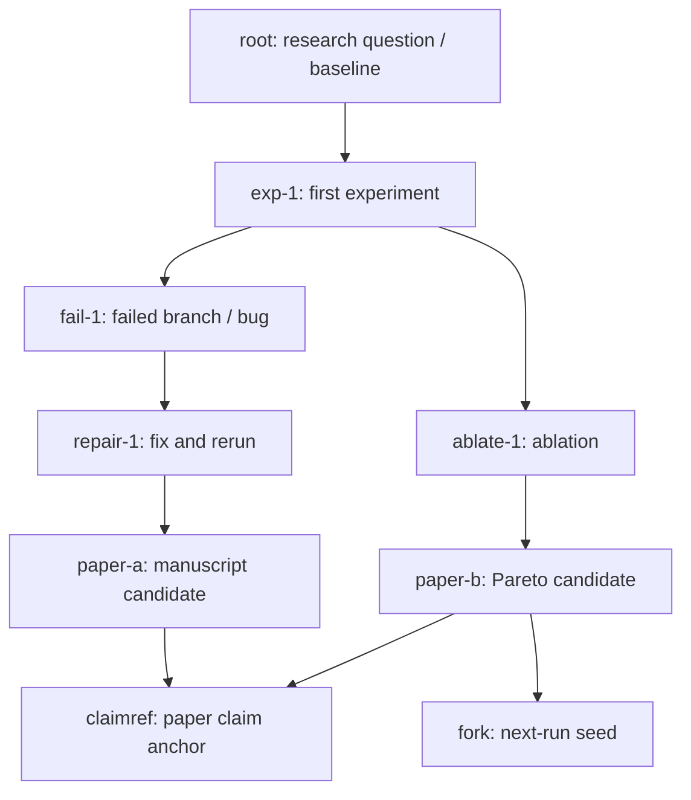

# XScientist

[](LICENSE)

Chinese README: [README.zh.md](README.zh.md)

> A sustainable, self-improving autonomous research system: idea generation, experiment execution, paper writing, self-review loops, strategy scheduling, and long-running daemon ops.
> Going a step further — we're not just building "better autonomous research"; we're building a **git-like protocol for research**, expanding outward along an automation tech tree whose root nodes are mathematics and physics.

XScientist is not built to "generate one paper once". It is designed as an operational research pipeline that can run continuously, stay observable, and produce handoff-ready artifacts (plans, evidence, reviews, repair tasks, quality gates, and reports) for iterative improvement and collaboration. Those artifacts conform to a standalone protocol (`ai_scientist/protocol/`, ARA v1), so any other implementation can read, write, diff, or fork them.

System report:

- arXiv: [2607.12301](https://arxiv.org/abs/2607.12301) — *XScientist: A Git-Like Research Protocol for Long-Running Autonomous Scientific Discovery*
- Source: [`paper/xscientist_arxiv/`](paper/xscientist_arxiv/)

Important notes:

- Cost: running the system calls LLMs / retrieval services and may incur API fees and long runtimes.
- Reliability: model outputs may contain errors or hallucinations; verify key claims, data, and citations yourself.
- Output isolation: by default, run outputs are written outside this git repo (to avoid polluting an open-source repository).

---

## Contents

- [Vision: a git-like protocol for research](#vision-a-git-like-protocol-for-research)
- [Overview](#overview)
- [Key Features](#key-features)
- [Quick Start](#quick-start)
- [Configuration](#configuration)
- [Usage](#usage)
- [Outputs & Observability](#outputs--observability)
  - [Integrity Forensics](#integrity-forensics)
  - [ARA bundles (agent-facing artifact)](#ara-bundles-agent-facing-artifact)
    - [Science Exploration Tree View](#science-exploration-tree-view)
- [Example Papers](#example-papers)
- [Docs](#docs)
- [Development](#development)
- [Roadmap](#roadmap)
- [System Architecture](#system-architecture)
- [Contributing & Community](#contributing--community)
- [License](#license)
- [Acknowledgements](#acknowledgements)
- [Citation and References](#citation-and-references)

---

## Vision: a git-like protocol for research

We don't just want a better "fully automated researcher" — we want a **git-like protocol for research** that makes doing science diffable, forkable, reviewable, and rebasable, just like code:

- **Protocol before system.** `ai_scientist/protocol/` (ARA v1) pins down what a research run looks like on disk: six JSON Schemas and a `content_hash` normalisation rule. Any third-party producer or consumer can implement the same protocol without depending on the rest of XScientist — the same way git is not the only tool that reads a git object database.
- **Every run is a commit.** An ARA archives the exploration graph, per-node `code / term_out / metrics / plots`, failed branches, the repair trajectory, the Pareto pool, and an environment fingerprint. Every manuscript claim is pinned back to its evidence node via `\claimref{node_id}`.
- **Fork-continue, not cold-start.** Any node can be `run_ara_fork.py fork`-ed into a directory that is itself a conformant ARA. The next run seeds from it, and provenance lands automatically in the child ARA — across systems, teams, or long time gaps.
- **An automation tech tree with maths and physics at the root.** We believe the parts of science that are automatable form a *tree*: **mathematics and physics are the root nodes**, where "protocol / evidence / verification" signals are strongest and machines can safely go furthest; the further out you go toward engineering, human factors, or social science, the more indispensable human judgment becomes. XScientist starts near the root — automate what is verifiable, reproducible, and forkable, and surface the rest to human reviewers explicitly.

In one line: **make research a protocol; make the system one implementation of that protocol.**<br/>
See [`ai_scientist/protocol/SPEC.md`](ai_scientist/protocol/SPEC.md) and the [ARA bundles](#ara-bundles-agent-facing-artifact) / [fork-continue](#fork-continue-from-an-ara) sections below for the concrete surface.

---

## Overview

Think of XScientist as a "research operating system":

- Input: topics / sources / constraints (budget, stop conditions, quality gates)
- Process: ideation -> experiments -> writing -> self-review -> repair/rewrite -> packaging
- Output: reusable research assets (reports, paper drafts, review/repair queues, run index, handoff briefs)

Core loop (simplified):


---

## Key Features

- Self-review loop: multi-round self-review produces structured issues + repair plans, and enforces regression/coverage gates.
- Measurable experiment TODO closure: turns "missing evidence" into explicit TODOs and tracks closure progress.
- Long-running daemon: continuous execution, failure protection, source scheduling, trend reports, handoff briefs, and strategy feedback.
- Enhanced feedback system: multi-source feedback collection, real-time health monitoring, trend analysis, automated action generation.
- Observability and replay: critical stage artifacts are written as structured files (JSON/MD) for comparison and post-mortems.
- Engineering safeguards: login guard, preflight/repo validation, config schemas, output directory isolation.
- Agent-Native Research Artifact (ARA) export: every finished run also writes a machine-readable bundle under `<project_dir>/ara/`, containing the full exploration graph, per-node `code.py` / `term_out.log` / `metrics.json` / `plots.json`, the Pareto pool, repair history, an environment fingerprint, and a scan of `\claimref{node_id}` markers from the LaTeX source. Companion CLI `run_ara_fork.py` can inspect / re-execute / fork any node so a downstream AI scientist can continue or verify prior work without decoding the PDF; `exploration_graph.html` presents each paper's process as a browser-viewable science exploration tree.

Public interfaces:

- `xscientist`: unified CLI installed from PyPI
- `from xscientist import XScientist, ProjectRequest`: stable Python SDK
- `from xscientist import create_app`: optional FastAPI application factory

Legacy-compatible entrypoints:

- `run_project.py`: single-project end-to-end run (good for local debugging and reproducing a run)
- `continuous_paper_generator.py`: continuous/batch generation
- `continuous_research_daemon.py`: long-running autonomous scheduling
- `research_manager.py`: index + boards (filtering, exporting, packaging)
- `run_ara_fork.py`: inspect / re-execute / fork a single node from an ARA bundle

The four main workflow scripts are thin aliases. Their implementations live in
`ai_scientist/apps/{project,batch,daemon,manager}.py`; PyPI users should prefer
the `xscientist` commands above.

---

## Quick Start

### 0) Prerequisites

- Python: 3.10+ (3.11 recommended)
- System deps (recommended):
  - LaTeX toolchain (to compile paper PDFs, e.g., TeX Live / MacTeX)
  - `poppler` (PDF processing/extraction)
  - `chktex` (optional LaTeX lint)

> GPU/CUDA is optional. If you need GPU acceleration, install the matching PyTorch build following the official PyTorch instructions.

### 1) Install

From PyPI (recommended for users):

```bash
pip install "xscientist[full]"
pip install "xscientist[full,service]"  # include the HTTP API
```

For repository development:

```bash
conda create -n xscientist python=3.11 -y
conda activate xscientist

pip install -e ".[full,service,dev]"
```

More reproducible (CI-style) install (optional):

```bash
pip install -r requirements.txt -c constraints-ci.txt
```

Verify the installation:

```bash
xscientist info
python -c "from xscientist import XScientist, ProjectRequest; print('ready')"
```

### 2) Configure API keys (as needed)

Set the env vars for your provider(s) (you do not need all of them):

```bash
export OPENAI_API_KEY="..."
export ZHIPU_API_KEY="..."
export GEMINI_API_KEY="..."
export S2_API_KEY="..."
```

### 3) Login (required)

```bash
xscientist auth login --user <your_name>
xscientist auth status
```

Login guard doc: `docs/LOGIN_GUARDRAIL.md`

### 4) Preflight (recommended)

```bash
python3 preflight_check.py --strict
xscientist validate
make smoke
```

### 5) Isolate AI-generated experiment code

The BFTS executor supports `process`, `docker`, and `auto` backends under the
`exec:` section of `bfts_config*.yaml`. `auto` prefers Docker and records any
fallback to the non-isolated process backend in each node/ARA. For trusted,
submission-grade runs, set `require_isolation: true` so execution fails closed
when Docker is unavailable. The Docker policy drops capabilities, disables
network access by default, uses a read-only root filesystem, and applies CPU,
memory, and PID limits. The bundled image installs the CPU PyTorch build; GPU
runs should use a CUDA-specific image and an explicit device policy. Build or
provide an image containing the experiment dependencies and pin `docker_image`
by digest for reproducible runs. Metric parsing and plotting remain offline.
The experiment phase may use bridge networking when
`allow_experiment_network: true` is enabled for dataset/model downloads;
it is disabled by default and should be turned off again after inputs are
cached. `require_isolation: true` rejects networked
experiment execution, so strict runs must place required inputs in the run
workspace before execution. Container downloads are cached inside that
workspace rather than writing to shared host caches. Only the run workspace is
writable; configured data and run-log directories are mounted read-only.

```bash
make executor-image
```

---

## Configuration

### Output directory (do not write into the repo by default)

To keep the repo clean, outputs are written to a sibling directory by default:

- Default output root: sibling `<repo-name>_outputs`; for this repo that is `../XScientist_outputs`
- Priority: `RESEARCH_OUTPUT_DIR` > `AI_SCIENTIST_OUTPUT_DIR` > default sibling dir
- Fallback: if the sibling dir is not writable, use a system data dir (e.g., `~/.local/share/ai_scientist/research`)

Recommended: set an explicit output root.

```bash
export RESEARCH_OUTPUT_DIR="/path/to/my_xscientist_outputs"
```

### Strict fallback policy (debugging note)

Most scripts support stricter quality gates. During local debugging you may choose to relax strict fallbacks via `--override-strict-fallbacks` (not recommended for serious runs).

---

## Usage

### A) Run a single project from a topic

```bash
xscientist project my_project \
  --output-root "$RESEARCH_OUTPUT_DIR" \
  --topic examples/example_topic.md
```

More usage: `docs/guides/PROJECT_USAGE.md`

### B) Continuous/batch generation

```bash
xscientist batch \
  --research-dir "$RESEARCH_OUTPUT_DIR" \
  --topic examples/example_topic.md \
  --paper-types icbinb
```

### C) Long-running daemon (recommended for continuous iteration)

```bash
xscientist daemon \
  --source-config configs/sources/stable_source_priority.example.json \
  --duration-hours 24 \
  --enable-rewrite-followup \
  --auto-source-quality-feedback \
  --auto-quality-strategy-feedback \
  --auto-quality-governor \
  --auto-evidence-strategy-feedback \
  --auto-export-submission-dossier \
  --auto-failure-guard \
  --serve-dashboard \
  -- --submission-mode --num-ideas 3
```

Python SDK:

```python
from xscientist import ProjectRequest, XScientist

client = XScientist(output_root="./research-output")
result = client.run_project(
    ProjectRequest(project="my_project", topic="examples/example_topic.md")
)
print(result.returncode, result.stdout)
```

HTTP API:

```bash
xscientist serve --host 0.0.0.0 --port 8000 --output-root ./research-output
curl -X POST http://127.0.0.1:8000/v1/projects \
  -H 'content-type: application/json' \
  -d '{"project":"demo","topic":"examples/example_topic.md"}'
```

Set `XSCIENTIST_API_KEY` and send it as `X-API-Key` when exposing the service
beyond localhost.

See [`docs/guides/SDK_AND_API.md`](docs/guides/SDK_AND_API.md) for the public
package structure, SDK contract, API endpoints, and deployment guidance.

Submission-grade and high-quality runs enable deterministic integrity forensics by default. You can also control it explicitly:

```bash
# Force integrity forensics for the final manuscript.
xscientist project my_project \
  --output-root "$RESEARCH_OUTPUT_DIR" \
  --topic examples/example_topic.md \
  --integrity-forensics

# Temporarily disable it during high-quality debugging.
xscientist batch \
  --research-dir "$RESEARCH_OUTPUT_DIR" \
  --topic examples/example_topic.md \
  --paper-types icbinb \
  --high-quality-mode \
  --no-integrity-forensics
```

Common ops commands:

```bash
bash run_stable_daemon.sh status
bash run_stable_daemon.sh brief
bash run_stable_daemon.sh handoff
bash run_stable_daemon.sh report-trends
bash run_stable_daemon.sh source-plan
```

### D) Feedback system monitoring

```bash
# Check system health
xscientist feedback --feedback-dir ./feedback status

# View recommended actions
xscientist feedback --feedback-dir ./feedback actions

# Analyze trends
xscientist feedback --feedback-dir ./feedback trends \
  --metrics quality_score success_rate error_rate

# Export report
xscientist feedback --feedback-dir ./feedback report
```

More usage: `docs/guides/FEEDBACK_QUICKSTART.md`

---

## Outputs & Observability

XScientist writes structured artifacts under the output root (directory names may evolve across versions):

- `projects/`: full per-project directories
- `experiments/`: experiment outputs and logs
- `ideas/`: idea artifacts
- `papers/`: per-paper directories from batch generation
- `batches/`: continuous-generator batch progress and reports
- `cache/`: HuggingFace / Torch / wandb runtime caches
- `reports/`: trends/handoff reports (daemon)
- `knowledge_base/`: cross-project memory (e.g., self-evolution history/playbook)

Common index/board commands (see `xscientist manager --help` for more):

```bash
xscientist manager rebuild-index
xscientist manager submission-board --top 5 --require-gate
xscientist manager rewrite-board --top 10
xscientist manager repair-board --top 20 --priority-tier p0
xscientist manager evolution-board --top 20
xscientist manager process-board --status blocked --top 30
```

### Integrity Forensics

XScientist runs deterministic integrity forensics near the final-manuscript stage to catch hard submission risks before the submission gate, including evidence/claim consistency and anomalous signals surfaced in structured reports. This is not a replacement for human review or factual verification; it is a reproducible machine check that writes artifacts other agents can inspect.

Default behavior:

- Enabled automatically when `--submission-mode` or `--high-quality-mode` is active.
- Disabled by default for ordinary runs, but `--integrity-forensics` forces it on.
- `--no-integrity-forensics` explicitly disables it for debugging or cost-sensitive runs.
- Supported by `run_project.py`, `continuous_paper_generator.py`, `launch_scientist_bfts.py`, and `launch_scientist_zhipu.py`.

Per-manuscript artifacts are written under that run's `integrity_forensics/` directory, usually including a JSON report and a Markdown summary. Project and batch summaries record `integrity_forensics_status`, `integrity_forensics_verdict`, finding counts, and report paths, and shortlists surface the same signal. `HARD_FLAGS` blocks submission-ready acceptance; `SOFT_FLAGS` is reported but does not block by itself.

### ARA bundles (agent-facing artifact)

Every successful `run_project.py` also emits a machine-readable "Agent-Native Research Artifact" under `<project_dir>/ara/<timestamp>_<idea>/`. The goal: another AI scientist can fork or re-execute prior work directly, without having to decode the PDF.

Typical layout:

```
<project_dir>/ara/<timestamp>_<idea>/
├── manifest.json              # top-level pointer to everything below
├── exploration_graph.json     # tree-search DAG: nodes + parent/child edges
├── exploration_graph.html     # browser-viewable exploration-tree visualization
├── exploration_graph.summary.json # DAG summary (roots / leaves / topological order)
├── nodes/<node_id>/
│   ├── code.py                # exact code the node ran
│   ├── term_out.log           # untrimmed stdout/stderr
│   ├── metrics.json           # metric + analysis + is_buggy
│   ├── plots.json             # plot paths + VLM analyses
│   ├── env.json               # python version / expected cwd
│   └── run.sh                 # one-shot re-runner
├── claims/                    # `\claimref{node_id}` markers scanned from the .tex
├── repair_history.jsonl       # repair reflection / verifier / attempts
├── pareto_pool.json           # non-dominated manuscript candidates
├── env/
│   ├── bfts_config.yaml
│   └── model_fingerprint.json
└── README.md                  # agent-facing entry point
```

#### Science Exploration Tree View

Every ARA records a paper run as a directed acyclic graph (DAG): the root is usually the initial plan or baseline, while child nodes are experiments, ablations, repairs, failed branches, or manuscript candidates. Users can open `exploration_graph.html` directly to browse this science exploration tree, or run `run_ara_fork.py graph --json` to read the same graph as structured data.

Conceptually:



This tree shares provenance with the git-like record, CLI logs, and node diffs: `exploration_graph.json` is the source of truth, while `exploration_graph.html`, `exploration_graph.summary.json`, `run_ara_fork.py log`, `run_ara_fork.py diff --only-node`, and `run_ara_fork.py fork` are different views over the same graph. If the ARA directory is committed to git, git captures the file-level snapshot of that graph; XScientist's log/diff/fork commands expose the node-level history. So if a paper claim comes from `candidate2`, you can trace back through its parent experiment, failed repair path, ablation evidence, and the node that can seed the next fork.

The `run_ara_fork.py` CLI ships `inspect` / `exec` / `fork` / `freeze` / `validate` / `verify` / `graph` and related sub-commands:

```bash
# Print a node's metric / analysis / code size.
xscientist ara inspect \
  --ara <project_dir>/ara/<timestamp>_<idea> \
  --node-id <node_id>

# Re-execute a node and write a verify report (fresh vs recorded metric).
xscientist ara exec \
  --ara <project_dir>/ara/<timestamp>_<idea> \
  --node-id <node_id>

# Fork a node into a fresh directory that is itself a valid ARA
# (own manifest, single-node exploration graph, provenance to parent).
xscientist ara fork \
  --ara <project_dir>/ara/<timestamp>_<idea> \
  --node-id <node_id> \
  --dest /path/to/fork_seed

# Snapshot the current interpreter's pip freeze into env/.
xscientist ara freeze --ara <project_dir>/ara/<timestamp>_<idea>

# Run conformance validation against ai_scientist/protocol/SPEC.md.
xscientist ara validate --ara <project_dir>/ara/<timestamp>_<idea>

# Check the DAG invariant and regenerate the visualization if needed.
xscientist ara graph \
  --ara <project_dir>/ara/<timestamp>_<idea> \
  --write-html

# Batch re-execute a handful of nodes and write verify/reexec_batch_*.json.
xscientist ara verify \
  --ara <project_dir>/ara/<timestamp>_<idea> \
  --limit 3
```

`exploration_graph.json` is the exploration DAG behind each paper: nodes are concrete experiments, repairs, or failed branches, and edges are parent -> child evolution links. `validate` checks that the graph is directed and acyclic; `graph --json` reports roots, leaves, topological order, and structural issues; `exploration_graph.html` is the human-facing visualization. `run_ara_fork.py log --node <id>`, `diff --only-node <id>`, and the browser view all read the same graph data.

During writing, the LLM is prompted to append `\claimref{<node_id>}` after each quantitative claim. The macro renders as nothing in the PDF, but `ai_scientist/utils/claim_registry.py` scans the LaTeX source and drops each claim into `ara/.../claims/<claim_id>.json` — giving downstream agents a two-way link between paper assertions and the tree-search nodes that produced them. `ai_scientist/utils/claim_coverage.py` aggregates those markers into a `coverage_score` and a severity band (`ok` / `sparse` / `unresolved` / `insufficient` / `none`), persisted at `ara/.../claims/coverage.json` for quality gating, ranking, and dossier scoring.

Optional: batch re-execution verification. Set the env flag and `run_project.py` will re-run a handful of top-metric nodes at the end and save a verify report:

```bash
export AI_SCIENTIST_ARA_REEXEC=1
```

Off by default because re-executing arbitrary code can hit external APIs / GPUs.

### Fork-continue from an ARA

Any ARA produced by an XScientist run can seed the next run — the very first BFTS draft reuses the code from the chosen node instead of paying for an LLM cold start, and `provenance` is written into the child ARA's `manifest.json` automatically:

```bash
# Seed from a fork directory (recommended workflow).
python3 run_project.py \
  --project-dir <B_project> \
  --seed-from-ara /path/to/fork_seed \
  --topic ...   # other normal flags

# Or seed directly from a node inside an existing ARA (fork + seed in one step).
python3 run_project.py \
  --project-dir <B_project> \
  --seed-from-ara <A_project>/ara/<timestamp>_<idea> \
  --seed-node-id <node_id>
```

Under the hood the seed manifest is passed through the `AI_SCIENTIST_ARA_SEED_PATH` env var, so the short-circuit also applies inside parallel workers. Protocol details in [`ai_scientist/protocol/SPEC.md`](ai_scientist/protocol/SPEC.md) §7.

### Protocol package

`ai_scientist/protocol/` is a standalone, portable protocol package (`ara.v1`): six JSON Schemas, a `content_hash` normalisation algorithm, and a minimal conformance validator. Third-party producers / consumers can implement the same protocol without depending on the rest of XScientist — useful for letting another agent consume our ARAs, for cross-system provenance tracking, or as a `--strict` gate in CI. Full spec: [`ai_scientist/protocol/SPEC.md`](ai_scientist/protocol/SPEC.md).

### A/B evidence harness

To check that the ARA seed actually accelerates the next run (rather than just feeling like it does), run `ai_scientist/experiments/ara_ab/`:

```bash
# CI-safe: no real LLM calls, only verifies that the seed short-circuits.
python -m ai_scientist.experiments.ara_ab.harness stub \
    --seed-manifest <project>/.ara_seed/ara_seed.json \
    --out-dir /tmp/ab_out

# Full run: shells out to run_project.py twice (baseline vs seeded). Needs API keys.
python -m ai_scientist.experiments.ara_ab.harness real \
    --project-dir-baseline /tmp/ab_baseline \
    --project-dir-seeded   /tmp/ab_seeded \
    --seed-from-ara /path/to/fork \
    --out-dir /tmp/ab_out \
    -- --topic mytopic.md   # everything after `--` is forwarded to run_project.py
```

The resulting `ab_report.json` (schema `ara.ab_report.v1`) records wall-clock, LLM call counts, node counts, and content-hash overlap for both arms, plus a verdict (`seed_saved_llm_calls` / `seed_wall_clock_faster` / `seed_did_not_short_circuit` / `seed_inconclusive`).

---

## Example Papers

Example papers and related submission artifacts are collected in `example/` for checking paper formatting, supplementary material organization, and final delivery structure.

Currently organized example files:

- [example/XScientist_Board.pdf](example/XScientist_Board.pdf): XScientist Board paper/report PDF.
- [example/icml_submitted_gravitation_paper.pdf](example/icml_submitted_gravitation_paper.pdf): ICML-submitted gravitation manuscript PDF.

---

## Docs

- `docs/guides/PROJECT_USAGE.md`: `run_project.py` usage and flags
- `docs/guides/SDK_AND_API.md`: PyPI installation, Python SDK, CLI, and HTTP API
- `docs/guides/FEEDBACK_QUICKSTART.md`: Feedback system quick start guide
- `docs/CONFIG_REFERENCE.md`: detailed configuration and parameters
- `docs/SOURCE_ORCHESTRATION.md`: source queue orchestration and recommended run postures
- `docs/LONG_RUNNING_GUIDE.md`: Long-running operations guide
- `docs/LOGIN_GUARDRAIL.md`: login guard and session management
- `docs/guides/OUTPUT_DIRECTORIES.md`: output directory policy (if it diverges from code, follow `ai_scientist/config/paths.py`)
- `ARCHITECTURE.md`: System architecture documentation
- `OPTIMIZATION_SUMMARY.md`: Optimization summary

---

## Development

- Unit tests: `make test`
- Syntax/import/validation smoke: `make smoke`
- Stricter local doctor: `make doctor` (requires a valid login session)
- Formatting: `make format`

---

## Roadmap

XScientist aims to move autonomous research from "one-shot paper generation" toward long-running, reproducible, reviewable, submission-ready infrastructure. Issues and PRs welcome (see `CONTRIBUTING.md`).

- **Near term**: ship a reproducible submission-ready example; harden preflight and delivery checklists; wire TODO closure into quality gates.
- **Mid term**: bidirectional evidence↔figure/table/metric binding; dossier consistency/regression checks; multi-reviewer aggregation.
- **Long term**: daemon adapts strategy from historical metrics; cross-project knowledge base; standard benchmarks / leaderboards; fuller English docs and plugin API.

---

## System Architecture

For detailed architecture documentation, see: [ARCHITECTURE.md](ARCHITECTURE.md)

Core components:
- **Ideation Engine**: Idea generation and ranking
- **Experiments Engine**: Experiment execution and evidence collection
- **Writeup Engine**: Paper writing and compilation
- **Self-Review Engine**: Self-review and repair
- **Autonomous Evolution Engine**: Autonomous evolution and strategy optimization
- **Adaptive Learning Engine**: Adaptive learning and recommendations
- **Enhanced Feedback System**: Enhanced feedback and monitoring

## Contributing & Community

- Contributing guide: `CONTRIBUTING.md`
- Code of conduct: `CODE_OF_CONDUCT.md`
- Security policy: `SECURITY.md`
- Architecture docs: `ARCHITECTURE.md`

---

## License

Apache-2.0. See `LICENSE`.

---

## Acknowledgements

Thanks to the open-source projects that inspired parts of this work:

- [Sakana AI: AI Scientist](https://github.com/SakanaAI/AI-Scientist)
- [karpathy/autoresearch](https://github.com/karpathy/autoresearch)
- [awesome-ai-research-writing](https://github.com/Leey21/awesome-ai-research-writing)
- [AIDE](https://github.com/WecoAI/aideml)
- [DeepReviewer-v2](https://github.com/ResearAI/DeepReviewer-v2)

---

## Citation and References

If you use XScientist in research, please cite this project and the generated paper you used. For papers or reports, include the commit hash, experiment configuration, model versions, and output directory for reproducibility.

### XScientist

XScientist (software / repository):

```bibtex
@software{xscientist,
  title        = {XScientist},
  author       = {Luo, Jixiang},
  year         = {2026},
  url          = {https://github.com/smileformylove/XScientist}
}
```

XScientist arXiv system report:

```bibtex
@misc{xscientist_arxiv_2607_12301,
  title        = {XScientist: A Git-Like Research Protocol for Long-Running Autonomous Scientific Discovery},
  author       = {Luo, Jixiang},
  year         = {2026},
  eprint       = {2607.12301},
  archivePrefix = {arXiv},
  primaryClass = {cs.SE},
  doi          = {10.48550/arXiv.2607.12301},
  url          = {https://arxiv.org/abs/2607.12301}
}
```

XScientist Board (paper or report authored/refined with this system):

```bibtex
@misc{xscientist_board,
  title        = {XScientist Board: Artifact-Routed Submission Hardening for Autonomous Research Systems},
  author       = {{XScientist}},
  year         = {2026},
  url          = {https://github.com/smileformylove/XScientist/blob/main/example/XScientist_Board.pdf}
}
```

ICML-submitted gravitation example paper:

```bibtex
@misc{xscientist_icml_submitted_gravitation,
  title        = {A Gravitational Field Theory for Deep Networks},
  author       = {{XScientist}},
  year         = {2026},
  url          = {https://github.com/smileformylove/XScientist/blob/main/example/icml_submitted_gravitation_paper.pdf}
}
```

### Citation Notes

- When citing papers generated by XScientist, cite both this repository and the specific generated paper.
- Clearly describe any human review, filtering, rewriting, or post-processing applied to generated results.
