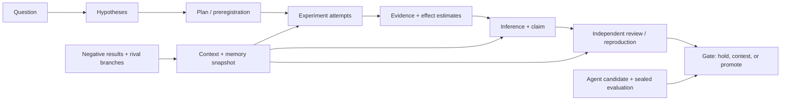
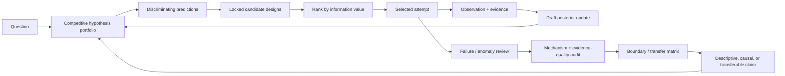
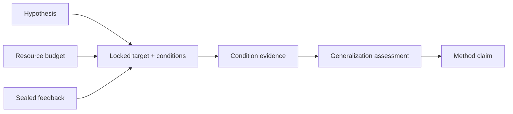
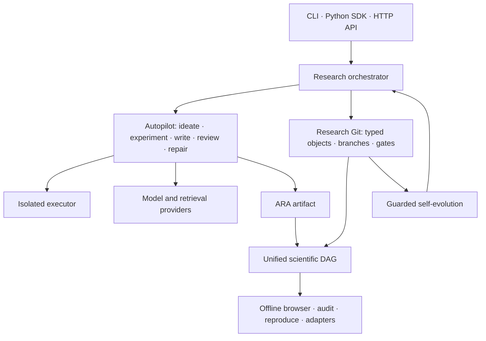

<p align="center">
  
</p>

<h1 align="center">XScientist</h1>

<p align="center"><strong>Autonomous research you can audit, fork, and reproduce.</strong></p>

<p align="center">
  Turn a falsifiable question into experiments, an evidence DAG, review gates,
  and a paper — with every decision versioned like code.
</p>

<p align="center">
  <a href="https://pypi.org/project/xscientist/"></a>
  <a href="https://pypi.org/project/xscientist/"></a>
  <a href="https://pypi.org/project/xscientist/"></a>
  <a href="https://github.com/smileformylove/XScientist/actions/workflows/smoke.yml"></a>
  <a href="LICENSE"></a>
  <a href="https://arxiv.org/abs/2607.12301"></a>
</p>

<p align="center">
  <a href="#two-minute-local-demo">Quick start</a> ·
  <a href="#run-an-autonomous-study">Autonomous run</a> ·
  <a href="#go-deeper-than-one-hypothesis">Deep research</a> ·
  <a href="#from-a-better-score-to-a-transferable-method">Method discovery</a> ·
  <a href="#research-git-for-humans-and-agents">Research Git</a> ·
  <a href="docs/RESEARCH_PROTOCOL_V2.md">Protocol</a> ·
  <a href="docs/README.zh.md">中文</a>
</p>

XScientist is a local-first research system and an open scientific protocol. It
can plan, execute, criticize, repair, and package computational studies, while
preserving the question, context, failed attempts, evidence, decisions, and
claims as a machine-readable history. Humans and agents can inspect an earlier
commit, challenge it on a branch, or continue from an exact experiment node.

> [!IMPORTANT]
> XScientist is **alpha research software**, not an oracle. Local Research Git
> is free and works without an API key. Autonomous runs use external models,
> can incur cost, and execute generated code only through the configured
> isolation boundary. Machine-generated claims remain unverified until the
> required evidence and independent gates exist.

This README documents stable `0.1.3` and the compatible surface on `main`; see
[Install and compatibility](#install-and-compatibility) before choosing a
release channel.

## Choose your path

| Goal | Time to first value | Needs an API key? | Start here |
| --- | --- | --- | --- |
| Learn the protocol and visualize a research DAG | A few minutes | No | [Two-minute local demo](#two-minute-local-demo) |
| Run a question through the autonomous pipeline | Setup plus model/experiment runtime | Yes | [Run an autonomous study](#run-an-autonomous-study) |
| Compare explanations and choose the most informative next experiment | Minutes after hypotheses exist | No for deterministic ranking | [Deep research loop](#go-deeper-than-one-hypothesis) |
| Review, branch, diff, or reproduce past work | Immediate for an existing repository or ARA | No for inspection | [Research Git](#research-git-for-humans-and-agents) |
| Embed XScientist in another tool | Depends on the integration | Only for model-backed actions | [SDK, API, and adapters](#sdk-api-and-adapters) |

## Two-minute local demo

Start here even if you eventually plan to use a paid model. This proves that
the package, Git-backed research history, evidence graph, status view, and
offline browser work before credentials or Docker enter the picture.

Requirements: Python 3.10+ and Git.

```bash
python -m pip install "xscientist==0.1.3"
xscientist demo ./first-study --autopilot --open
xscientist status ./first-study
```

Expected result:

- a complete offline study in about a few seconds;
- an evidence DAG with supporting and refuting results;
- `$0.00` cost, with no model or network access;
- a concrete next command that is safe to copy from your current directory.

The final state is deliberately `blocked`, not failed. Held-out evidence
refutes an overly broad claim, so XScientist preserves the conflict and asks
for a boundary experiment instead of manufacturing a positive conclusion. If
the browser does not open, use the path printed after `Open:`.

You can also run the repeatable first-run benchmark:

```bash
xscientist benchmark first-run --max-seconds 30
```

## Run an autonomous study

`xscientist start` is the main user entry point. It creates or reuses a
workspace, configures one provider, asks for a local research actor name,
initializes Research Git, checks the isolated executor, and starts from one
question.

Before continuing, choose one provider route.

### Route A: local Ollama

Use this route to avoid model API charges. XScientist detects models already
installed in a running Ollama service and presents them in the interactive
setup.

```bash
python -m pip install "xscientist[research,openai-compatible]==0.1.3"
xscientist start ./local-study
```

The terminal asks for the question, provider, detected model, evidence mode,
local actor name, and optional budget. Bare Ollama names such as
`qwen2.5:7b` are accepted and normalized automatically.

### Route B: hosted model provider

Install the research runtime plus exactly one provider client:

```bash
python -m pip install "xscientist[research,openai]==0.1.3"
export OPENAI_API_KEY="..."
xscientist start ./hosted-study
```

Replace `openai` with `anthropic`, `zhipu`, `bedrock`, `vertex`, or
`openai-compatible`. The last profile covers DeepSeek, Gemini, OpenRouter,
Hugging Face inference, Ollama, and generic OpenAI-compatible endpoints.

For an explicit, automation-friendly start:

```bash
xscientist start ./ood-reflection \
  --question "Why does retrieval-guided reflection fail out of distribution?" \
  --provider openai \
  --model openai/gpt-4.1 \
  --user YOUR_NAME \
  --autopilot discovery \
  --allow-synthetic-data \
  --max-cost-usd 10 \
  --non-interactive
```

Use `--data-dir ./data` instead of `--allow-synthetic-data` for empirical
work. Input data is content-hashed before model calls and mounted read-only.
Unknown model pricing fails closed when `--max-cost-usd` is active; unbundled
models can supply `--price-input-per-million` and
`--price-output-per-million` explicitly.

### Required isolation

Model-generated experiment code is never silently executed in the host Python
process. A model-backed experiment needs Docker and a version-matched executor:

```bash
xscientist executor prepare --workspace ./ood-reflection
```

If Docker is unavailable, the command stops with a direct diagnostic. The
provider-free demo and read-only Research Git operations remain usable without
Docker.

### Check readiness before spending money

```bash
xscientist provider check --workspace ./ood-reflection --max-cost-usd 10
xscientist doctor --workspace ./ood-reflection --deep
```

`provider check` validates local credential presence, client availability, and
cost enforcement; it does not make a paid or live provider request. Doctor
prints ordered, copyable repairs using the same public commands shown here.

Autopilot profiles make the main trade-off explicit:

| Profile | Best for | Behavior |
| --- | --- | --- |
| `balanced` | First complete run | Cost-bounded search and standard review/repair |
| `discovery` | Mechanism finding | More rival hypotheses, branch diversity, and refutation pressure |
| `publication` | Candidate manuscript | Multi-role review board and stricter submission gates |

### Detach and control long runs

```bash
xscientist start ./ood-reflection \
  --question "Why does the mechanism fail out of distribution?" \
  --allow-synthetic-data --max-cost-usd 10 --detach

xscientist runs list --workspace ./ood-reflection
xscientist runs show RUN_ID --workspace ./ood-reflection
xscientist runs watch RUN_ID --workspace ./ood-reflection
xscientist runs logs RUN_ID --workspace ./ood-reflection --tail 100
xscientist runs cancel RUN_ID --workspace ./ood-reflection
xscientist runs resume RUN_ID --workspace ./ood-reflection
```

Run views show state, profile, provider/model, duration, exit code, and a
bounded failure summary. Questions and exact resume arguments remain private.
Resume rechecks local prerequisites before relaunching; `--force` is available
for an intentional bypass.

### Recover from a stopped setup or run

```bash
xscientist status ./ood-reflection
xscientist doctor --workspace ./ood-reflection --deep
xscientist runs logs RUN_ID --workspace ./ood-reflection --tail 100
```

Fix the first reported blocker and rerun the original command. Workspaces pin
the research question and preserve completed checkpoints, so recovery does not
silently restart valid work. A misspelled or missing workspace path is an
error, rather than an empty successful status.

### Shell completion and compatibility checks

```bash
# Current zsh session; add this line to .zshrc if desired.
source <(xscientist completion zsh)

xscientist upgrade check --workspace ./ood-reflection
xscientist upgrade check --workspace ./ood-reflection --online
```

Completion includes practical subcommands and options but never edits shell
configuration. Upgrade checks are read-only and offline unless `--online` is
explicitly present.

### Continue the offline demo by hand

```bash
xscientist research guide --repo ./first-study
xscientist research plan @latest:hypothesis \
  "Compare retrieval against a no-retrieval baseline" \
  --test "A held-out benchmark separates the explanations" \
  --repo ./first-study
```

After recording the plan, `status` advances to the boundary experiment instead
of repeating the same instruction. Selectors such as `@latest:hypothesis`
avoid manual ID copying while immutable full IDs remain in the repository.

### What the autonomous loop produces

```text
question + constraints
        ↓
ideas + ranked alternatives
        ↓
isolated experiments + failed branches + metrics
        ↓
evidence-bound insights + hostile review + repair
        ↓
paper candidates + integrity report + release gates
        ↓
Research Git history + ARA bundle + offline scientific DAG
```

The loop is operationally end to end, but scientific roles remain separate.
Internal agents may propose, execute, criticize, and synthesize; they do not
count as independent replication. Autonomous insight reports are labeled
`machine_synthesized_unverified` and stay behind a hold gate until stronger
evidence exists.

## Why XScientist

Many research agents optimize for the last artifact: an answer or a PDF.
XScientist optimizes for the inspectable path that makes the artifact credible
and reusable.

| Capability | What XScientist records |
| --- | --- |
| Scientific reasoning | Questions, hypotheses, premises, assumptions, warrants, estimands, effect estimates, and inference decisions |
| Research strategy | Competitive portfolios, discriminating predictions, expected-information-value ranking, anomalies, mechanisms, evidence-quality audits, and transfer boundaries |
| Exact context and memory | An immutable audit closure plus a budgeted, frontier-aware working set that keeps current evidence, contradictions, failures, and prior decisions visible to the agent |
| Experiments | Plans, locked preregistrations, code, environment, data hashes, attempts, failures, metrics, plots, and protocol deviations |
| Evidence and claims | Supporting, refuting, qualified, contested, superseded, reviewed, reproduced, and promoted relations |
| Collaboration | Semantic branches, diffs, blame, merge previews, conflict guidance, tags, bundles, restore, and revert |
| Agent self-evolution | Immutable candidates, sealed evaluations, bounded canaries, signed promotion, and content-verified rollback |
| Interoperability | ARA plus RO-Crate, PROV-JSON, CWL, DVC, MLflow, OpenLineage, Croissant, and Nanopublication-oriented exchange surfaces |

## One evidence DAG, not a folder of disconnected logs

The scientific DAG links the research process, its epistemic argument, and the
exact context consumed by each decision.



The offline browser filters six epistemic layers—strategy, execution, evidence,
theory, decision memory, and evolution—and distinguishes support, refutation,
verification, theory, boundary, self-evolution, and context edges. Selecting a
claim shows its strongest support and refutation, mechanism, quality audits,
applicability boundaries, open gaps, and ranked next experiment. Every node carries integrity and
closure information, enabling three different claims about a result:

- **Traceable**: the provenance path exists.
- **Replayable**: the executable artifacts and environment receipts exist.
- **Verified**: an eligible independent authority has passed the required gate.

These levels are intentionally not interchangeable. See the
[protocol v2 specification](docs/RESEARCH_PROTOCOL_V2.md),
[DAG and adapter guide](docs/RESEARCH_DAG_AND_ADAPTERS.md), and
[research integrity policy](docs/RESEARCH_INTEGRITY.md).

## Go deeper than one hypothesis

A productive autonomous loop should try to distinguish explanations, not just
accumulate support for its first idea. XScientist records that strategy as a
separate, content-addressed profile while keeping old Research Objects valid.



Start by generating the editable JSON examples, then lock at least a primary
and rival hypothesis. Candidate experiments must predict an outcome for every
portfolio member; their expected entropy reduction is combined with declared
novelty, impact, transfer value, cost, risk, and redundancy by a versioned,
deterministic policy.

```bash
xscientist research program template --output deep-research.json

xscientist research program portfolio PRIMARY_ID \
  --alternative RIVAL_ID \
  --question "Which mechanism best predicts held-out behavior?" \
  --prior PRIMARY_ID=2 --prior RIVAL_ID=1

xscientist research program prediction @latest:hypothesis_portfolio PRIMARY_ID \
  --when "The proposed mediator is ablated" \
  --expect "The effect disappears" \
  --distinguishes RIVAL_ID \
  --falsifier "The effect remains unchanged"

# Record the same-condition outcome for every rival/null member as well.
xscientist research program prediction @latest:hypothesis_portfolio RIVAL_ID \
  --when "The proposed mediator is ablated" \
  --expect "The effect remains" \
  --distinguishes PRIMARY_ID --falsifier "The effect disappears"

# Edit experiment_candidates in the generated file, then rank the whole set.
xscientist research program prioritize \
  @latest:hypothesis_portfolio deep-research.json

# The attempt must consume the design selected by that priority.
xscientist research experiment "Run selected ablation" --status completed \
  --plan SELECTED_DESIGN_ID --priority PRIORITY_ID
xscientist research evidence "The effect disappeared" --attempt ATTEMPT_ID
xscientist research program posterior PORTFOLIO_ID PRIORITY_ID ATTEMPT_ID EVIDENCE_ID \
  --observed "The effect disappeared" \
  --likelihood PRIMARY_ID=0.9 --likelihood RIVAL_ID=0.1

# Read-only review, or append a review plus newly detected anomalies.
xscientist research program review
xscientist research program review --record
```

Verified `causal` claims require a mechanism whose verified evidence traces to
a completed intervention attempt, plus a strong/moderate quality assessment by
an actor absent from the full producer lineage. `transferable` additionally
requires separate attempts/evidence for each condition and distinct
development/held-out dataset hashes. Existing v1 history remains readable;
new strategy objects use the fail-closed v2 profile:

```bash
xscientist research claim "M causes the effect across held-out domains." \
  --evidence EVIDENCE_ID --verified --gate GATE_ID \
  --depth-level transferable \
  --mechanism MECHANISM_ID --quality QUALITY_ID --transfer MATRIX_ID

xscientist research program claim @latest:claim
xscientist research dag --output ./research-dag
```

See the [deep research protocol](docs/DEEP_RESEARCH_PROTOCOL.md) for object
semantics, scoring, fail-closed gates, and automation boundaries.

## From a better score to a transferable method

XScientist does not treat benchmark improvement as automatic method discovery.
Before evaluation, `research discovery plan` locks the target component,
allowed and protected code scope, fixed variables, resource limits, strong
baselines, multiple conditions, and sealed feedback. After evaluation,
`research discovery assess` distinguishes a local engineering gain from a
method that survives transfer or scale.

```bash
xscientist research discovery plan \
  @latest:hypothesis discovery.json

xscientist research discovery assess \
  @latest:experiment_design results.json \
  --evidence @latest:evidence

xscientist research claim \
  "The mechanism transfers across locked conditions." \
  --evidence @latest:evidence_synthesis \
  --contribution-level method_discovery
```

The resulting DAG makes the proof obligation visible:



Claims at `method_discovery` strength are blocked unless a passing
cross-condition assessment is linked. The assessment also rejects improvements
caused by protected-file edits, resource expansion, runner changes, missing
baselines, incomplete conditions, or broken proxy-to-target ranking. See the
[method discovery protocol](docs/METHOD_DISCOVERY_PROTOCOL.md) for complete
JSON examples and verdict semantics.

## Research Git for humans and agents

Research Git exposes scientific concepts instead of raw files. Git is the
current replaceable persistence adapter; no GitHub account, remote, or server
is required, and XScientist never auto-pushes.

### Revisit an earlier decision

```bash
xscientist research log --limit 20
xscientist research show HEAD~1
xscientist research diff HEAD~1 HEAD --deep
xscientist research objects --kind evidence
xscientist research blame rso-<evidence-object-id>

# Compile exactly what an agent should see before continuing.
xscientist research context @latest:claim \
  --intent continue \
  --budget 8000 \
  --record
```

The recorded context receipt makes later review answerable: *which evidence,
negative knowledge, policy, and memory were visible when this decision was
made?* Agents can request bounded views without losing hard evidence closure.
The durable snapshot and prompt view are intentionally separate: use
`--json` for audit/replay and `--prompt` for the compact source-bound input an
agent should actually consume. Superseded evidence stays inspectable but is
ranked as archived history; the current frontier, active contradictions, and
the newest relevant prior decision take precedence. If those semantics cannot
fit the declared budget, the context is incomplete instead of silently
dropping them.

```bash
xscientist research context @latest:claim \
  --intent continue --budget 2000 --prompt
```

### Challenge work on a branch

```bash
xscientist research branch challenge/retrieval --switch
xscientist research plan @latest:hypothesis \
  "Search for a counterexample" \
  --test "A reproducible failure refutes the current mechanism"

xscientist research switch main
xscientist research merge challenge/retrieval --preview
xscientist research merge challenge/retrieval
xscientist research branch -d challenge/retrieval
```

Semantic merge detects incompatible preregistrations, metric mismatches,
opposing evidence, and ungated agent changes. A challenged claim can remain
contested while both evidence paths are preserved.

### Audit, reproduce, and carry work elsewhere

```bash
xscientist research audit --level trace
xscientist research audit --level replay
xscientist research reproduce HEAD --execute --record

xscientist research bundle --dest ./study-backup
xscientist research export --dest ./exchange
```

ARA is the node-level handoff format for another agent:

```bash
xscientist ara graph --ara /path/to/ara --write-html --open
xscientist ara context --ara /path/to/ara \
  --intent continue \
  --node NODE_ID \
  --budget 8000 \
  --receipt
xscientist ara fork --help
```

An ARA contains the exploration graph, exact node code and terminal output,
metrics, plots, environment fingerprints, repair history, Pareto candidates,
claim references, and provenance. A downstream agent can inspect, re-execute,
or fork a node without reverse-engineering the manuscript.

## Architecture



The public surface lives in `xscientist/`; workflow implementation lives in
`ai_scientist/`; versioned schemas live in `ai_scientist/protocol/`. See the
[architecture document](docs/ARCHITECTURE.md) for component boundaries.

## Install and compatibility

### Release channels

| Channel | Install | Use when |
| --- | --- | --- |
| Stable `0.1.3` | `python -m pip install "xscientist==0.1.3"` | You need the published package and its release contract |
| Current `main` | `python -m pip install "xscientist @ git+https://github.com/smileformylove/XScientist.git@main"` | You need unreleased development work and accept a moving source revision |
| Contributor | `python -m pip install -e ".[research,openai,dev]" -c requirements/constraints-ci.txt` | You are changing the repository |

Pin a commit instead of `main` when an experiment must be exactly repeatable.
Published releases follow semantic versioning; ARA and Research VCS schemas
have independent versioned identities.

### Optional extras

| Extra | Purpose |
| --- | --- |
| `research` | Recommended end-to-end research runtime |
| `openai`, `anthropic`, `zhipu` | One direct model client |
| `openai-compatible` | Compatible endpoints and local/server routes |
| `bedrock`, `vertex` | Managed Anthropic routes |
| `plot`, `pdf`, `pdf-layout`, `ml` | Specialist capabilities, installed only when needed |
| `service` | FastAPI/Uvicorn HTTP service |
| `trust` | Optional signing and trust primitives |
| `full` | Backward-compatible all-in-one environment |

Core CLI and protocol tests run on Python 3.10–3.12 on Linux, plus Python 3.11
on macOS and Windows. Full autonomous research additionally depends on the
chosen provider, experiment stack, Docker isolation, and optional LaTeX/PDF
tooling. GPU/CUDA is optional.

For a local clone:

```bash
git clone https://github.com/smileformylove/XScientist.git
cd XScientist
python3 -m venv .venv
source .venv/bin/activate  # Windows: .venv\Scripts\activate
python -m pip install -e ".[research,openai,dev]" \
  -c requirements/constraints-ci.txt
python -m xscientist --version
```

Use `xscientist ...` after installation. `python -m xscientist ...` is useful
inside an activated source environment; it will not follow you into another
directory unless the package is installed.

## Outputs and observability

One autonomous project typically produces:

```text
<output-root>/projects/<project>/
├── 00_config/                  pinned question and run configuration
├── 01_ideas/                   alternatives and rankings
├── 02_experiments/             code, logs, metrics, plots, reviews
├── 03_papers/                  manuscript candidates and final PDFs
├── 04_logs/                    progress, budgets, insights, gates
└── ara/                        agent-native research artifacts

<output-root>/views/<project>/research-dag/
├── research-dag.json
└── research-dag.html           offline evidence browser
```

Autonomous-run views live outside the Research Git working tree. A view written
inside a repository with `research dag --output` is excluded by the scientific
tracking policy, so regenerating it does not enter a checkpoint. Run progress is
resumable from `04_logs/progress.json` and valid experiment checkpoints.

## Safety and scientific boundaries

| Boundary | Default |
| --- | --- |
| Generated experiment code | Isolated executor; strict setups fail closed if the required image is unavailable |
| Experiment network | Disabled in strict isolation; inputs should be staged first |
| Secrets | Hidden provider input, Git-ignored private env file, redacted diagnostics |
| Remote publication | No remote is created and no automatic push occurs |
| Evidence promotion | Draft by default; verified claims require eligible evidence and independent gates |
| Negative results | Preserved as first-class history and memory, not deleted to improve a narrative |
| Self-evolution | Shadow candidate → sealed evaluation → canary → signed promotion; production mutation is opt-in |
| Human responsibility | Required for factual checking, ethics, licenses, external validity, and real-world decisions |

For sensitive domains, treat XScientist as research infrastructure, not a
substitute for institutional review, domain experts, or regulated validation.

## SDK, API, and adapters

The stable Python entry point is compact:

```python
from xscientist import ProjectRequest, XScientist

client = XScientist(output_root="./research-output")
result = client.run_project(
    ProjectRequest(
        project="retrieval-study",
        question="When does retrieval-guided reflection fail?",
        autopilot="discovery",
        allow_synthetic_data=True,
        max_cost_usd=10,
    )
)
print(result.returncode)
```

An optional FastAPI service is available through `xscientist[service]`. Tool
authors can discover platform adapters with `xscientist research adapter list`
and use the versioned `xscientist.research_adapters` entry-point contract.

See [SDK and API](docs/guides/SDK_AND_API.md),
[configuration](docs/CONFIG_REFERENCE.md), and
[DAG/adapters](docs/RESEARCH_DAG_AND_ADAPTERS.md).

## Documentation

| Need | Guide |
| --- | --- |
| First autonomous project | [Project usage](docs/guides/PROJECT_USAGE.md) |
| Understand current onboarding difficulty and targets | [Onboarding audit](docs/ONBOARDING_AUDIT.md) |
| Research Git commands and mental model | [Local Research Git](docs/LOCAL_RESEARCH_GIT.md) |
| Protocol guarantees and migration | [Research protocol v2](docs/RESEARCH_PROTOCOL_V2.md) · [migration](docs/PROTOCOL_MIGRATION_2026.md) |
| Evidence DAG and integrations | [DAG and adapters](docs/RESEARCH_DAG_AND_ADAPTERS.md) |
| Competitive hypotheses and deeper claim gates | [Deep research protocol](docs/DEEP_RESEARCH_PROTOCOL.md) |
| Engineering gain vs. method discovery | [Method discovery protocol](docs/METHOD_DISCOVERY_PROTOCOL.md) |
| Context and memory invariants | [Epistemic graph](docs/EPISTEMIC_GRAPH_SPEC.md) · [science constitution](docs/SCIENCE_CONSTITUTION.md) |
| Scientific integrity and evaluation | [Research integrity](docs/RESEARCH_INTEGRITY.md) · [evaluation governance](docs/EVALUATION_GOVERNANCE.md) |
| Controlled self-evolution | [Self-evolution architecture](docs/SELF_EVOLUTION_ARCHITECTURE.md) · [evolution gate](docs/EVOLUTION_GATE.md) |
| ARA retention, bundles, and GC | [ARA storage lifecycle](docs/ARA_STORAGE_LIFECYCLE.md) |
| Long-running daemon operations | [Long-running guide](docs/LONG_RUNNING_GUIDE.md) |
| Architecture, engineering, and release policy | [Architecture](docs/ARCHITECTURE.md) · [engineering](docs/ENGINEERING.md) |

## Project status and roadmap

The repository is in alpha. The strongest surfaces are immutable scientific
history, provenance, safety defaults, protocol schemas, and offline handoff.
Version 0.1.3 adds a provider-free first success, a unified status view,
task-sized executor dependencies, stable diagnostic remediation, explicit
price preflight, and a built-wheel demo smoke. The remaining adoption work is
reducing container/provider setup further, publishing sample ARAs, adding a
polished recorded demo, and measuring time-to-first-value across clean
machines. The detailed strategy is in the
[onboarding audit](docs/ONBOARDING_AUDIT.md).

The project is building toward:

- end-to-end golden journeys for model-backed runs on all supported systems;
- more external adapters and protocol conformance fixtures;
- public reproducibility benchmarks and example studies;
- a hosted documentation site and searchable protocol reference.

## Contributing

Issues, protocol proposals, adapters, reproducible examples, and focused pull
requests are welcome.

- Read the [contributing guide](.github/CONTRIBUTING.md).
- Use the [issue templates](.github/ISSUE_TEMPLATE/) for bugs and features.
- Follow the [code of conduct](.github/CODE_OF_CONDUCT.md).
- Report vulnerabilities through the [security policy](.github/SECURITY.md),
  not a public issue.

Common checks:

```bash
make syntax
make engineering
make test
make coverage
make package-check
```

Changes to protocol schemas, evidence binding, context selection,
re-execution, or CAS reachability require compatibility tests.

## Papers, examples, and citation

- System report: [XScientist: A Git-Like Research Protocol for Long-Running Autonomous Scientific Discovery](https://arxiv.org/abs/2607.12301)
- Paper source: [`paper/xscientist_arxiv/`](paper/xscientist_arxiv/)
- Example system report: [`example/XScientist_Board.pdf`](example/XScientist_Board.pdf)
- Example gravitation manuscript: [`example/icml_submitted_gravitation_paper.pdf`](example/icml_submitted_gravitation_paper.pdf)

If XScientist contributes to a research result, record the software commit,
configuration, model versions, data identities, and ARA/Research Git artifact
IDs. GitHub can also read the repository's [`CITATION.cff`](CITATION.cff).

```bibtex
@misc{xscientist_arxiv_2607_12301,
  title        = {XScientist: A Git-Like Research Protocol for Long-Running Autonomous Scientific Discovery},
  author       = {Luo, Jixiang},
  year         = {2026},
  eprint       = {2607.12301},
  archivePrefix = {arXiv},
  doi          = {10.48550/arXiv.2607.12301},
  url          = {https://arxiv.org/abs/2607.12301}
}
```

## Acknowledgements

XScientist builds on ideas and open-source work from
[The AI Scientist](https://github.com/SakanaAI/AI-Scientist),
[autoresearch](https://github.com/karpathy/autoresearch),
[AIDE](https://github.com/WecoAI/aideml), and the broader reproducible-science
ecosystem. See source headers and dependency metadata for specific licenses and
attribution.

## License

Apache-2.0. See [LICENSE](LICENSE).
