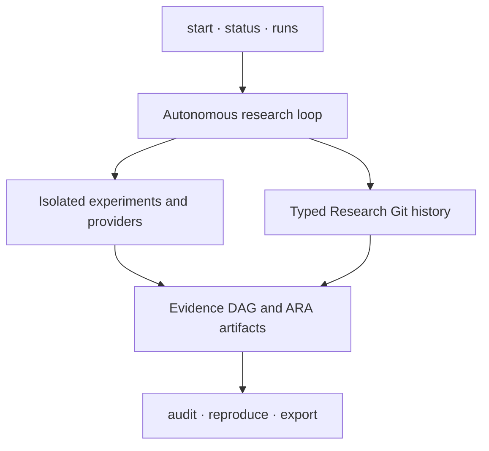

<p align="center">
  
</p>

<h1 align="center">XScientist</h1>

<p align="center"><strong>Autonomous research you can inspect, challenge, and reproduce.</strong></p>

<p align="center">
  Start with a falsifiable question. Keep the hypotheses, experiments, failures,
  evidence, reviews, and claims as one versioned scientific history.
</p>

<p align="center">
  <a href="https://pypi.org/project/xscientist/"></a>
  <a href="https://pypi.org/project/xscientist/"></a>
  <a href="https://github.com/smileformylove/XScientist/actions/workflows/smoke.yml"></a>
  <a href="https://github.com/smileformylove/XScientist/blob/main/LICENSE"></a>
  <a href="https://arxiv.org/abs/2607.12301"></a>
</p>

<p align="center">
  <a href="#start-without-a-provider">Quick start</a> ·
  <a href="#run-an-autonomous-study">Autonomous study</a> ·
  <a href="#inspect-and-reproduce">Audit</a> ·
  <a href="#installation">Install</a> ·
  <a href="https://github.com/smileformylove/XScientist/tree/main/docs">Docs</a> ·
  <a href="https://github.com/smileformylove/XScientist/blob/main/docs/README.zh.md">中文</a>
</p>

XScientist is a local-first research system and an open scientific protocol. It
can explore competing explanations, choose informative experiments, execute
them behind an isolation boundary, criticize its own results, and preserve the
whole path as typed, machine-readable research objects.

> [!IMPORTANT]
> XScientist is alpha research software, not an oracle. Autonomous runs may use
> paid models. Generated code requires the configured isolated executor.
> Machine-generated claims remain unverified until their evidence and
> independent review gates are complete.

This README describes the `0.1.3` release candidate on `main`. PyPI currently
publishes `0.1.2`; install from `main` to use the workflows below.

## Start without a provider

Requirements: Python 3.10+ and Git. No API key, model, Docker, or network call
is needed after installation.

```bash
python -m pip install \
  "xscientist @ git+https://github.com/smileformylove/XScientist.git@main"
xscientist demo ./first-study --autopilot --open
xscientist status ./first-study
```

In a few seconds you get:

- a versioned study with a failed attempt and both supporting and refuting evidence;
- an offline evidence DAG and an exact reproduction receipt;
- `$0.00` model cost and no generated-code execution;
- one copyable next action.

The demo intentionally ends with “more evidence needed.” Its held-out result
challenges an over-broad claim. Preserving that conflict is a successful
scientific outcome, not a software failure.

Use `xscientist status ./first-study --verbose` only when you need branch,
pipeline, token, or background-run details. Use `--json` for automation.

## Run an autonomous study

First discover usable providers. This works before a workspace exists and can
detect a running local Ollama service.

```bash
xscientist provider list
```

### Local model

```bash
python -m pip install \
  "xscientist[research,openai-compatible] @ git+https://github.com/smileformylove/XScientist.git@main"
xscientist start ./local-study
```

The interactive flow asks only for missing choices: question, provider/model,
evidence source, local research identity, and optional budget. If one usable
provider is detected, it is selected automatically.

### Hosted model

Install the research runtime plus one provider client:

```bash
python -m pip install \
  "xscientist[research,openai] @ git+https://github.com/smileformylove/XScientist.git@main"
export OPENAI_API_KEY="..."
xscientist start ./hosted-study
```

Available client extras are `openai`, `anthropic`, `zhipu`, `bedrock`,
`vertex`, and `openai-compatible`. The last covers local Ollama and compatible
services such as DeepSeek, Gemini, OpenRouter, and custom endpoints.

For scripts and CI, make every consequential choice explicit:

```bash
xscientist start ./ood-study \
  --question "Why does retrieval-guided reflection fail out of distribution?" \
  --provider openai \
  --model openai/gpt-4.1 \
  --user YOUR_NAME \
  --autopilot discovery \
  --data-dir ./data \
  --max-cost-usd 10 \
  --non-interactive
```

Use `--allow-synthetic-data` instead of `--data-dir` only for an explicitly
exploratory study. Input data is content-hashed and mounted read-only. Unknown
model pricing fails closed when a cost limit is active.

### Isolation and readiness

Generated experiment code never runs silently in the host Python process. A
model-backed experiment needs Docker and a version-matched executor:

```bash
xscientist executor prepare --workspace ./ood-study
xscientist provider check --workspace ./ood-study --max-cost-usd 10
xscientist doctor --workspace ./ood-study --deep
```

The commands distinguish missing clients, credentials, local models, Docker
CLI, Docker daemon, and executor-image mismatches. They print ordered repair
commands without making a paid provider request.

### Long-running studies

```bash
xscientist start ./ood-study \
  --question "Where does the mechanism break?" \
  --allow-synthetic-data --max-cost-usd 10 --detach

xscientist runs list --workspace ./ood-study
xscientist runs watch RUN_ID --workspace ./ood-study
xscientist runs logs RUN_ID --workspace ./ood-study --tail 100
xscientist runs cancel RUN_ID --workspace ./ood-study
xscientist runs resume RUN_ID --workspace ./ood-study
```

`xscientist status ./ood-study` shows a failed or active background run before
lower-priority scientific follow-ups. A failed state returns a non-zero exit
code while preserving a complete JSON report for automation.

## What remains autonomous

The simple entry point does not reduce the research loop. Depending on the
selected profile, XScientist can:

1. propose rival and null hypotheses instead of defending the first idea;
2. lock predictions and rank experiments by expected information value;
3. execute bounded experiments and retain failed or negative attempts;
4. scan anomalies, contradictions, evidence quality, and transfer boundaries;
5. run independent review roles, repair bounded defects, and stop at hard gates;
6. package the paper, evidence DAG, provenance, and exact continuation context.

Profiles expose one meaningful trade-off:

| Profile | Use it for | Emphasis |
| --- | --- | --- |
| `balanced` | A first end-to-end study | Bounded search and standard review |
| `discovery` | Mechanism and boundary finding | Rival hypotheses, refutation, branch diversity |
| `publication` | A manuscript candidate | Independent reviews and stricter hold gates |

Deep strategy commands remain available under `xscientist research`, but new
users do not need to learn them before the first result. See the
[deep-research protocol](https://github.com/smileformylove/XScientist/blob/main/docs/DEEP_RESEARCH_PROTOCOL.md)
and [method-discovery protocol](https://github.com/smileformylove/XScientist/blob/main/docs/METHOD_DISCOVERY_PROTOCOL.md).

## Inspect and reproduce

Research Git versions scientific objects rather than asking users to infer
meaning from a folder of logs. Git is the current local storage adapter; no
GitHub account or remote is required, and XScientist never pushes research by
itself.

```bash
xscientist research log --repo ./first-study --limit 20
xscientist research show HEAD --repo ./first-study
xscientist research diff HEAD~1 HEAD --repo ./first-study --deep
xscientist research objects --repo ./first-study --kind evidence
xscientist research context @latest:claim \
  --repo ./first-study --intent continue --budget 8000 --record
```

Audit answers three different questions and never conflates them:

- `trace`: can every claim be traced to recorded evidence and decisions?
- `replay`: are code, data, environment, seed, and command sufficient to rerun it?
- `verify`: was the result independently checked under the required gates?

```bash
xscientist research audit --repo ./first-study --level trace
xscientist research audit --repo ./first-study --level replay
xscientist research audit --repo ./first-study --level verify
xscientist research reproduce HEAD --repo ./first-study --execute --record \
  --reproduces @latest:claim

xscientist research bundle --repo ./first-study --dest ./study-backup
xscientist research export --repo ./first-study --dest ./exchange
```

A generated DAG is a disposable view, not scientific source data. Regenerating
it does not dirty a research checkpoint or prevent a bundle. Eligible research
changes, tracked edits, or staged changes still block bundling until reviewed.

To challenge a conclusion without erasing its history:

```bash
xscientist research branch challenge/boundary --repo ./first-study --switch
xscientist research plan @latest:hypothesis --repo ./first-study \
  "Search for a counterexample" \
  --test "A reproducible failure refutes the current mechanism"
xscientist research switch main --repo ./first-study
xscientist research merge challenge/boundary --repo ./first-study --preview
```

## A small surface over inspectable layers



The default path is intentionally small:

| Need | Command |
| --- | --- |
| Prove the installation | `xscientist demo` |
| Run or continue research | `xscientist start` |
| Understand the current state | `xscientist status` |
| Repair configuration | `xscientist doctor --deep` |
| Inspect a long run | `xscientist runs` |
| Audit scientific history | `xscientist research` |

The public orchestration surface lives in `xscientist/`, the experiment
workflow in `ai_scientist/`, and versioned schemas in
`ai_scientist/protocol/`. See [Architecture](https://github.com/smileformylove/XScientist/blob/main/docs/ARCHITECTURE.md).

## Installation

| Channel | Command |
| --- | --- |
| Published 0.1.2 | `python -m pip install "xscientist==0.1.2"` |
| 0.1.3 candidate | `python -m pip install "xscientist @ git+https://github.com/smileformylove/XScientist.git@main"` |
| Contributor | `python -m pip install -e ".[research,openai,dev]" -c requirements/constraints-ci.txt` |

Pin a commit rather than `main` for an exactly repeatable experiment.

Install optional capabilities only when a study needs them:

| Extra | Purpose |
| --- | --- |
| `research` | End-to-end autonomous research runtime |
| provider extra | Exactly one model client or compatible route |
| `plot`, `pdf`, `pdf-layout`, `ml` | Specialist experiment capabilities |
| `service` | FastAPI/Uvicorn service |
| `trust` | Optional signing primitives |
| `full` | Backward-compatible all-in-one environment |

Core protocol and CLI support Python 3.10–3.13. Autonomous execution also
depends on the selected provider, Docker, and the study's experiment stack.

## Outputs and boundaries

An autonomous project keeps configuration, ideas, experiments, papers, logs,
and ARA handoff artifacts separate. The exact layout is documented in
[Output directories](https://github.com/smileformylove/XScientist/blob/main/docs/guides/OUTPUT_DIRECTORIES.md).

| Boundary | Default |
| --- | --- |
| Generated code | Isolated executor; strict setups fail closed |
| Experiment network | Disabled in strict isolation |
| Secrets | Private env, Git ignore, and redacted diagnostics |
| Remote publication | Never automatic |
| Claims | Draft until evidence and independent gates qualify them |
| Negative results | Preserved as first-class history |
| Self-evolution | Shadow → sealed evaluation → canary → signed promotion |

For sensitive domains, use XScientist as research infrastructure—not as a
substitute for domain experts, ethics review, or regulated validation.

## SDK and documentation

```python
from xscientist import ProjectRequest, XScientist

client = XScientist(output_root="./research-output")
result = client.run_project(
    ProjectRequest(
        project="retrieval-study",
        question="When does retrieval-guided reflection fail?",
        autopilot="discovery",
        allow_synthetic_data=True,
        max_cost_usd=10,
    )
)
print(result.returncode)
```

| Need | Guide |
| --- | --- |
| First project and recovery | [Getting started](https://github.com/smileformylove/XScientist/blob/main/docs/GETTING_STARTED.md) · [Long-running guide](https://github.com/smileformylove/XScientist/blob/main/docs/LONG_RUNNING_GUIDE.md) |
| Research history and protocol | [Local Research Git](https://github.com/smileformylove/XScientist/blob/main/docs/LOCAL_RESEARCH_GIT.md) · [Protocol v2](https://github.com/smileformylove/XScientist/blob/main/docs/RESEARCH_PROTOCOL_V2.md) |
| Integrity and scientific strategy | [Research integrity](https://github.com/smileformylove/XScientist/blob/main/docs/RESEARCH_INTEGRITY.md) · [Science constitution](https://github.com/smileformylove/XScientist/blob/main/docs/SCIENCE_CONSTITUTION.md) |
| SDK, HTTP API, and adapters | [SDK/API](https://github.com/smileformylove/XScientist/blob/main/docs/guides/SDK_AND_API.md) · [DAG/adapters](https://github.com/smileformylove/XScientist/blob/main/docs/RESEARCH_DAG_AND_ADAPTERS.md) |
| Configuration and operations | [Configuration](https://github.com/smileformylove/XScientist/blob/main/docs/CONFIG_REFERENCE.md) · [Operations](https://github.com/smileformylove/XScientist/blob/main/docs/OPERATIONS_CHECKLIST.md) |

Run `xscientist --help` for the small everyday command set and
`xscientist research --help` for the complete scientific protocol surface.

## Project status

XScientist is under active alpha development. Contributions should include a
test, preserve protocol/schema compatibility, and avoid weakening provenance,
isolation, cost, or scientific gates. Read [CONTRIBUTING.md](https://github.com/smileformylove/XScientist/blob/main/.github/CONTRIBUTING.md)
and [CHANGELOG.md](https://github.com/smileformylove/XScientist/blob/main/CHANGELOG.md).

Paper: [XScientist: Towards an AI-Driven Scientific Research Ecosystem](https://arxiv.org/abs/2607.12301).

Apache-2.0 licensed. See [LICENSE](https://github.com/smileformylove/XScientist/blob/main/LICENSE).
