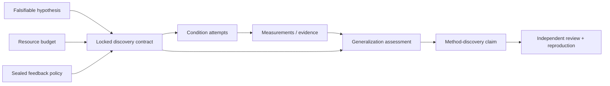

# Method Discovery Protocol

An improved score is not automatically a scientific method. XScientist uses a
locked, cross-condition contract to distinguish three claims:

1. **Execution** — the agent correctly implemented a requested procedure.
2. **Engineering optimization** — the candidate improved a fixed objective in
   the development setting.
3. **Method discovery** — a new mechanism survives fixed-resource, sealed
   evaluation across conditions and scales.

This design is informed by [MLS-Bench](https://arxiv.org/abs/2605.08678) and
its [reference task repository](https://github.com/Imbernoulli/MLS-Bench). The
important lesson is not a particular leaderboard: target-variable isolation,
reproduced strong baselines, multiple conditions, proxy-fidelity checks, and
feedback control must be part of the protocol rather than left to the agent's
self-report.

## Evidence DAG



The contract, budget, and blinding nodes are created before results exist. The
assessment is deterministic and remains evidence, not an independent review.
A verified claim still requires the normal review, gate, and reproduction
closure.

## 1. Write and lock the contract

Generate a complete starter file, then replace every `REPLACE_*` value:

```bash
xscientist research discovery template --output discovery.json
```

The resulting `discovery.json` has this shape:

```json
{
  "summary": "Test a new optimizer mechanism without changing scale",
  "contribution_level": "method_discovery",
  "target_component": "optimizer",
  "mechanism": "Decouple update direction from adaptive magnitude",
  "metric": {
    "name": "accuracy",
    "direction": "maximize",
    "minimum_effect": 0.01,
    "theoretical_bound": 1.0
  },
  "edit_scope": {
    "allowed_paths": ["src/method.py"],
    "protected_paths": ["src/model.py", "src/data.py", "src/evaluator.py"]
  },
  "fixed_variables": {
    "model": "tiny-transformer-v1",
    "training_steps": 1000,
    "data_version": "dataset-v1"
  },
  "resource_limits": {
    "gpu_hours": 10,
    "parameters": 1000000
  },
  "runner": {
    "entrypoint": "python evaluate.py",
    "seeds": [1, 2, 3]
  },
  "baselines": [
    {"id": "adamw", "method": "AdamW", "source": "doi:10.48550/arXiv.1711.05101"},
    {"id": "lion", "method": "Lion", "source": "doi:10.48550/arXiv.2302.06675"},
    {"id": "schedule_free", "method": "Schedule-Free AdamW", "source": "commit:baseline-schedule-free"}
  ],
  "conditions": [
    {
      "id": "dev-small",
      "role": "development",
      "visibility": "visible",
      "dataset": "dataset-a",
      "scale": "proxy",
      "proxy_for": "scale-large"
    },
    {
      "id": "transfer-b",
      "role": "transfer",
      "visibility": "sealed",
      "dataset": "dataset-b",
      "scale": "proxy"
    },
    {
      "id": "scale-large",
      "role": "scale",
      "visibility": "sealed",
      "dataset": "dataset-a",
      "scale": "target"
    }
  ]
}
```

Optionally bind the exact evidence and memory visible when choosing the
mechanism, then lock the design before running the candidate:

```bash
xscientist research context @latest:hypothesis \
  --intent decide \
  --decision-kind method_discovery_design \
  --record

xscientist research discovery plan \
  @latest:hypothesis discovery.json \
  --context @latest:context_snapshot
xscientist research objects @latest:experiment_design --json
```

The context binding is optional for exploratory convenience, but recommended:
it preserves the literature, negative results, alternatives, prior decisions,
policy, and external memory references visible at design time. It does not
substitute for the locked comparison and generalization contract.

The command records three linked objects in one checkpoint:

- `experiment_design`: target mechanism, edit boundary, runner, baselines,
  conditions, success rule, and immutable `design_hash`;
- `resource_budget`: hard resource limits and an information-value allocation
  policy;
- `evaluation_blinding`: which conditions stay sealed until final candidate
  commitment.

For a `method_discovery` contract, XScientist requires at least three strong
baselines, at least three conditions, a development condition, a generalization
condition, a sealed condition, protected paths, fixed variables, and numeric
resource limits.

## 2. Record condition evidence

Use the normal lifecycle commands for every attempt, including failures and
timeouts. Each measurement must remain linked to its plan, environment, data,
code, and seeds.

```bash
xscientist research experiment "transfer-b run" \
  --status completed \
  --plan @latest:research_plan \
  --metric accuracy=0.77

xscientist research evidence "locked conditions completed" \
  --attempt @latest:experiment_attempt \
  --metric accuracy=0.77
```

Real studies normally have one or more evidence objects per condition. The
assessment command accepts repeated `--evidence` selectors and binds them all.

## 3. Assess generalization

Create `results.json`. Copy the `runner_hash` from the locked contract:

```json
{
  "candidate": {
    "id": "candidate-a",
    "changed_paths": ["src/method.py"]
  },
  "runner_hash": "sha256:REPLACE_WITH_LOCKED_RUNNER_HASH",
  "fixed_variables": {
    "model": "tiny-transformer-v1",
    "training_steps": 1000,
    "data_version": "dataset-v1"
  },
  "resource_usage": {
    "gpu_hours": 8,
    "parameters": 1000000
  },
  "condition_results": [
    {
      "condition_id": "dev-small",
      "candidate": 0.80,
      "baselines": {"adamw": 0.72, "lion": 0.74, "schedule_free": 0.75}
    },
    {
      "condition_id": "transfer-b",
      "candidate": 0.77,
      "baselines": {"adamw": 0.69, "lion": 0.71, "schedule_free": 0.72}
    },
    {
      "condition_id": "scale-large",
      "candidate": 0.83,
      "baselines": {"adamw": 0.76, "lion": 0.78, "schedule_free": 0.79}
    }
  ]
}
```

```bash
xscientist research discovery assess \
  @latest:experiment_design results.json \
  --evidence @latest:evidence
```

The assessment checks:

- the exact locked runner was used;
- candidate edits stayed within the target and outside protected paths;
- fixed model, data, training, and evaluator variables match;
- all resource usage is declared and within budget;
- every locked condition and every strong baseline is present;
- proxy-scale baseline ordering matches target scale when `proxy_for` is used;
- the candidate exceeds the strongest baseline by the locked minimum effect in
  every required condition;
- at least one sealed transfer, held-out, or scale condition passes.

Scores are normalized with the weakest reproduced baseline at 0 and the
strongest at 50. When a meaningful theoretical bound is supplied it anchors
100. Raw values, baseline rankings, checks, and normalized scores remain in the
`evidence_synthesis` node.

## 4. Make the right strength of claim

Possible deterministic verdicts are:

| Verdict | Meaning |
| --- | --- |
| `method_discovery_supported` | Scope/resource checks and required sealed generalization passed |
| `engineering_gain_only` | Development improved, but the method did not satisfy generalization |
| `invalid_protocol_execution` | Edit scope, runner, fixed variables, resource parity, coverage, or proxy fidelity was violated |
| `inconclusive` | The protocol was valid but evidence did not establish the required effect |

A claim that declares `--contribution-level method_discovery` must cite a
passing generalization assessment. Closure auditing blocks unsupported claims:

```bash
xscientist research claim \
  "The mechanism improves across locked conditions." \
  --evidence @latest:evidence_synthesis \
  --contribution-level method_discovery

xscientist research audit --level trace
xscientist research dag --output research-dag
```

This gate prevents a visible-development improvement, a larger-resource run,
or an evaluator change from being relabeled as a scientific discovery. It does
not prove novelty by itself; literature grounding, rival hypotheses,
independent evaluation, and reproduction remain separate requirements.
