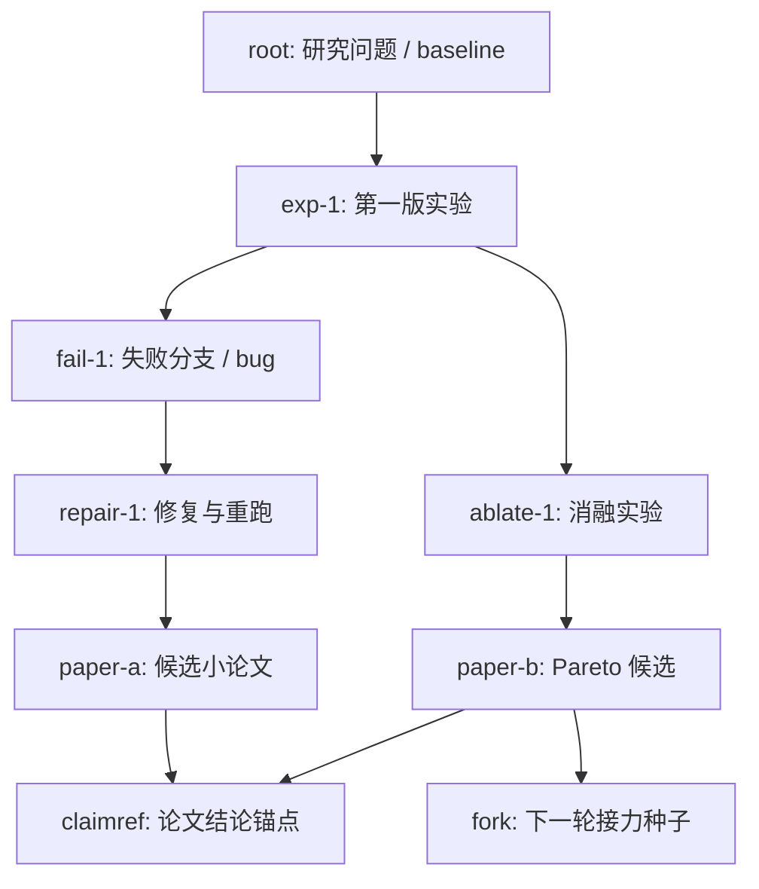

# XScientist

[](https://pypi.org/project/xscientist/)
[](https://pypi.org/project/xscientist/)
[](https://pypi.org/project/xscientist/)
[](../LICENSE)
[](https://github.com/smileformylove/XScientist/actions/workflows/smoke.yml)

English README: [README.md](../README.md)

**安装：** `python -m pip install "xscientist[full]"` ·
[PyPI 包](https://pypi.org/project/xscientist/) ·
[最新 Release](https://github.com/smileformylove/XScientist/releases/latest) ·
[完整文档](./)

> 面向"可持续自我迭代"的 AI 科研系统：从想法生成、实验执行、论文写作，到自评审闭环、策略调度与长期运行（daemon）。
> 更进一步——我们想做的不只是「更好的全自动科研」，而是**可 git 的科研协议**，沿着自动化的科技树，从数学与物理这类可验证的根节点向外扩展。

本仓库的目标不是一次性"生成一篇论文"，而是把自动科研系统做成**可长期运行、可观测、可回放、可交接**的研究流水线：每次运行都产出结构化工件（计划、证据、评审、修复任务、质量门禁与报告），便于持续改进与协作。这些工件对齐一份独立的协议规范（`ai_scientist/protocol/`，ARA v1），因此可以被别的实现读、写、diff、fork。

系统报告：

- arXiv: [2607.12301](https://arxiv.org/abs/2607.12301) — *XScientist: A Git-Like Research Protocol for Long-Running Autonomous Scientific Discovery*
- 源码目录：[`paper/xscientist_arxiv/`](../paper/xscientist_arxiv/)

重要提示（建议先读）：

- 发布状态：`0.1.0` 是首个公开 PyPI 版本。只有在明确需要尚未发布的
  开发改动时，才建议从 `main` 分支安装。
- 成本：运行会调用大模型/检索服务，可能产生 API 费用与较长运行时间。
- 可靠性：生成内容可能存在错误或幻觉；请务必自行复核关键结论、数据与引用。
- 输出目录：默认**不会**把运行产物写入仓库目录（避免污染开源仓库）。

如果你对该仓库来时路感兴趣，欢迎阅读对应的知乎随笔：[XScientist踩坑实录](https://zhuanlan.zhihu.com/p/2027818800238666075) 。如果对你有帮助，感谢star和小心心～
---

## 目录 (Contents)

- [XScientist](#xscientist)
  - [目录 (Contents)](#目录-contents)
  - [愿景：可 git 的科研协议](#愿景可-git-的科研协议)
  - [项目概览](#项目概览)
  - [核心能力](#核心能力)
  - [公共接口](#公共接口)
  - [仓库结构](#仓库结构)
  - [快速开始](#快速开始)
    - [0) 依赖说明](#0-依赖说明)
    - [1) 安装](#1-安装)
    - [2) 配置 API Key（按需）](#2-配置-api-key按需)
    - [3) 登录（必需）](#3-登录必需)
    - [4) 预检（推荐）](#4-预检推荐)
    - [5) 隔离 AI 生成的实验代码](#5-隔离-ai-生成的实验代码)
  - [配置](#配置)
    - [输出目录（默认不写入仓库）](#输出目录默认不写入仓库)
    - [严格兜底策略（调试提示）](#严格兜底策略调试提示)
  - [使用方法](#使用方法)
    - [A) 从 Topic 跑一个项目（最常用）](#a-从-topic-跑一个项目最常用)
    - [B) 连续运行/批量生成（适合跑一段时间）](#b-连续运行批量生成适合跑一段时间)
    - [C) Daemon 长期自治运行（推荐用于"持续迭代"）](#c-daemon-长期自治运行推荐用于持续迭代)
    - [D) 反馈系统监控](#d-反馈系统监控)
  - [本地科研 Git（不需要服务器）](#本地科研-git不需要服务器)
  - [输出与可观测性](#输出与可观测性)
    - [科研完整性取证（Integrity Forensics）](#科研完整性取证integrity-forensics)
    - [ARA 工件（面向下游智能体）](#ara-工件面向下游智能体)
      - [科技探索树视图](#科技探索树视图)
  - [示例论文](#示例论文)
  - [文档索引](#文档索引)
  - [开发与测试](#开发与测试)
  - [路线图](#路线图)
  - [系统架构](#系统架构)
  - [贡献与社区](#贡献与社区)
  - [License](#license)
  - [Acknowledgements](#acknowledgements)
  - [Citation and References](#citation-and-references)

---

## 愿景：可 git 的科研协议

XScientist 想做的不只是「一个更好的全自动科研系统」，更是一层**可 git 的科研协议**——让研究这件事像代码一样可 diff、可 fork、可 review、可 rebase：

- **协议先于系统**：`ai_scientist/protocol/`（ARA v1）用一组带版本的 JSON Schema + 一个 `content_hash` 归一化算法，把一次研究运行沉淀成机读工件。第三方 producer / consumer 无需依赖 XScientist 本身也能实现同一协议——就像 git 之于代码。
- **每次运行都是一个 commit**：ARA 把 exploration graph、每个节点的 `code / term_out / metrics / plots`、失败分支、修复轨迹、Pareto 池和环境指纹一起归档；每一份 manuscript 断言用 `\claimref{node_id}` 反向锚回其证据节点。
- **fork-continue 而非冷启动**：任一节点都可通过 `xscientist ara fork` 导出一份「本身也是合规 ARA」的种子，下一次运行直接接力（provenance 自动落进 child ARA），跨系统 / 跨团队都可以延续。
- **自动化的科技树，数学与物理是根节点**：我们相信科研的可自动化程度沿着一棵树展开——**数学和物理是根节点**，越靠近根的问题「协议 / 证据 / 复核」信号越强、更适合被机器扩展；越靠近叶子（工程、经验、社会科学）越依赖人类判断。XScientist 的重心先落在根附近：把「可验证、可复现、可 fork」的部分自动化，把「值得人类花时间的」部分显式暴露给评审者。

一句话：**把科研做成协议，把系统做成协议的一个实现**。<br/>
配套细节见 [`ai_scientist/protocol/SPEC.md`](../ai_scientist/protocol/SPEC.md) 与下文的 [ARA 工件](#ara-工件面向下游智能体) / [从 ARA 接力](#从-ara-接力fork-continue) 章节。

---

## 项目概览

你可以把它理解为一个"研究操作系统（research operating system）"：

- 输入：Topic / Sources / 研究约束（预算、停止条件、质量门禁）
- 过程：ideation -> 实验 -> 写作 -> 自评审 -> 修复/重写 -> 打包交付
- 输出：可复用的研究资产（报告、论文草稿、评审与修复队列、运行索引、交接简报）

核心循环（简化）：


---

## 核心能力

- **自评审闭环**：多轮 self-review 生成结构化 issue 与修复计划，并将修复覆盖率/回归检查纳入门禁。
- **Pareto 前沿候选池**：自动追踪不同 rewrite round 的稿件质量向量，保留 Pareto 前沿候选稿，为后续改写提供互补强项参考与种子稿。
- **修复反思与验证**：在生成修复计划前进行 LLM 反思（reflection），执行修复后自动验证（verifier），并记录修复尝试历史（repair attempts）用于趋势分析与策略反馈。
- **实验 TODO 可度量闭环**：把"还差什么实验/证据"显式落成 TODO，并持续跟踪 closure 进度。
- **长期自治运行（Daemon）**：支持持续运行、失败保护、来源调度、趋势报告、交接简报与策略反馈。
- **增强反馈系统**：多源反馈收集、实时健康监控、趋势分析、自动行动生成。
- **可观测与可回放**：关键阶段工件结构化落盘（JSON/MD），便于对比、复盘与二次加工。
- **工程化安全**：登录守卫、预检/仓库校验、配置 schema、默认输出目录隔离。
- **本地科研 Git**：无需 GitHub 或服务器即可按科研里程碑 commit、branch、diff、离线备份和按 commit 复现；大型证据留在本地 CAS，Git 只保存紧凑指针。
- **ARA（Agent-Native Research Artifact）导出**：每次运行结束会在 `<project_dir>/ara/` 下额外落一份「面向下游智能体」的机读工件——完整的 exploration graph、每个节点的 `code.py`/`term_out.log`/`metrics.json`/`plots.json`、Pareto 池、修复历史、环境指纹，以及从 LaTeX 中扫描出的 `\claimref{node_id}` 声明到节点的映射。配套的 `xscientist ara` CLI 可以 inspect / re-exec / fork 任意节点，让另一个 AI Scientist 无需解码 PDF 就能续跑或验证前作；`exploration_graph.html` 则把每篇小论文的探索过程展示成可浏览的科技探索树。

## 公共接口

- `xscientist`：PyPI wheel 与源码 checkout 都可直接使用的统一 CLI
- `xscientist init`：面向已安装包的工作区与快速配置脚手架
- `xscientist research`：无需服务器的本地科研 Git 历史与离线备份
- `from xscientist import XScientist, ProjectRequest`：稳定 Python SDK
- `from xscientist import create_app`：可选 FastAPI 应用工厂

| 使用场景 | 推荐接口 |
|---|---|
| 创建已配置的科研工作区 | `xscientist init` |
| 单项目端到端运行 | `xscientist project` |
| 批量生成论文 | `xscientist batch` |
| 长期自治运行 | `xscientist daemon` |
| 查看产物和看板 | `xscientist manager` |
| 检查/接力 ARA | `xscientist ara` |
| 记录本地科研 commit | `xscientist research` |
| 嵌入 Python 应用 | `XScientist` + `ProjectRequest` |
| 提供 HTTP 服务 | `xscientist serve` / `create_app()` |

源码 checkout 也可以统一使用 `python -m xscientist ...`。实际实现位于
`ai_scientist/apps/`。构建出的 wheel 会继续提供历史顶层模块名作为
兼容别名，但新集成应使用公共 CLI、SDK 或 HTTP API。

## 仓库结构

```text
xscientist/             公共 SDK、CLI、数据模型和可选 HTTP API
ai_scientist/           内部科研工作流实现
configs/                BFTS、daemon、source 和环境变量示例
scripts/                源码 checkout 运维辅助脚本
docs/                   架构、指南和中文 README
requirements/           CI 专用依赖集合与约束
tests/                   单测、分发、兼容与 smoke 测试
tools/                   仅供仓库使用的验证工具
```

根目录刻意只保留标准工具必须发现的协议文件（`pyproject.toml`、
`MANIFEST.in`、`.gitignore`）、主 README/许可证、主依赖文件、Make 入口，
以及两个向后兼容的 shell 运维入口。

---

## 快速开始

### 0) 依赖说明

- Python: 3.10+（推荐 3.11）
- Git：从 GitHub 仓库直接安装时需要
- 系统依赖（建议安装）：
  - LaTeX 工具链（用于编译论文 PDF，例如 TeX Live / MacTeX）
  - `poppler`（用于 PDF 处理/抽取）
  - `chktex`（可选，LaTeX 静态检查）

> GPU/CUDA 并非必需；如需 GPU，请按 PyTorch 官方指引安装匹配版本。

### 1) 安装

从 PyPI 安装稳定版本：

| 安装目标 | 命令 | 包含内容 |
|---|---|---|
| SDK 与 ARA 协议工具 | `python -m pip install xscientist` | 公共 Python API、CLI、Schema 与工件工具 |
| 科研运行环境 | `python -m pip install "xscientist[full]"` | 大模型提供商、数据/科学计算依赖与端到端工作流 |
| 运行环境与 HTTP 服务 | `python -m pip install "xscientist[full,service]"` | 完整运行环境以及 FastAPI、Uvicorn |

```bash
# 轻量 SDK 与协议接口
python -m pip install xscientist

# 完整科研运行环境（运行项目时推荐）
python -m pip install "xscientist[full]"

# 完整运行环境与 FastAPI/Uvicorn 服务
python -m pip install "xscientist[full,service]"
```

需要固定完全相同的环境时，可锁定当前版本：

```bash
python -m pip install "xscientist[full]==0.1.0"
```

如需测试尚未发布的开发改动，可安装当前 `main` 分支：

```bash
python -m pip install "xscientist[full,service] @ git+https://github.com/smileformylove/XScientist.git@main"
```

本地 clone 或仓库开发环境：

```bash
git clone https://github.com/smileformylove/XScientist.git
cd XScientist
conda create -n xscientist python=3.11 -y
conda activate xscientist

python -m pip install -e ".[full,service,dev]"
```

更稳定的"CI 风格"安装（可选）：

```bash
python -m pip install -r requirements.txt
```

验证安装：

```bash
xscientist --version
xscientist info --json
xscientist --help
python -c "from xscientist import XScientist, ProjectRequest; print('ready')"
```

无需 clone 仓库，直接生成一个自包含的起步工作区：

```bash
xscientist init my-research
cd my-research
```

脚手架包含科研问题模板、`.env.example`、随 wheel 分发的 BFTS 配置，以及
固定到当前 XScientist 版本的隔离执行 Dockerfile。它不会写入 API Key；除非
显式使用 `--force`，也不会覆盖已有文件。使用 `xscientist init --help` 可选择
其他 provider、model 或 deep profile。

### 2) 配置 API Key（按需）

按你使用的提供商设置环境变量（不需要全部设置）：

```bash
# 仅源码 checkout 使用此模板；PyPI 用户可使用 `xscientist init` 生成的模板。
cp configs/environment/example.env .env
# 编辑 .env，再通过 shell 或进程管理器加载其中的变量。

export OPENAI_API_KEY="..."
export ZHIPU_API_KEY="..."
export GEMINI_API_KEY="..."
export S2_API_KEY="..."
```

### 3) 登录（必需）

```bash
xscientist auth login --user <your_name>
xscientist auth status
```

登录守卫说明：`docs/LOGIN_GUARDRAIL.md`

### 4) 预检（推荐）

```bash
xscientist preflight --strict
xscientist validate
```

在源码 checkout 中，贡献者还可以运行 `make smoke`。

### 5) 隔离 AI 生成的实验代码

BFTS 执行器在 `bfts_config*.yaml` 的 `exec:` 配置中支持 `process`、
`docker` 和 `auto` 后端。`auto` 会优先使用 Docker，并在回退到未隔离的
进程执行时把记录写入节点和 ARA。投稿级运行建议设置
`require_isolation: true`，让 Docker 不可用时直接失败，而不是静默降级。

默认 Docker 策略会移除 capabilities、关闭网络、使用只读根文件系统，并
限制 CPU、内存和 PID；只有运行工作区可写。需要下载数据或模型时可以临时
启用 `allow_experiment_network: true`，缓存完成后应重新关闭。严格隔离模式
不允许联网执行，因此需提前把必要输入放入运行工作区。构建默认执行镜像：

```bash
make executor-image
```

---

## 配置

### 输出目录（默认不写入仓库）

为避免运行产物污染仓库，默认输出到**仓库平级目录**：

- 默认输出根目录：仓库平级的 `<仓库名>_outputs`；本仓库默认是 `../XScientist_outputs`
- 优先级：`RESEARCH_OUTPUT_DIR` > `AI_SCIENTIST_OUTPUT_DIR` > 默认平级目录
- 若平级目录不可写：回退到系统数据目录（如 `~/.local/share/ai_scientist/research`）

推荐显式指定输出路径：

```bash
export RESEARCH_OUTPUT_DIR="/path/to/my_xscientist_outputs"
```

### 严格兜底策略（调试提示）

多数脚本都支持更严格的质量门禁。若你在调试阶段需要放宽兜底策略，可查阅参数 `--override-strict-fallbacks`（仅建议本地调试使用）。

---

## 使用方法

先在当前目录准备一个 `topic.md` 主题文件。它可以直接从自然语言研究问题开始：

```markdown
# 研究主题

评估检索引导的反思是否能提高长篇科学综述的事实准确性，并设计一个能够
隔离该因素影响的消融实验。
```

源码仓库中也可以使用 `examples/example_topic.md`。需要查看完整参数时，运行
`xscientist <command> --help`。

### A) 从 Topic 跑一个项目（最常用）

```bash
xscientist project my_project \
  --output-root "$RESEARCH_OUTPUT_DIR" \
  --topic topic.md
```

更多用法：`docs/guides/PROJECT_USAGE.md`

### B) 连续运行/批量生成（适合跑一段时间）

```bash
xscientist batch \
  --research-dir "$RESEARCH_OUTPUT_DIR" \
  --topic topic.md \
  --paper-types icbinb
```

### C) Daemon 长期自治运行（推荐用于"持续迭代"）

```bash
xscientist daemon \
  --topic topic.md \
  --duration-hours 24 \
  --enable-rewrite-followup \
  --auto-source-quality-feedback \
  --auto-quality-strategy-feedback \
  --auto-quality-governor \
  --auto-evidence-strategy-feedback \
  --auto-export-submission-dossier \
  --auto-failure-guard \
  --serve-dashboard \
  -- --submission-mode --num-ideas 3
```

Python SDK：

```python
from xscientist import ProjectRequest, XScientist

client = XScientist(output_root="./research-output")
result = client.run_project(ProjectRequest(project="demo", topic="topic.md"))
print(result.returncode, result.stdout)
```

HTTP API：

```bash
xscientist serve --host 0.0.0.0 --port 8000 --output-root ./research-output
curl http://127.0.0.1:8000/health
curl -X POST http://127.0.0.1:8000/v1/projects \
  -H 'content-type: application/json' \
  -d '{"project":"demo","topic":"topic.md"}'
```

交互式 API 文档位于 `http://127.0.0.1:8000/docs`，OpenAPI 文档位于
`/openapi.json`。

服务不只监听本机时，建议设置 `XSCIENTIST_API_KEY`，客户端通过
`X-API-Key` 请求头传入。

完整说明见 [`docs/guides/SDK_AND_API.md`](guides/SDK_AND_API.md)。

投稿级/高质量运行会默认启用 deterministic integrity forensics。你也可以显式控制：

```bash
# 强制启用最终稿完整性取证
xscientist project my_project \
  --output-root "$RESEARCH_OUTPUT_DIR" \
  --topic topic.md \
  --integrity-forensics

# 在高质量调试中临时关闭
xscientist batch \
  --research-dir "$RESEARCH_OUTPUT_DIR" \
  --topic topic.md \
  --paper-types icbinb \
  --high-quality-mode \
  --no-integrity-forensics
```

常用运维命令：

下面的 shell 运维命令只在源码 checkout 或 sdist 中提供，wheel 安装不包含它们。

公共 Python SDK 和 HTTP 服务也提供只读的论文列表/详情、shortlist、投稿看板和重写看板，且始终绑定服务配置的输出根目录；详见 `docs/guides/SDK_AND_API.md`。

```bash
bash run_stable_daemon.sh status
bash run_stable_daemon.sh brief
bash run_stable_daemon.sh handoff
bash run_stable_daemon.sh report-trends
bash run_stable_daemon.sh source-plan
```

### D) 反馈系统监控

```bash
# 查看系统健康状态
xscientist feedback --feedback-dir ./feedback status

# 查看推荐行动
xscientist feedback --feedback-dir ./feedback actions

# 分析趋势
xscientist feedback --feedback-dir ./feedback trends \
  --metrics quality_score success_rate error_rate

# 导出报告
xscientist feedback --feedback-dir ./feedback report
```

更多用法：`docs/guides/FEEDBACK_QUICKSTART.md`

---

## 本地科研 Git（不需要服务器）

Git 本身不依赖 GitHub 或服务器。可以先创建一个独立的本地科研仓库，只在
科研状态发生实质变化时 commit：

```bash
xscientist research init ./my-research \
  --question "检索引导的反思是否能提高事实准确性？"

cd my-research

# 编辑 hypotheses/h1.json 后：
xscientist research checkpoint \
  --stage preregister \
  --subject "锁定 H1 与证伪条件"

xscientist research log
xscientist research diff HEAD~1 HEAD
```

大型数据、模型和二进制证据保存在本地 CAS，Git 只记录不可变指针：

```bash
xscientist research object add ./raw/results.parquet \
  --logical-path data/results.parquet
xscientist research checkpoint \
  --stage evidence \
  --subject "登记不可变结果表"
```

没有服务器时，可以把 Git 全历史与复现所需 CAS 闭包一起离线备份：

```bash
xscientist research bundle \
  --profile reproduce \
  --dest ../my-research-backup.tar.gz
```

完整项目运行也可以选择自动记录本地里程碑：

```bash
xscientist project my_project \
  --topic topic.md \
  --research-git local \
  --git-checkpoint-policy milestone
```

XScientist 不创建 remote，并通过 schema 强制 `auto_push: false`。提交采用
deny-first 白名单，拒绝已有 staged 内容，排除密钥和大文件，并验证 checkpoint
哈希。`xscientist research reproduce` 可以把指定 commit 物化成独立 worktree。
完整说明见 [`docs/LOCAL_RESEARCH_GIT.md`](LOCAL_RESEARCH_GIT.md)。

---

## 输出与可观测性

本项目会在输出根目录下生成结构化工件，便于索引与复盘（目录名可能随版本演进）：

- `projects/`：每个研究项目的完整目录
- `experiments/`：实验运行结果与日志
- `ideas/`：生成/整理后的 idea 工件
- `papers/`：批量生成的单篇论文目录
- `batches/`：连续生成器批次记录与进度
- `cache/`：HuggingFace / Torch / wandb 等运行缓存
- `reports/`：趋势报告/交接报告等（daemon 场景）
- `knowledge_base/`：跨项目沉淀（例如 self-evolution history/playbook）

常用看板/索引命令（更多见 `xscientist manager --help`）：

```bash
xscientist manager rebuild-index
xscientist manager submission-board --top 5 --require-gate
xscientist manager rewrite-board --top 10
xscientist manager repair-board --top 20 --priority-tier p0
xscientist manager evolution-board --top 20
xscientist manager process-board --status blocked --top 30
```

### 科研完整性取证（Integrity Forensics）

XScientist 会在最终稿阶段运行一组 deterministic integrity forensics 检查，用于在进入 submission gate 前发现更像“硬阻断”的稿件风险，例如证据/断言一致性、结构化报告中的异常信号等。它不是人工审稿或事实核查的替代品，而是一层可复现、可落盘、可被后续 agent 消费的机器检查。

默认行为：

- `--submission-mode` 或 `--high-quality-mode` 下默认启用。
- 其他普通运行默认关闭，但可用 `--integrity-forensics` 强制启用。
- 调试或成本敏感场景可用 `--no-integrity-forensics` 显式关闭。
- 入口覆盖 `xscientist project`、`xscientist batch`、`xscientist bfts` 与 `xscientist zhipu`。

每篇稿件的取证产物写入对应运行目录下的 `integrity_forensics/`，通常包括 JSON 报告和 Markdown 摘要。批量/项目 summary 会记录 `integrity_forensics_status`、`integrity_forensics_verdict`、finding 数量和报告路径，并在 shortlist 中展示。`HARD_FLAGS` 会阻断 submission-ready 判定；`SOFT_FLAGS` 会被报告出来，但不会单独阻断。

### ARA 工件（面向下游智能体）

除了给人看的 PDF，每次成功跑完 `xscientist project` 之后，还会在 `<project_dir>/ara/<timestamp>_<idea>/` 下写入一份「机读」的研究工件（Agent-Native Research Artifact，简称 ARA），设计目标是让另一个 AI Scientist 可以直接 fork / re-execute，而不必去逆向 PDF。

典型目录结构：

```
<project_dir>/ara/<timestamp>_<idea>/
├── manifest.json              # 顶层入口，指向下面的所有文件
├── exploration_graph.json     # 树搜索 DAG：每个节点与 parent/child 边（含失败分支）
├── exploration_graph.html     # 可在浏览器打开的科技探索树视图
├── exploration_graph.summary.json # DAG 校验摘要（root / leaf / 拓扑序）
├── nodes/<node_id>/
│   ├── code.py                # 该节点原样执行的代码
│   ├── term_out.log           # 完整的 stdout/stderr
│   ├── metrics.json           # metric + analysis + is_buggy
│   ├── plots.json             # 图表路径与 VLM 分析
│   ├── env.json               # Python 版本 / 预期 cwd
│   └── run.sh                 # 一键复跑脚本
├── claims/                    # 从 .tex 里扫描出的 `\claimref{node_id}` 映射
├── repair_history.jsonl       # 修复反思 / 验证器 / 尝试历史
├── pareto_pool.json           # 非支配的候选稿池
├── env/
│   ├── bfts_config.yaml
│   └── model_fingerprint.json
└── README.md                  # 面向 agent 的入口说明
```

#### 科技探索树视图

每一份 ARA 都把一次小论文生成过程记录成一个有向无环图（DAG）：根节点通常是初始方案或 baseline，子节点是后续实验、消融、修复、失败分支或候选稿改写。用户可以直接打开 `exploration_graph.html` 查看这棵科技探索树，也可以用 `xscientist ara graph --json` 读取同一份结构化图。

示意图如下：



这棵树和 git-like 记录、CLI log、节点 diff 使用的是同一份 provenance：`exploration_graph.json` 是源数据，`exploration_graph.html`、`exploration_graph.summary.json`、`xscientist ara log`、`xscientist ara diff --only-node` 和 `xscientist ara fork` 都是它的不同视图。如果把 ARA 目录提交进 git，git 记录的是这份图数据的文件级快照；XScientist 的 log/diff/fork 则给出节点级历史。因此某篇小论文的结论如果来自 `candidate2`，就能继续追到它的父实验、失败修复、消融对照，以及可以从哪个节点 fork 出下一轮研究。

配套 CLI：`xscientist ara` 提供 `inspect` / `exec` / `fork` / `freeze` / `validate` / `verify` / `graph` 等子命令：

```bash
# 打印某个节点的 metric / analysis / 代码大小
xscientist ara inspect \
  --ara <project_dir>/ara/<timestamp>_<idea> \
  --node-id <node_id>

# 重跑一个节点并把 fresh vs recorded metric 写进 verify/*.json
xscientist ara exec \
  --ara <project_dir>/ara/<timestamp>_<idea> \
  --node-id <node_id>

# 把节点拷贝出一份「本身也是合规 ARA」的 fork 目录（可再次 fork / validate）
xscientist ara fork \
  --ara <project_dir>/ara/<timestamp>_<idea> \
  --node-id <node_id> \
  --dest /path/to/fork_seed

# 快照当前解释器的 pip freeze
xscientist ara freeze --ara <project_dir>/ara/<timestamp>_<idea>

# 对照 ai_scientist/protocol/SPEC.md 做 conformance 校验
xscientist ara validate --ara <project_dir>/ara/<timestamp>_<idea>

# 检查 DAG invariant，并按需重建可视化
xscientist ara graph \
  --ara <project_dir>/ara/<timestamp>_<idea> \
  --write-html

# 批量重跑若干节点并写一份 verify/reexec_batch_*.json（对齐 CI 门禁）
xscientist ara verify \
  --ara <project_dir>/ara/<timestamp>_<idea> \
  --limit 3
```

`exploration_graph.json` 是每篇小论文对应的科技探索 DAG：节点是一次具体实验、修复或失败分支，边是 parent -> child 的演化关系。`validate` 会校验它是有向无环图；`graph --json` 给出 root、leaf、拓扑序和问题列表；`exploration_graph.html` 则是给人看的可视化入口。这样 `xscientist ara log --node <id>` 的祖先链、`xscientist ara diff --only-node <id>` 的节点差异和浏览器里的探索树使用同一份图数据。

写作阶段的 prompt 会引导模型在关键定量结论后附加 `\claimref{<node_id>}`。该宏在 PDF 里不可见，但会被 `ai_scientist/utils/claim_registry.py` 扫描，把每一条 claim 落到 `ara/.../claims/<claim_id>.json`——完成「论文 assertion ↔ 探索节点」的双向锚定。`ai_scientist/utils/claim_coverage.py` 会把这些标记聚合成 `coverage_score` 与 severity（`ok` / `sparse` / `unresolved` / `insufficient` / `none`），存入 `ara/.../claims/coverage.json`，供质量门禁 / 排行 / dossier 打分使用。

可选：批量 re-execution 验证。设置环境变量后，`xscientist project` 结束时会挑选 top-metric 节点重跑并生成 verify 报告：

```bash
export AI_SCIENTIST_ARA_REEXEC=1
```

默认关闭，避免非预期地重复调用外部 API/GPU。

长期项目可使用 `xscientist ara storage-report`、`pin`、`gc`、按 profile
计算闭包的 `bundle`，以及不改写原始工件的 `compact` 来控制记录增长；
详见 [`ARA_STORAGE_LIFECYCLE.md`](ARA_STORAGE_LIFECYCLE.md)。

完整历史仍然保存，但不会整包注入 Agent。节点扩展、写作、审查和复现前，
系统会分别编译 `continue/write/audit/reproduce` ContextPack，并把 pack 哈希
绑定到新节点、Claim 或验证报告。可使用 `xscientist ara catalog --ara <ara>`
检查语义目录，或使用 `xscientist ara context --ara <ara> --intent continue
--node <id>` 显式生成任务上下文。

### 从 ARA 接力（Fork-Continue）

任何一个 XScientist 实例产出的 ARA 都可以作为下一次运行的种子——tree search 的首个 draft 直接使用指定节点的 code，跳过 LLM 冷启动，`provenance` 会自动写进 child ARA 的 `manifest.json`：

```bash
# 用 fork 目录作为种子（推荐）
xscientist project <B_project> \
  --seed-from-ara /path/to/fork_seed \
  --topic topic.md

# 或直接从上一次 ARA 的某个节点起接力（等价于 fork + seed 一步到位）
xscientist project <B_project> \
  --seed-from-ara <A_project>/ara/<timestamp>_<idea> \
  --seed-node-id <node_id> \
  --topic topic.md
```

底层通过环境变量 `AI_SCIENTIST_ARA_SEED_PATH` 传递种子清单——同一机制会自动跨越 subprocess 边界（并行 worker 也能生效）。协议细节见 [`ai_scientist/protocol/SPEC.md`](../ai_scientist/protocol/SPEC.md) §7。

### 协议规范

`ai_scientist/protocol/` 是独立可移植的协议包（`ara.v1`），包含一组带版本的 JSON Schema、`content_hash` 归一化算法与最小 conformance validator。第三方 producer/consumer 无需依赖 XScientist 也能实现同一协议——用途包括：让另一个 agent 消费我们的 ARA、跨系统的 provenance 追踪、CI 中把 `--strict` 校验作为门禁。工程一致性检查会直接从注册表读取 Schema 清单，避免文档中的手写数量再次漂移。规范正文见 [`ai_scientist/protocol/SPEC.md`](../ai_scientist/protocol/SPEC.md)。

### A/B 加速证据实验

想验证「从 ARA 接力真的省事」而不是自嗨，可以跑 `ai_scientist/experiments/ara_ab/`：

```bash
# CI 安全：不调用真实 LLM，只验证 seed 短路机制
python -m ai_scientist.experiments.ara_ab.harness stub \
    --seed-manifest <project>/.ara_seed/ara_seed.json \
    --out-dir /tmp/ab_out

# 真跑：两次调用 `xscientist project`（baseline vs seeded），需 API key
python -m ai_scientist.experiments.ara_ab.harness real \
    --project-dir-baseline /tmp/ab_baseline \
    --project-dir-seeded   /tmp/ab_seeded \
    --seed-from-ara /path/to/fork \
    --out-dir /tmp/ab_out \
    -- --topic mytopic.md   # 后接的参数直传 xscientist project
```

产物 `ab_report.json`（schema `ara.ab_report.v1`）会同时给出两侧的 wall-clock、LLM 调用数、node 数、content_hash 重叠度，以及最终 verdict（`seed_saved_llm_calls` / `seed_wall_clock_faster` / `seed_did_not_short_circuit` / `seed_inconclusive`）。

---

## 示例论文

示例论文与相关提交材料统一放在 `example/` 目录，便于检查论文排版、补充材料组织方式和最终交付格式。

当前已整理的示例文件：

- [example/XScientist_Board.pdf](../example/XScientist_Board.pdf)：XScientist Board 论文/报告 PDF。
- [example/icml_submitted_gravitation_paper.pdf](../example/icml_submitted_gravitation_paper.pdf)：ICML 投稿中的 gravitation 论文稿件 PDF。

---

## 文档索引

- [项目使用指南](guides/PROJECT_USAGE.md)：项目流用法与参数说明
- [SDK 与 API](guides/SDK_AND_API.md)：安装、Python SDK、CLI 与 HTTP API
- [本地科研 Git](LOCAL_RESEARCH_GIT.md)：无需服务器的科研 commit、本地 CAS、离线备份与按 commit 复现
- [反馈系统快速入门](guides/FEEDBACK_QUICKSTART.md)：反馈系统运维方式
- [配置参考](CONFIG_REFERENCE.md)：更细的配置与参数说明
- [Source 编排](SOURCE_ORCHESTRATION.md)：source queue 编排与运行姿态建议
- [长时运行指南](LONG_RUNNING_GUIDE.md)：daemon 运维与维护
- [登录守卫](LOGIN_GUARDRAIL.md)：登录与会话管理
- [输出目录](guides/OUTPUT_DIRECTORIES.md)：输出策略（如与代码不一致，请以 `ai_scientist/config/paths.py` 为准）
- [系统架构](ARCHITECTURE.md)：系统边界与核心组件
- [科研可信协议](RESEARCH_INTEGRITY.md)：预注册、盲测复现与结论晋升门禁
- [开放式科研发现](RESEARCH_DISCOVERY.md)：假设谱系、文献证据、Pareto 多样性与多评审共识
- [科研宪法约束的自我进化](EVOLUTION_GATE.md)：变更边界、消融归因、前瞻评测、真实科研灰度与可验证回滚
- [可控自进化架构](SELF_EVOLUTION_ARCHITECTURE.md)：L0/L1/L2 分层、固定评估周期、多样化候选组合与结果反馈
- [科研宪法](SCIENCE_CONSTITUTION.md)：不可静默弱化的科研原则、受保护资产与修订治理
- [认知科技树](EPISTEMIC_GRAPH_SPEC.md)：问题、主张、反例及证据状态的追加式积累
- [独立科研评估治理](EVALUATION_GOVERNANCE.md)：角色隔离、密封/前瞻/外部评测与高置信结论晋升门禁
- [性能回归门禁](PERFORMANCE_GATES.md)：精简重构使用的冷启动、内存、延迟加载与行为等价预算
- [工程指南](ENGINEERING.md)：支持环境、依赖策略、CI 分层、打包契约与发布清单
- [优化总结](guides/OPTIMIZATION_SUMMARY.md)：既有优化工作汇总

---

## 开发与测试

- 单元测试：`make test`
- 覆盖率回归门禁：`make coverage`（全仓分支覆盖率基线 45%）
- 元数据、依赖与协议一致性：`make engineering`
- 语法/导入/校验 smoke：`make smoke`
- 更严格的本地 doctor：`make doctor`（需要有效登录会话）
- 代码格式化：`make format`
- 构建并检查 wheel/sdist：`make package-check`

工程策略、CI 分层、依赖规则与发布清单见 [`docs/ENGINEERING.md`](ENGINEERING.md)。

---

## 路线图

XScientist 的目标是把自动科研从「单次生成一篇论文」推进为「长期可运行、可复现、可评审、可交付」的科研基础设施。欢迎 issue / PR 协作（见 `.github/CONTRIBUTING.md`）。

- **近期**：交付可复现的 submission-ready 样例；补齐 preflight/交付清单；把 TODO closure 并入质量门禁。
- **中期**：evidence 与 figure/table/metric 双向绑定；dossier 一致性/回归检查；多评审视角聚合。
- **长期**：daemon 依据历史指标自适应策略；跨项目知识库；标准 benchmark / leaderboard；更完整的英文文档与插件接口。

---

## 系统架构

详细架构文档请参阅：[ARCHITECTURE.md](ARCHITECTURE.md)

核心组件：
- **Ideation Engine**: 想法生成与排序
- **Experiments Engine**: 实验执行与证据收集
- **Writeup Engine**: 论文写作与编译
- **Self-Review Engine**: 自评审与修复
- **Repair Reflection & Verifier**: 修复反思与验证
- **Pareto Pool**: 前沿候选稿管理
- **Autonomous Evolution Engine**: 自主进化与策略优化
- **Adaptive Learning Engine**: 自适应学习与推荐
- **Enhanced Feedback System**: 增强反馈与监控

## 贡献与社区

- 贡献指南：`.github/CONTRIBUTING.md`
- 行为准则：`.github/CODE_OF_CONDUCT.md`
- 安全策略：`.github/SECURITY.md`
- 架构文档：`docs/ARCHITECTURE.md`

---

## License

Apache-2.0，详见根目录 `LICENSE`。

---

## Acknowledgements

感谢以下开源工作提供的经验与启发：

- [Sakana AI: AI Scientist](https://github.com/SakanaAI/AI-Scientist)
- [karpathy/autoresearch](https://github.com/karpathy/autoresearch)
- [awesome-ai-research-writing](https://github.com/Leey21/awesome-ai-research-writing)
- [AIDE](https://github.com/WecoAI/aideml)
- [DeepReviewer-v2](https://github.com/ResearAI/DeepReviewer-v2)

---

## Citation and References

如果你在研究中使用了 XScientist，建议引用本项目和具体生成论文；用于论文或报告时，请注明使用的 commit hash、实验配置、模型版本和输出目录，以便复现。

### XScientist

XScientist（软件/代码仓库）：

```bibtex
@software{xscientist,
  title        = {XScientist},
  author       = {Luo, Jixiang},
  year         = {2026},
  url          = {https://github.com/smileformylove/XScientist}
}
```

XScientist arXiv 系统报告：

```bibtex
@misc{xscientist_arxiv_2607_12301,
  title        = {XScientist: A Git-Like Research Protocol for Long-Running Autonomous Scientific Discovery},
  author       = {Luo, Jixiang},
  year         = {2026},
  eprint       = {2607.12301},
  archivePrefix = {arXiv},
  primaryClass = {cs.SE},
  doi          = {10.48550/arXiv.2607.12301},
  url          = {https://arxiv.org/abs/2607.12301}
}
```

XScientist Board（使用本系统写作/打磨的论文或报告）：

```bibtex
@misc{xscientist_board,
  title        = {XScientist Board: Artifact-Routed Submission Hardening for Autonomous Research Systems},
  author       = {{XScientist}},
  year         = {2026},
  url          = {https://github.com/smileformylove/XScientist/blob/main/example/XScientist_Board.pdf}
}
```

ICML 投稿中的 gravitation 示例论文：

```bibtex
@misc{xscientist_icml_submitted_gravitation,
  title        = {A Gravitational Field Theory for Deep Networks},
  author       = {{XScientist}},
  year         = {2026},
  url          = {https://github.com/smileformylove/XScientist/blob/main/example/icml_submitted_gravitation_paper.pdf}
}
```

### Citation Notes

- 引用 XScientist 生成的论文时，请同时引用本仓库和具体生成论文。
- 引用自动生成结果时，请明确标注人工复核、修改和筛选过程。
