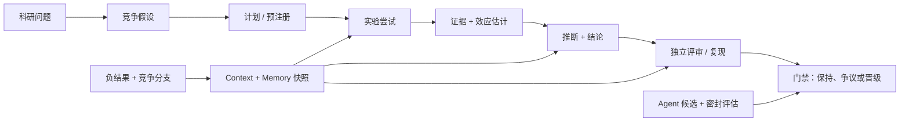
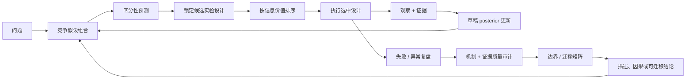

<p align="center">
  
</p>

<h1 align="center">XScientist</h1>

<p align="center"><strong>可审计、可分支、可复现的自动化科研。</strong></p>

<p align="center">
  从一个可证伪问题出发，自动形成实验、证据 DAG、评审门禁和论文；
  每一次决策都像代码一样留下版本历史。
</p>

<p align="center">
  <a href="https://pypi.org/project/xscientist/"></a>
  <a href="https://pypi.org/project/xscientist/"></a>
  <a href="https://github.com/smileformylove/XScientist/actions/workflows/smoke.yml"></a>
  <a href="../LICENSE"></a>
  <a href="https://arxiv.org/abs/2607.12301"></a>
</p>

<p align="center">
  <a href="#两分钟本地体验">快速开始</a> ·
  <a href="#不要只验证第一个假设">深度科研</a> ·
  <a href="#运行一次全自动研究">全自动研究</a> ·
  <a href="#从分数提升到可迁移方法">方法发现</a> ·
  <a href="#人和-agent-都能用的科研-git">科研 Git</a> ·
  <a href="RESEARCH_PROTOCOL_V2.md">科研协议</a> ·
  <a href="../README.md">English</a>
</p>

XScientist 既是一套本地优先的自动科研系统，也是一份开放科研协议。它可以规划、
执行、批判、修复和打包计算型研究，同时把研究问题、上下文、失败尝试、证据、
决策与结论保存成机器可读的历史。人类和 Agent 都可以回到过去的 commit，建立
挑战分支，或从某个精确实验节点继续探索。

> [!IMPORTANT]
> XScientist 目前是 **Alpha 科研软件**，不是科学事实机器。本地科研 Git 免费且
> 不需要 API Key；全自动研究会调用外部模型、可能产生费用，并且只应在配置好的
> 隔离边界内执行生成代码。机器生成的结论不会自动获得“已验证”状态，只有满足
> 证据闭环和独立门禁后才能晋级。

本文档覆盖稳定版 `0.1.3` 以及 `main` 上兼容的公开接口；安装前请先看
[安装与兼容性](#安装与兼容性)。

## 先选择你的使用路径

| 目标 | 第一次看到价值 | 需要 API Key | 入口 |
| --- | --- | --- | --- |
| 理解科研协议、看到证据 DAG | 几分钟 | 不需要 | [两分钟本地体验](#两分钟本地体验) |
| 从问题开始跑全自动研究 | 完成配置后，运行时间取决于模型和实验 | 需要 | [运行一次全自动研究](#运行一次全自动研究) |
| 回顾、分支、diff 或复现已有研究 | 已有仓库或 ARA 时可立即开始 | 只读检查不需要 | [科研 Git](#人和-agent-都能用的科研-git) |
| 集成其他工具或 Agent | 取决于集成范围 | 只有模型动作需要 | [SDK、API 与适配器](#sdkapi-与适配器) |

## 两分钟本地体验

下面会创建一个完整的科研 Git 仓库和离线 DAG 浏览器，包含失败尝试、支持证据、
反驳证据、独立拒绝和争议结论；不调用模型或网络。只需要 Python 3.10+ 和 Git。

```bash
python -m pip install "xscientist==0.1.3"
xscientist demo ./retrieval-study --lang zh --open
xscientist status ./retrieval-study --lang zh
```

如果还想零成本验证完整的 Autopilot 形态（进度、预算、洞见和可恢复回执），运行：

```bash
xscientist demo ./autopilot-study --autopilot --lang zh
xscientist benchmark first-run --max-seconds 30
```

如果浏览器没有自动打开，请打开
`retrieval-study/research-dag/research-dag.html`。该演示成本为 `$0.00`，结果可
确定复现，并且会诚实地停在“科学闭环未通过”：留出证据反驳了宽泛的迁移结论。
`status` 会在一个只读视图中显示分支、科学进度、运行/预算状态、DAG 和下一步。

继续研究：

```bash
cd retrieval-study
xscientist research guide --lang zh

# 探索性路线：锁定研究前先比较不同解释。
xscientist research plan @latest:hypothesis \
  "比较检索与无检索基线" \
  --test "留出基准能区分两个解释"

# 验证性路线：看到结果前锁定数据、指标、基线与划分。
xscientist research preregister @latest:hypothesis \
  --dataset DATASET \
  --metric factual_accuracy \
  --baseline no_retrieval \
  --split-file SPLIT_FILE \
  --registered-by human:YOUR_NAME
```

`@latest:hypothesis` 这样的选择器消除了大多数手工复制 ID 的操作；不可变完整 ID
仍保存在仓库中，保证可复现性。

## 运行一次全自动研究

`xscientist start` 是带安全门禁的一站式入口：创建或复用工作区、配置一个模型
供应商、建立本地科研身份、初始化科研 Git、检查隔离执行器，然后从一个问题启动
Autopilot。

### 1. 只安装需要的 Provider

```bash
python -m pip install \
  "xscientist[research,openai]==0.1.3"
```

可选 Provider extra 包括 `openai`、`anthropic`、`zhipu`、`bedrock`、
`vertex` 和 `openai-compatible`。最后一个覆盖 DeepSeek、Gemini、OpenRouter、
Hugging Face 推理、Ollama 和通用兼容端点。
默认 `research` 任务不会安装 ML 或 PDF 排版栈；只有研究确实需要时再选择
`--task ml-study` 或 `--task paper`。

### 2. 从一个问题开始

下面是明确标记为探索性的计算研究。若凭据不存在，CLI 会使用隐藏输入；进程中已
配置的环境变量优先。

```bash
xscientist start ./ood-reflection \
  --question "为什么检索引导的反思在分布外场景失效？" \
  --provider openai \
  --model openai/gpt-4.1 \
  --autopilot discovery \
  --allow-synthetic-data \
  --max-cost-usd 10 \
  --build-executor
```

真实数据研究应把 `--allow-synthetic-data` 换成 `--data-dir ./data`。系统会在模型
调用前为输入计算哈希，并以只读方式挂载数据快照。可同时设置
`--max-project-tokens`、`--max-project-hours`、`--max-cost-usd` 作为项目级
硬上限；启用费用上限后，未知模型价格会直接阻断而不是猜测。未内置价格的模型可
通过 `--price-input-per-million` 与 `--price-output-per-million` 显式配置，
也可以写入工作区的 `llm_budget.prices_per_million`。

付费运行前，可以在不发起 API 请求的前提下检查本地状态：

```bash
xscientist provider check --max-cost-usd 10
```

输出会明确区分“凭据存在”和“真实 API 已验证”，并显示该模型能否执行费用门禁。

| Autopilot | 适合场景 | 主要行为 |
| --- | --- | --- |
| `balanced` | 第一次完整运行 | 成本受控的搜索与标准评审/修复 |
| `discovery` | 探索机制和洞见 | 更多竞争假设、分支多样性和反证压力 |
| `publication` | 候选论文 | 多角色评审委员会和更严格投稿门禁 |

如果设置阶段中止，按诊断修复后重新执行同一命令即可。研究问题与完成的工作都会
保留，系统从有效 checkpoint 继续，而不是悄悄重跑。

长任务可以放到后台，并在另一个终端中安全管理：

```bash
xscientist start ./ood-reflection \
  --question "为什么该机制在分布外失效？" \
  --allow-synthetic-data --max-cost-usd 10 --detach
xscientist runs list --workspace ./ood-reflection
xscientist runs watch RUN_ID --workspace ./ood-reflection
xscientist runs logs RUN_ID --workspace ./ood-reflection --tail 100
```

`runs cancel` 会先请求优雅终止，`runs resume` 使用私有保存的原始命令继续；公开
运行视图不会暴露研究问题或恢复参数。`xscientist upgrade check` 默认离线且只读，
只有显式添加 `--online` 才会查询 PyPI。

### 全自动闭环会留下什么

```text
问题 + 约束
    ↓
想法 + 候选排序
    ↓
隔离实验 + 失败分支 + 指标
    ↓
证据绑定洞见 + 敌对评审 + 修复
    ↓
论文候选 + 完整性报告 + 发布门禁
    ↓
科研 Git 历史 + ARA 工件 + 离线科研 DAG
```

“流程全自动”不等于“科学角色合并”。内部 Agent 可以提出、执行、批判、修复和
总结，但不能充当自己的独立复现者。自动洞见会标记为
`machine_synthesized_unverified`，在独立证据出现前停留在 hold gate 后面。

## 为什么是 XScientist

许多科研 Agent 主要优化最后一个产物——答案或 PDF。XScientist 优先保存使产物
可信、可复核、可接力的完整路径。

| 能力 | 被保存的内容 |
| --- | --- |
| 科学推理 | 问题、假设、前提、假定、论证依据、估计目标、效应估计和推断决策 |
| 科研策略 | 竞争假设组合、区分性预测、信息价值排序、异常、机制、证据质量审计和迁移边界 |
| 精确 Context 与 Memory | 不丢失的审计闭包，加上受 token 预算约束、感知当前科研前沿的工作记忆；关键证据、反证、失败和历史决策不会被长上下文静默淹没 |
| 实验 | 计划、锁定预注册、代码、环境、数据哈希、尝试、失败、指标、图表和方案偏离 |
| 证据与结论 | 支持、反驳、条件支持、争议、取代、评审、复现和晋级关系 |
| 协作 | 语义分支、diff、blame、merge 预览、冲突指导、tag、bundle、restore 和 revert |
| Agent 自进化 | 不可变候选、密封评估、受控 canary、多方签名晋级和内容校验回滚 |
| 跨平台互操作 | ARA，以及面向 RO-Crate、PROV-JSON、CWL、DVC、MLflow、OpenLineage、Croissant、Nanopublication 的交换接口 |

## 一张统一证据 DAG，而不是互不相干的日志目录



离线浏览器可以按策略、执行、证据、理论、决策记忆和进化六层筛选，并区分支持、
反驳、验证、理论、边界、自进化和 context/memory 边。点开一个 Claim，会直接看到
支持、反证、机制、质量审计、适用边界、未补齐缺口和下一项高信息价值实验。每个节点携带
完整性和闭包状态，因此系统严格区分：

- **可追溯（traceable）**：来源路径存在；
- **可回放（replayable）**：执行工件与环境回执齐全；
- **已验证（verified）**：合格的独立主体已通过所需门禁。

三者不能互相替代。详见[科研协议 v2](RESEARCH_PROTOCOL_V2.md)、
[科研 DAG 与适配器](RESEARCH_DAG_AND_ADAPTERS.md)和
[科研完整性协议](RESEARCH_INTEGRITY.md)。

## 不要只验证第一个假设

真正有深度的自动科研，应该主动区分竞争解释，而不是围绕第一个想法不断累积支持。
XScientist 把这条策略链也记录为内容寻址、不可变的科研对象，同时保持旧对象兼容。



```bash
# 先生成候选实验、质量评估和边界矩阵模板。
xscientist research program template --output deep-research.json

# PRIMARY_ID、RIVAL_ID 是已记录的假设选择器或完整 ID；null 可按需追加。
xscientist research program portfolio PRIMARY_ID \
  --alternative RIVAL_ID \
  --question "哪个机制最能预测留出条件？" \
  --prior PRIMARY_ID=2 --prior RIVAL_ID=1

xscientist research program prediction @latest:hypothesis_portfolio PRIMARY_ID \
  --when "对候选中介变量做消融" \
  --expect "效应消失" \
  --distinguishes RIVAL_ID \
  --falsifier "效应保持不变"

# 对同一条件，也必须逐一锁定每个 rival/null 的预测。
xscientist research program prediction @latest:hypothesis_portfolio RIVAL_ID \
  --when "对候选中介变量做消融" --expect "效应保持" \
  --distinguishes PRIMARY_ID --falsifier "效应消失"

xscientist research program prioritize \
  @latest:hypothesis_portfolio deep-research.json

xscientist research experiment "执行被选中的消融" --status completed \
  --plan SELECTED_DESIGN_ID --priority PRIORITY_ID
xscientist research evidence "效应消失" --attempt ATTEMPT_ID
xscientist research program posterior PORTFOLIO_ID PRIORITY_ID ATTEMPT_ID EVIDENCE_ID \
  --observed "效应消失" \
  --likelihood PRIMARY_ID=0.9 --likelihood RIVAL_ID=0.1

# 只读检查结构性短板，或把复盘和新异常写入科研历史。
xscientist research program review
xscientist research program review --record
```

已验证的 `causal` 结论必须把机制证据追溯到已完成的干预实验，质量评估者不能出现在
完整生产者 lineage 中；`transferable` 还要求各条件使用独立 attempt/evidence，并隔离
开发集与留出集的数据哈希。旧 v1 历史仍可验证，新对象默认使用 fail-closed v2：

```bash
xscientist research claim "机制 M 在留出域中仍然成立。" \
  --evidence EVIDENCE_ID --verified --gate GATE_ID \
  --depth-level transferable \
  --mechanism MECHANISM_ID --quality QUALITY_ID --transfer MATRIX_ID

xscientist research program claim @latest:claim
xscientist research dag --output ./research-dag
```

完整对象语义、排序公式、阻断规则与自动化边界见
[深度科研协议](DEEP_RESEARCH_PROTOCOL.md)。

## 从分数提升到可迁移方法

XScientist 不会把单个基准分数提升直接称为“方法发现”。实验前，
`research discovery plan` 会锁定目标组件、允许与禁止修改的代码范围、固定变量、
资源上限、强基线、多种评测条件和盲测反馈；实验后，
`research discovery assess` 会判断结果只是开发条件上的工程优化，还是能够通过
迁移或尺度验证的新方法。

```bash
# 先生成完整模板，不需要从空白 JSON 开始。
xscientist research discovery template --output discovery.json

# 替换模板中的 REPLACE_* 字段后，在实验前锁定契约。
xscientist research discovery plan \
  @latest:hypothesis discovery.json

# 所有条件完成后，综合真实证据并产生确定性 verdict。
xscientist research discovery assess \
  @latest:experiment_design results.json \
  --evidence @latest:evidence
```

方法发现 DAG 会显式包含“资源预算 → 锁定实验设计 ← 盲测策略”，再连接各条件证据、
泛化评估和结论。若候选方法修改了受保护文件、扩大资源、替换评测器、漏跑基线或
条件，或只在可见开发集上提升，协议都不会允许它以 `method_discovery` 强度晋级。
完整 JSON 结构、归一化评分和四种 verdict 见
[方法发现协议](METHOD_DISCOVERY_PROTOCOL.md)。

## 人和 Agent 都能用的科研 Git

科研 Git 暴露的是科学概念，不是普通文件操作。Git 只是当前可替换的持久化
适配器；无需 GitHub、远端或服务器，XScientist 永远不会自动 push。

### 回顾过去的决策与上下文

```bash
xscientist research log --limit 20
xscientist research show HEAD~1
xscientist research diff HEAD~1 HEAD --deep
xscientist research objects --kind evidence
xscientist research blame rso-<evidence-object-id>

# 为 Agent 编译一次“继续研究”真正需要看到的上下文。
xscientist research context @latest:claim \
  --intent continue \
  --budget 8000 \
  --record
```

被记录的 context receipt 可以回答：这次决策发生时，Agent 究竟看到了哪些证据、
负知识、政策和记忆？有限 token 的上下文可以压缩，但硬证据闭包不能被裁掉。
系统会把“完整审计快照”和“真正送入模型的工作记忆”分开：`--json` 用于审计和
回放，`--prompt` 只输出带来源绑定的紧凑工作集。被新证据取代的对象仍可检查，
但会进入 archived history；当前前沿、仍然有效的反证和最近相关决策优先。如果
这些必要语义放不进声明的预算，Context 会明确标为 incomplete，而不会假装完整。

```bash
xscientist research context @latest:claim \
  --intent continue --budget 2000 --prompt
```

### 建立挑战分支

```bash
xscientist research branch challenge/retrieval --switch
xscientist research plan @latest:hypothesis \
  "寻找反例" \
  --test "一个可复现失败会反驳当前机制"

xscientist research switch main
xscientist research merge challenge/retrieval --preview
xscientist research merge challenge/retrieval
xscientist research branch -d challenge/retrieval
```

语义合并会识别不兼容预注册、指标错配、相反证据和未经门禁的 Agent 变更。即使
当前结论进入 contested 状态，双方证据仍会被完整保留。

### 审计、复现和移交

```bash
xscientist research audit --level trace
xscientist research audit --level replay
xscientist research reproduce HEAD --execute --record

xscientist research bundle --dest ./study-backup
xscientist research export --dest ./exchange
```

ARA 是面向另一个 Agent 的节点级交接格式：

```bash
xscientist ara graph --ara /path/to/ara --write-html --open
xscientist ara context --ara /path/to/ara \
  --intent continue \
  --node NODE_ID \
  --budget 8000 \
  --receipt
xscientist ara fork --help
```

ARA 包含探索图、每个节点的代码与终端输出、指标、图表、环境指纹、修复历史、
Pareto 候选、claim 引用与 provenance。下游 Agent 无需从 PDF 反向猜测研究过程。

## 系统架构

```mermaid
flowchart TB
  U["CLI · Python SDK · HTTP API"] --> O["科研编排器"]
  O --> A["Autopilot：构思 · 实验 · 写作 · 评审 · 修复"]
  O --> RG["科研 Git：类型对象 · 分支 · 门禁"]
  A --> EX["隔离执行器"]
  A --> M["模型与检索 Provider"]
  A --> ARA["ARA 工件"]
  RG --> DAG["统一科研 DAG"]
  ARA --> DAG
  DAG --> V["离线浏览器 · 审计 · 复现 · 适配器"]
  RG --> EV["受控自进化"]
  EV --> O
```



公共接口位于 `xscientist/`，科研工作流实现在 `ai_scientist/`，版本化 Schema 位于
`ai_scientist/protocol/`。组件边界见[系统架构](ARCHITECTURE.md)。

## 安装与兼容性

| 渠道 | 安装命令 | 使用场景 |
| --- | --- | --- |
| 稳定版 `0.1.3` | `python -m pip install "xscientist==0.1.3"` | 需要已发布版本和稳定发布契约 |
| 当前 `main` | `python -m pip install "xscientist @ git+https://github.com/smileformylove/XScientist.git@main"` | 需要尚未发布的开发改动，并接受源码版本持续变化 |
| 贡献者 | `python -m pip install -e ".[research,openai,dev]" -c requirements/constraints-ci.txt` | 修改源码和测试 |

实验需要精确复现时，请固定 commit，不要跟踪 `main`。Python 包遵循语义版本，ARA
和科研 VCS Schema 拥有独立的版本身份。

| Extra | 作用 |
| --- | --- |
| `research` | 推荐的端到端科研运行环境 |
| `openai`、`anthropic`、`zhipu` | 单一模型客户端 |
| `openai-compatible` | 兼容端点与本地/服务端路由 |
| `bedrock`、`vertex` | 托管 Anthropic 路由 |
| `plot`、`pdf`、`pdf-layout`、`ml` | 按研究需要安装的专业能力 |
| `service` | FastAPI/Uvicorn 服务 |
| `trust` | 可选签名和信任组件 |
| `full` | 向后兼容的一体化环境 |

核心 CLI 与协议会测试 Linux 上的 Python 3.10–3.12，以及 macOS、Windows 上的
Python 3.11。完整自动科研还依赖具体 Provider、实验依赖、Docker 隔离和可选的
LaTeX/PDF 工具。GPU/CUDA 不是必需条件。

源码开发：

```bash
git clone https://github.com/smileformylove/XScientist.git
cd XScientist
python3 -m venv .venv
source .venv/bin/activate  # Windows: .venv\Scripts\activate
python -m pip install -e ".[research,openai,dev]" \
  -c requirements/constraints-ci.txt
python -m xscientist --version
```

普通用户安装后使用 `xscientist ...`。`python -m xscientist ...` 适合已激活的源码
开发环境；如果包没有安装，切换到仓库外的工作区后模块不会自动可见。

## 产物与可观测性

```text
<output-root>/projects/<project>/
├── 00_config/                  固定问题与运行配置
├── 01_ideas/                   候选想法与排序
├── 02_experiments/             代码、日志、指标、图表、评审
├── 03_papers/                  论文候选与最终 PDF
├── 04_logs/                    进度、预算、洞见、门禁
└── ara/                        Agent-Native Research Artifact

<output-root>/views/<project>/research-dag/
├── research-dag.json
└── research-dag.html           离线证据浏览器
```

Autopilot 生成的视图默认位于科研 Git 工作树之外；手动通过
`research dag --output` 写在仓库内的视图会被科学暂存策略排除，因此重新生成不会
进入 checkpoint。系统可以从 `04_logs/progress.json` 和有效实验 checkpoint 安全续跑。

## 安全与科学边界

| 边界 | 默认策略 |
| --- | --- |
| 生成实验代码 | 进入隔离执行器；严格模式缺少指定镜像时直接停止 |
| 实验网络 | 严格隔离时关闭，输入应提前准备 |
| 凭据 | 隐藏输入、Git 忽略的私有 env 文件、诊断输出脱敏 |
| 远端发布 | 不创建 remote，不自动 push |
| 证据晋级 | 默认 draft；verified 需要合格证据与独立门禁 |
| 负结果 | 作为一等历史和 memory 保存，不为改善叙事而删除 |
| 自进化 | shadow candidate → sealed evaluation → canary → 签名晋级；生产变更默认关闭 |
| 人类责任 | 事实核查、伦理、许可证、外部有效性和现实决策仍由人承担 |

敏感领域中，XScientist 只能作为科研基础设施，不能替代机构审查、领域专家或受监管
验证。

## SDK、API 与适配器

```python
from xscientist import ProjectRequest, XScientist

client = XScientist(output_root="./research-output")
result = client.run_project(
    ProjectRequest(
        project="retrieval-study",
        question="检索引导反思在什么条件下失效？",
        autopilot="discovery",
        allow_synthetic_data=True,
        max_cost_usd=10,
    )
)
print(result.returncode)
```

安装 `xscientist[service]` 可启用 FastAPI 服务。工具开发者可以用
`xscientist research adapter list` 发现平台适配器，并实现版本化的
`xscientist.research_adapters` entry point。

详见 [SDK 与 API](guides/SDK_AND_API.md)、[配置参考](CONFIG_REFERENCE.md)、
[DAG 与适配器](RESEARCH_DAG_AND_ADAPTERS.md)。

## 文档索引

| 目标 | 文档 |
| --- | --- |
| 第一次全自动研究 | [项目使用](guides/PROJECT_USAGE.md) |
| 当前上手难度与量化优化策略 | [上手与增长审计](ONBOARDING_AUDIT.md) |
| 科研 Git 命令与心智模型 | [本地科研 Git](LOCAL_RESEARCH_GIT.md) |
| 协议保证与迁移 | [科研协议 v2](RESEARCH_PROTOCOL_V2.md) · [迁移指南](PROTOCOL_MIGRATION_2026.md) |
| 证据 DAG 与平台集成 | [科研 DAG 与适配器](RESEARCH_DAG_AND_ADAPTERS.md) |
| 竞争假设、信息价值与深度结论门禁 | [深度科研协议](DEEP_RESEARCH_PROTOCOL.md) |
| 工程提升与方法发现门禁 | [方法发现协议](METHOD_DISCOVERY_PROTOCOL.md) |
| Context、Memory 与科学不变量 | [认识图谱](EPISTEMIC_GRAPH_SPEC.md) · [科学宪法](SCIENCE_CONSTITUTION.md) |
| 科研完整性与独立评估 | [科研完整性](RESEARCH_INTEGRITY.md) · [评估治理](EVALUATION_GOVERNANCE.md) |
| 受控自进化 | [自进化架构](SELF_EVOLUTION_ARCHITECTURE.md) · [进化门禁](EVOLUTION_GATE.md) |
| ARA 保存、打包与 GC | [ARA 生命周期](ARA_STORAGE_LIFECYCLE.md) |
| Daemon 长期运行 | [长期运行指南](LONG_RUNNING_GUIDE.md) |
| 架构、工程与发布 | [架构](ARCHITECTURE.md) · [工程指南](ENGINEERING.md) |

## 当前状态与优化方向

项目目前处于 Alpha。0.1.3 已加入零 Provider 首次体验、统一状态视图、按任务缩减
的执行器依赖、稳定诊断修复项、显式价格预检，以及从构建 wheel 运行 demo 的发行
门禁。下一步重点是继续降低容器/Provider 配置成本、增加高质量录屏与样例 ARA，
并在干净机器上持续测量首次价值时间。详细策略见
[上手与增长审计](ONBOARDING_AUDIT.md)。

## 参与贡献

欢迎提交 Issue、协议提案、平台适配器、可复现实例和聚焦的 Pull Request。

- [贡献指南](https://github.com/smileformylove/XScientist/blob/main/.github/CONTRIBUTING.md)
- [Issue 模板](../.github/ISSUE_TEMPLATE/)
- [行为准则](https://github.com/smileformylove/XScientist/blob/main/.github/CODE_OF_CONDUCT.md)
- [安全报告](https://github.com/smileformylove/XScientist/blob/main/.github/SECURITY.md)

```bash
make syntax
make engineering
make test
make coverage
make package-check
```

协议 Schema、证据绑定、context 选择、重执行或 CAS 可达性发生变化时，必须增加
兼容性测试。贡献协议、文档和普通测试不应强制使用付费模型。

## 论文、示例与引用

- 系统论文：[XScientist: A Git-Like Research Protocol for Long-Running Autonomous Scientific Discovery](https://arxiv.org/abs/2607.12301)
- 论文源码：[`paper/xscientist_arxiv/`](../paper/xscientist_arxiv/)
- 系统报告示例：[`example/XScientist_Board.pdf`](https://github.com/smileformylove/XScientist/blob/main/example/XScientist_Board.pdf)
- 引力研究论文示例：[`example/icml_submitted_gravitation_paper.pdf`](https://github.com/smileformylove/XScientist/blob/main/example/icml_submitted_gravitation_paper.pdf)
- GitHub 引用元数据：[`CITATION.cff`](https://github.com/smileformylove/XScientist/blob/main/CITATION.cff)

如果 XScientist 参与了研究结果，请同时记录软件 commit、配置、模型版本、数据身份
以及 ARA/科研 Git 工件 ID。

```bibtex
@misc{xscientist_arxiv_2607_12301,
  title         = {XScientist: A Git-Like Research Protocol for Long-Running Autonomous Scientific Discovery},
  author        = {Luo, Jixiang},
  year          = {2026},
  eprint        = {2607.12301},
  archivePrefix = {arXiv},
  doi           = {10.48550/arXiv.2607.12301},
  url           = {https://arxiv.org/abs/2607.12301}
}
```

## 致谢与许可证

XScientist 借鉴并使用了
[The AI Scientist](https://github.com/SakanaAI/AI-Scientist)、
[autoresearch](https://github.com/karpathy/autoresearch)、
[AIDE](https://github.com/WecoAI/aideml) 以及更广泛的开放科研生态中的思想与代码。
具体许可证与归属以源码头和依赖元数据为准。

项目采用 Apache-2.0 许可证，详见 [LICENSE](../LICENSE)。
