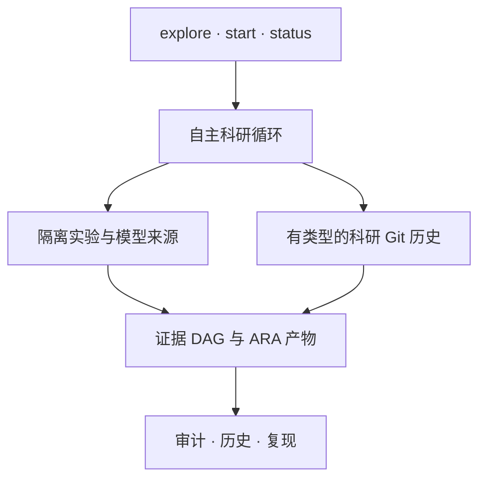

<p align="center">
  
</p>

<h1 align="center">XScientist</h1>

<p align="center"><strong>把一个想法变成 Git 式科研历史：可检查、可复现、可回滚。</strong></p>

<p align="center">
  只带来一个想法也可以——不要求先懂模型或 API Key。XScientist 会帮助检验它，
  但不会隐藏不确定性、失败尝试或相反证据。
</p>

<p align="center">
  <a href="https://pypi.org/project/xscientist/"></a>
  <a href="https://pypi.org/project/xscientist/"></a>
  <a href="https://github.com/smileformylove/XScientist/actions/workflows/smoke.yml"></a>
  <a href="https://github.com/smileformylove/XScientist/blob/main/LICENSE"></a>
  <a href="https://arxiv.org/abs/2607.12301"></a>
</p>

<p align="center">
  <a href="#api-key">快速开始</a> ·
  <a href="#运行自主研究">自主研究</a> ·
  <a href="#far-启发的研究机会漏斗">研究机会漏斗</a> ·
  <a href="#信念上下文投影受-bcg-启发">信念上下文</a> ·
  <a href="#检查审计与复现">审计复现</a> ·
  <a href="#安装方式">安装</a> ·
  <a href="https://zhuanlan.zhihu.com/p/2027818800238666075">项目随笔</a> ·
  <a href="../README.md">English</a>
</p>

XScientist 既是本地优先的自主科研系统，也是一套开放科学协议。它可以比较竞争
解释、选择更有信息量的实验、通过配置好的执行器边界运行、主动批判结果，并把整个
过程保存为带类型、机器可读的科研对象。一次运行完成，并不等于科学结论已经成立；
只有证据和评审门禁真正通过后，系统才会把它标记为已验证。

> **重要：** XScientist 目前是 Alpha 科研软件，不是科学事实机器。自主运行可能调用付费模型；
> 生成代码必须经过配置好的隔离执行器；机器生成的结论只有补齐证据和独立评审
> 门禁后，才能成为“已验证”。

PyPI 当前提供已发布的 `0.1.4` 正式版；`main` README 同时明确记录 changelog 中
`Unreleased` 的协议加固。0.1.4 新增受 FAR 启发、按来源核对的研究机会漏斗，同时保留既有来源追踪、隔离和
科研评审门禁。需要严格复现实验时，请固定软件版本或源码 commit。

## 先选最短路径

| 你的起点 | 先运行 | Provider 或成本 | 立即得到什么 |
| --- | --- | --- | --- |
| 有想法，但没有模型或 API Key | `xscientist explore ./my-study --lang zh` | 无 | 本地保存、带版本、可证伪的科研起点 |
| 想先看看系统是否实用 | `xscientist demo ./first-study --autopilot --lang zh --open` | 无；`$0.00` | 完整但故意保留争议的证据历史 |
| 已有本地 Ollama 模型 | `xscientist provider list` | 本地算力；无需托管 Key | 可用模型和下一条配置命令 |
| 已有托管模型 Key | `xscientist start ./my-study` | 可能产生模型费用 | 在同一历史中启动受控自主科研 |

如果不确定，从 `explore` 开始。它只记录你真正知道的内容，未知项会诚实保持为空。

## 从自己的想法开始：不需要 API Key

只需要 Python 3.10+ 和 Git。安装完成后，不需要 API Key、模型、Docker 或网络调用。

```bash
python -m pip install \
  "xscientist==0.1.4"
xscientist explore ./my-study --lang zh
```

引导过程不要求理解 Provider 或科研协议，只会问四个普通问题：

- 你想研究什么想法？
- 如果想法成立，你预计能观察到什么变化？
- 什么结果会让你改变看法？
- 先做哪一个公平比较或检验？

当一个可证伪假设已经存在、但研究计划尚未锁定时，引导器会把“竞争解释先行”设为
主动作：先记录一个可证伪的竞争假设，再把候选解释锁进 hypothesis portfolio，最后
才选择研究模式。底层 API 仍然可用，但新手引导不再把“先规划自己偏好的解释”排在
第一位。

只回答第一个问题也可以，之后再次运行同一命令继续。XScientist 会把真实状态明确
保存为“想法已保存”“可证伪”或“已有计划”，绝不会为了显得完整而替用户编造答案。
这条路径不使用 Provider，不调用模型，不执行生成代码，也不会伪造证据或结论。

脚本或自动化环境可以显式传入同样的信息：

```bash
xscientist explore ./my-study \
  --idea "每天散步是否改善睡眠质量？" \
  --expect "每天散步会改善预先选定的睡眠评分。" \
  --disprove "评分没有改善或变差。" \
  --test "比较散步阶段和日常活动阶段。" \
  --lang zh --non-interactive
```

无需阅读内部日志，也能理解工作区：

- `question.md` 保存人可以直接阅读的科研问题；
- `research.yaml` 保存本地策略与工作区身份；
- `.xscientist/objects/` 和 `checkpoints/` 保存有类型的决策与历史；
- 本地 Git 仓库没有远端，也不会自行推送。

在已有项目中初始化也保持非破坏性。已有 `.gitignore` 的文本和顺序会保留；若完整
安全策略尚未出现，则在末尾追加一份顺序固定的 XScientist 规范块。若已经存在内容不同的 `question.md` 或
`.xscientist/README.md`、Git index 中已有 staged work，或受管文件存在 tracked
修改，初始化会停止。若目录已经是 Git 仓库，首个 checkpoint 只包含 XScientist
管理的路径，其他未提交项目文件仍留在 commit 之外。

`init`、`setup` 与 `start` 只有在 privacy、Provider 和诊断检查正常完成、没有执行
异常后才发布 checkpoint。结构化的“运行时尚未就绪”可以保留为显式 blocked
准备状态，用户修复环境后无需重新输入已经验证的选择。出现异常或写入失败时，回滚
只移除仍与本次调用写入完全一致的文件；并发产生的
科研文件、Git 配置、ref、index intent 和历史都会保留，无法完整回滚时会明确报告，
不会静默删除。危险的 Git 控制路径、特殊受管文件和形似凭据的模型元数据会在持久化
之前被拒绝；结构化错误与成功 JSON 共用同一脱敏边界。

日常使用 `status` 和 `history` 查看即可；新用户无需直接修改内部对象仓库。

如果想先看一条完整但存在争议的证据历史，可运行内置 `$0.00` 样例：

```bash
xscientist demo ./first-study --autopilot --lang zh --open
xscientist status ./first-study --lang zh
```

演示会诚实停在“运行完成，仍需补充证据”，因为留出结果挑战了过度宽泛的结论。
保留冲突是正确的科学行为，不是程序失败。

日常只看 `status` 即可。需要分支、流水线、Token 或后台任务细节时再加
`--verbose`；自动化程序使用 `--json`。

可移植 JSON 不会嵌入被检查工作区的宿主机路径。每个 `primary_action` 或
`next_steps[]` 行都包含 `action` 契约：已有对象使用精确的 `rso-...` ID，并明确
给出 `argv_template`、`workspace_binding`、`cwd_binding` 与 `input_binding`。
调用方必须把 `{workspace}` 绑定到本次命令收到的工作区。若仍有待填写的人类输入，
则 `input_binding.required=true` 且 `executable_after_binding=false`；自动化程序
在这些值由人提供之前不得执行该模板。

## 运行自主研究

离线引导能够整理用户亲自给出的判断，但不能诚实地凭空产生领域知识、数据或科研
发现。需要 AI 辅助探索时，再为已经保存的问题添加模型；同一个工作区可以安全升级，
不会替换原有科研历史。

先查看当前可用模型。这个命令不要求已有工作区，会优先发现正在运行的本地 Ollama，
再显示托管服务：

```bash
xscientist provider list
```

### 本地模型

[安装 Ollama](https://ollama.com/download)，下载一个本地模型，并确认本地服务正在
运行。桌面应用会启动服务；无界面环境可使用 `ollama serve`。这条路径不需要托管
API Key。当前[官方 CLI 文档](https://docs.ollama.com/cli)使用 `ollama pull` 下载、
`ollama ls` 查看本地模型：

```bash
ollama pull gemma3
ollama ls

python -m pip install \
  "xscientist[research,openai-compatible]==0.1.4"
xscientist provider list
xscientist start ./my-study
```

交互流程只询问缺失的信息：问题、Provider/模型、证据来源、本地科研身份和可选
预算。如果只发现一个可用 Provider，会自动选择，不要求用户重复确认。对于
`explore` 创建的工作区，会直接复用已保存的问题，并保留已有科研文件。本地模型
可以避免托管 API 费用，但仍会占用本机算力；生成实验代码仍需经过 Docker 隔离。

### 托管模型

安装科研运行时，再只安装一个需要的 Provider 客户端：

```bash
python -m pip install \
  "xscientist[research,openai]==0.1.4"
export OPENAI_API_KEY="..."
xscientist start ./hosted-study
```

客户端 extra 包括 `openai`、`anthropic`、`zhipu`、`bedrock`、`vertex` 和
`openai-compatible`。最后一个也覆盖 Ollama、DeepSeek、Gemini、OpenRouter 和
自定义兼容端点。

对于任意 OpenAI-compatible 服务，可以显式添加自定义端点。`custom` 是通用
`openai_compat` Provider 的易用别名；地址和密钥会写入工作区中权限受限且被 Git
忽略的 `.env`，不会进入 Provider 元数据：

```bash
python -m pip install "xscientist[research,openai-compatible]"
export OPENAI_COMPAT_API_KEY="..."
xscientist provider add custom \
  --model gpt-5.6-luna \
  --base-url "https://your-compatible-service.example/v1" \
  --non-interactive
xscientist provider test custom --json
```

`provider test` 会发起一次明确的最小请求，并比较客户端发送的模型和端点返回的
模型。如果网关静默切换到较小模型，会标记为未验证；测试不会保存响应正文。

### 把 GLM-5.3 作为科研执行者

通过自定义 OpenAI-compatible 路由使用 GLM-5.3 时，传输参数只放在权限受限的
Provider 配置中，并显式选择带路由前缀的模型：

```bash
xscientist provider add custom \
  --model glm-5.3 \
  --base-url "https://your-compatible-service.example/v1" \
  --non-interactive
xscientist provider test custom --json
xscientist start ./glm53-study \
  --provider custom \
  --model openai_compat/glm-5.3
```

Python SDK 和底层 `--bfts-config glm53` 流程也可以直接使用内置的 `glm53` BFTS
预设。它把 `openai_compat/glm-5.3` 分配给代码生成、执行反馈、图表审查、阶段总结
和最终报告；但 GLM 无权自行晋级结果，流程推进仍由宿主确定性评估、held-out 确认
种子、checkpoint 重放和科研门禁决定。该预设不包含 endpoint、key、headers 或任何
私有传输信息，并设置 500,000 token / 6 小时上限；如果需要成本上限，必须另行
配置自定义模型价格。

该路由要求端点返回的模型身份精确等于 `glm-5.3`。文本探针通过不代表图像输入
一定可用；如果端点不能接收图像，VLM 图表审查会安全失败，不会静默切换模型。

脚本和 CI 应显式写出所有重要选择：

```bash
xscientist start ./ood-study \
  --question "为什么检索增强反思在分布外失效？" \
  --provider openai \
  --model openai/gpt-4.1 \
  --user YOUR_NAME \
  --autopilot discovery \
  --data-dir ./data \
  --max-cost-usd 10 \
  --non-interactive
```

只有明确做探索性研究时，才用 `--allow-synthetic-data` 替代 `--data-dir`。输入
数据会先做内容哈希，再以只读方式挂载。启用成本上限后，未知模型价格会安全失败。

### 隔离与就绪检查

生成的实验代码不会静默运行在宿主 Python 进程里。模型实验需要 Docker 和版本
匹配的执行器：

```bash
xscientist executor prepare --workspace ./ood-study
xscientist provider check --workspace ./ood-study --max-cost-usd 10
xscientist doctor --workspace ./ood-study --deep
```

检查会区分客户端、凭据、本地模型、Docker CLI、Docker daemon 和执行器镜像等
问题，并按顺序给出修复命令；默认检查本身不会发起付费模型请求。如果要明确
验证一次远端模型，可单独选择：

```bash
xscientist provider check --workspace ./ood-study --live --timeout 30 --json
```

`--live` 可能产生 Provider 费用，只记录传输结果、模型身份和 token 汇总，不保存
响应正文；不加该参数时仍然是 configuration-only 检查。

### 长任务

```bash
xscientist start ./ood-study \
  --question "机制会在哪里失效？" \
  --allow-synthetic-data --max-cost-usd 10 --detach

xscientist runs list --workspace ./ood-study
xscientist runs watch RUN_ID --workspace ./ood-study
xscientist runs logs RUN_ID --workspace ./ood-study --tail 100
xscientist runs cancel RUN_ID --workspace ./ood-study
xscientist runs resume RUN_ID --workspace ./ood-study
```

`status` 会优先显示运行中或失败的后台任务。失败态返回非零退出码，但 `--json`
仍会输出完整结构，便于自动诊断和恢复。

## 简单入口不会削弱自主科研

默认入口虽然精简，内部科研循环仍会根据 profile：

1. 提出竞争假设和零假设，而不是只维护第一个想法；
2. 提前锁定预测，并按预期信息价值选择实验；
3. 执行有边界的实验，保留失败和负结果；
4. 主动扫描异常、矛盾、证据质量和迁移边界；
5. 运行独立评审、有限修复，并在硬门禁处停止；
6. 打包论文、证据 DAG、来源信息和精确续研上下文。

自主不等于绕过科研权限。XScientist 不会静默编造用户没有回答的内容，不会把合成
数据冒充真实数据，不会在宿主机直接执行生成代码，不会晋级未经评审的结论，也不会
自行发表研究或推送工作区远端。

| Profile | 适用场景 | 侧重点 |
| --- | --- | --- |
| `balanced` | 第一次完整研究 | 有界搜索和标准评审 |
| `discovery` | 发现机制与边界 | 竞争假设、反驳压力、分支多样性 |
| `publication` | 论文候选 | 多角色独立评审和更严格门禁 |

深入策略能力仍在 `xscientist research` 下，但第一次使用无需学习几十个命令。详见
[深度科研协议](DEEP_RESEARCH_PROTOCOL.md)和[方法发现协议](METHOD_DISCOVERY_PROTOCOL.md)。

### FAR 启发的研究机会漏斗

如果要把“文献 → 开放问题 → 尝试/分配”做成可审计漏斗，可使用
[FAR 启发的研究机会协议](OPPORTUNITY_FUNNEL.zh.md)。它按顺序记录研究方向、完整的
候选池、尝试、独立判定、重要性分级和资源分配。`known`、`none`、失败和未尝试的
候选都会保留，不能只留下成功案例；只有候选池完整且每一行明确为
`source_status=open`，allocation 才能通过 fail-closed 门禁。概率和校准状态作为声明的
输入保存，不会被静默补齐，也不会被说成科研成功率。

CLI 使用同一套带类型的协议（默认只写入本地历史，不会自行推送远端）：

如果 `./first-study` 还不存在，请先按[快速开始](#api-key)
创建工作区，再运行下面的命令。

```bash
# 先锁定方向，再提供有界 JSON 候选集。
xscientist research opportunity direction mechanism-search-v1 \
  "哪个机制可以解释留出集异常？" \
  "产出可证伪、可复现的结果。" \
  --repo ./first-study
xscientist research opportunity pool mechanism-search-v1 ./candidates.json \
  --repo ./first-study

# 记录结果、独立门禁和透明的资源分配。
xscientist research opportunity attempt POOL_ID CANDIDATE_ID none \
  "本次尝试没有找到解答。" --repo ./first-study
xscientist research opportunity judge ATTEMPT_ID pass evaluator-independent \
  "证据支持一个新的结果。" --repo ./first-study
xscientist research opportunity grade JUDGMENT_ID substantial evaluator-grader \
  "若独立复现，可能具有较高重要性。" --repo ./first-study
xscientist research opportunity allocate POOL_ID --objective artifact_yield \
  --max-attempts 5 --repo ./first-study
xscientist research opportunity inspect POOL_ID --repo ./first-study --json
```

批量写入时可使用 `--no-commit`，评审后再创建一条明确检查点。阶段回溯必须同时使用
`--allow-stage-override` 和非空 `--override-reason`，理由会绑定到哈希。使用本地
`evidence_object_ids` 会生成可审计的 `derived_from` 关系；只有外部 URL 时会明确标为
未完成本地 lineage。该协议受 [FAR 论文](https://arxiv.org/abs/2608.16977) 和
[作者仓库](https://github.com/zeyu-zheng/FAR)启发，但不声称复现其全语料 importer、
solver、三个 judge 全部通过规则或 pilot 数字，也不生成“人类性能分数”或全球新颖性证明。

## 检查、审计与复现

科研 Git 保存的是有明确科学含义的对象，不要求用户从日志目录猜测上下文。Git 是
当前的本地存储适配器；无需 GitHub 账号或远端，XScientist 也不会自行推送研究。

如果熟悉 GitHub，可以直接使用下面这组对应关系：

| GitHub | XScientist |
| --- | --- |
| Repository | 一个本地科研工作区 |
| Commit 与 Activity | 经过哈希检查的 checkpoint 与 `history list` |
| Files changed | 同时比较文件、结论和科研对象的 `history diff` |
| Branch 与 Pull Request | 竞争科研分支与语义合并预览 |
| Required checks | `trace → replay → verify` 科研门禁 |
| Revert 与 Actions 产物 | 追加式回滚、可复现实验与离线 bundle |

```bash
xscientist status ./first-study --lang zh
xscientist history list ./first-study
xscientist history show ./first-study --commit HEAD
xscientist history diff ./first-study
xscientist audit ./first-study --level trace
xscientist audit ./first-study --level replay
xscientist audit ./first-study --level verify
```

审计会严格区分三个问题：

- `trace`：结论是否都能追溯到证据和决策？
- `replay`：代码、数据、环境、随机种子和命令是否足以重跑？
- `verify`：是否经过了要求的独立验证门禁？

三个层级只能逐级增强：已记录的结论可能可追踪但不可重放，也可能可重放但尚未经过
独立验证。审计显示阻塞，通常意味着存在明确的科研缺口，不一定是软件运行失败。

`verify` 检查的是完整的 active claim closure，不是人工挑选的支持子集。至少要有
一份独立、已验证的 review 单独覆盖全部 active evidence、reasoning、challenge/
refutation 及其不可变 resolution；不能把多份各自不完整的 review 拼起来绕过门禁。
只要仍有 active `refutes`、`qualified_refutes`、`contradicts` 或
`challenges_inference`，即使 `trace` 与 `replay` 完整，`verify` 仍会被阻止。单纯
supersede challenge 也不够；新的 review 与 gate 必须同时覆盖 challenge 和
resolution。

文献证据也遵循显式链条：locked search plan 限定 provider 与精确 query；retrieval
receipt 承诺完整 candidate set；source snapshot 必须唯一匹配一个已选 candidate，
并绑定该 receipt。retraction/withdrawal 是追加事件，后续普通 positive status check
不会将其抹掉。reinstatement 必须来自同一 provider、时间更晚、带 notice，并显式
supersede 当前 active retraction。历史决策使用 `--as-of` 时，会排除边界之后才出现
的证据、来源血缘根、retraction 和 reinstatement，不能让今天的信息改写过去上下文。

### 精确 checkpoint 与单命令保存

所有 checkpoint-sensitive 操作都使用目标 commit 本身，不会在 `HEAD` 或所选 ref
只是普通 raw Git commit 时回退到祖先 checkpoint。`show`、`fsck`、复现、tag、
bundle、export 和语义 merge 都会对未绑定 tip fail-closed；即使复制了 trailer，
只要 checkpoint JSON、父提交、hash 或精确 `changed_paths` 不一致，仍会失败。raw
Git 历史不会被删除，但不会获得 Research VCS 权限。

启用 commit 的单命令 recorder（如 `research hypothesis`）会先要求 native stage
为空，并要求 Git staged、tracked 与 research-eligible 路径均干净。生成的 checkpoint
只包含本次新建的对象路径和 checkpoint 记录，不会顺带吸收无关改动。`--no-commit`
是明确的批量组装模式；之后必须由调用方有意 stage 并 checkpoint 这些路径。

### 论文质量状态

写作通过不等于科学结果已经验证。`quality_gate_passed` 只有在锁定的预注册、每个
注册任务的 confirmatory 记录、独立随机种子、持久化结果文件、带不确定性的候选方法与
基线比较、确定性哈希、`任务 → 指标 → 结论` 证据路径，以及覆盖全部必需标准的干净环境
验证报告同时成立时才会为真。漂亮的文字、图表或 LLM 分数都不能替代缺失证据。

证据链完成前，输出会明确标为 `exploratory_draft` 或 `manuscript_draft`，不会标成
`submission_ready`。结果 JSON 还会给出
`scientific_evidence_failures` 和 `scientific_evidence_next_actions`，直接说明下一步
该补哪份证据；具体字段和复现要求见[科研完整性协议](RESEARCH_INTEGRITY.md)。

手工修改到达一个有意义的状态时，可以先保存检查点，再尝试风险更高的替代方案。
回滚默认只预览；显式使用 `--apply` 后也只会追加一条反向检查点，不删除、不改写
原始结果。

```bash
xscientist history save ./first-study -m "记录修正后的测量规则"
xscientist history rollback ./first-study --commit HEAD
# 先检查目标、影响、阻塞项以及自动生成的执行命令。
xscientist history rollback ./first-study --commit HEAD --apply
```

尚未保存的已跟踪、已暂存、已选择或符合科研策略的改动，以及仓库的第一个检查点，
都会阻止回滚。策略排除的生成视图会原样保留，不会阻塞回滚；回滚后如果 DAG 已经
过期，`status` 会明确标记并给出刷新命令。撤销较早的检查点仍可能与后续工作冲突，
此时 `--apply` 会停止，不会丢弃当前历史。复现、打包、对象检查、决策上下文、深度
差异与分支仍保留在完整协议入口中：

```bash
xscientist research reproduce HEAD --repo ./first-study --execute --record \
  --reproduces @latest:claim --verifier human:REPRODUCER

xscientist research bundle --repo ./first-study --dest ./study-backup
xscientist research export --repo ./first-study --dest ./exchange
```

生成的 DAG 是可随时重建的视图，不是科学源数据；重建它不会污染 checkpoint，也
不会阻止打包。真正的科研改动、已跟踪编辑或暂存内容仍必须先审查。

复现会在 detached worktree 中物化精确 checkpoint，校验并复制绑定的 CAS 对象，
比较已记录环境；只有显式传入 `--execute` 后，才会无 shell 地执行一条解析后的命令。
命令只收到精简后的环境变量并使用独立 HOME，但这个控制仅限变量层；宿主文件系统
仍然可见。保留输出有上限，并设置 timeout。POSIX 上 timeout 清理只会尽力向进程组
发信号，子进程仍可能逃逸；Windows 上只终止父进程，不保证终止整棵进程树。因此
新生成的 v2 receipt 会持久写出 `isolated=false`、`security_boundary=false`、
`environment_scope=variables_only`、`filesystem=host_visible` 和
`network=host_unrestricted`，审计会拒绝更强的声明。除非外部 runtime 另行限制，
复现命令仍可访问宿主文件和宿主机可用网络。历史 v1 自动升级时使用明确的
`legacy_unknown` 环境/进程字段，不虚构旧格式未记录的控制。输出 hash 只覆盖保留的
有界尾部；receipt 同时记录长度上限和 stdout/stderr 截断标记，旧 v1 的输出范围保持
`legacy_unknown`。

使用 `--record --verified` 时，生命周期会保存 v2 receipt，并绑定解析后的源
checkpoint、该同一 checkpoint 上被复现的精确对象和当前 claim 全闭包，以及执行结果
字段；审计器会从 Git 与不可变科研对象中独立重算这些绑定。合法的本地 v1 receipt 会
在 reproduction 对象写入前自动升级，历史 v1 仍可读取，但不能满足 `verify`。这些 hash
证明的是仓库内一致性，不证明声明 verifier 的现实身份或真实独立性。

语义 merge 要求 source 与 target tip 都是精确 checkpoint。preflight 会检查文件
冲突、不兼容 locked registration、metric 重定义，以及新引入的 support/refutation
对；即使其中一侧早已存在于 merge base，也不会漏检。最终 staged merge set 必须与
声明路径完全一致。privacy scan 读取这些 worktree 路径；门禁会在扫描前后分别确认
staged 与 worktree 内容一致，以此阻止漂移，而不声称 scanner 直接读取 Git index
blob。`--preserve-conflicts` 只能把 opposing evidence 保留在确定性 hold 下，不会
解决或晋级争议 claim。

Research bundle 会捕获内嵌 Git bundle 的全部 advertised refs，并从其完整历史派生
reachable pointer closure。因此 `reproduce`/`audit` profile 会包含只在旧 tag 或
非当前 branch 可达的 CAS，即使该 pointer 已从当前 `HEAD` 删除；`index` profile
则有意不包含 CAS payload。校验器会把内嵌 Git bundle 导入临时本地仓库，独立重算
闭包，再核对 pointer bytes 与 CAS hash/size。这是本地完整性重算，不是外部签名、
托管链或可信证明。

### 研究策略 Rollout 审计（受 Faraday 启发）

[Faraday 论文](https://arxiv.org/abs/2608.13331)训练一个外层研究策略，
把编码工作交给更强的工具，并在作者自己的 Replica benchmark 上评估。
XScientist 不包含这些权重，不运行该 benchmark，也不声称论文分数。我们
记录的是可迁移的系统边界：策略决策与预算连续性、工具执行 hash、五维
rubric 观察、turn credit，以及显式的独立评估器 receipt。完成态 rollout
只有在本地证据 hash resolver 确认评估器确实引用了成功执行 artifact，并且
本地 trust store 验证了评估器签名的 actor-disjoint 绑定后，才能进入
verification-eligible。对于完成态 episode，审计还要求声明边界内的预算核算完整
且连续。需要跟进的失败只有在后续 repair/delegate 成功或显式终止 stop 时才算
处理完成；失败的修复不会静默通过审计门。

如果要做公平的工具替换，请额外提供 `comparison_boundary`：harness 身份、
资源指纹、评估协议 hash、起始 artifact hash、网络策略和 seed 策略。缺失或
不一致会成为可见的 comparison reason，不会被静默当作同条件。

```bash
xscientist research rollout episode.json \
  --repo ./first-study --json > rollout.json
xscientist research rollout-audit rollout.json \
  --evidence-hash sha256:... \
  --trust-store trust-store.json --json
```

`rollout --json` 输出中已经包含规范 `rollout` payload，因此捕获的 wrapper 可以
直接交给 `rollout-audit`。程序化 strict 工具替换检查还要求提供两份 rollout 的
`audit_evidence_hashes` 并集 resolver，以及能验证双方 receipt 的
`audit_trust_store`；任一缺失都会 fail-closed。

该审计不输出 payload，并采用 fail-closed 语义；它只报告 blocker/warning，
不会单独信任旧的 `identity_verified` 自报字段，不会把 LLM judge 当成 ground
truth，也始终关闭 quality 与 causal claim。
边界和 schema 见[Rollout 契约](RESEARCH_ROLLOUTS.zh.md)。

### 信念上下文投影（受 BCG 启发）

[Belief Context Graph 项目](https://github.com/bigai-nlco/belief-context-graph)
说明了一个重要系统问题：Agent 不能只有检索，还需要明确看到支持、冲突、来源和
时效上下文。XScientist 借鉴这条系统经验，但不增加第二套可变 graph store，也不
复制 BCG 的启发式 confidence 公式；它只从不可变 Research VCS 闭包派生一个
确定、只读的投影，并把所有状态定义为序数标签，而不是校准概率。

投影会按根来源族去重证据，同时保留支持与质疑，并把
`claim -> depends_on -> evidence/passage` 映射为有类型约束的支持绑定，而不会把
任意血缘都当成支持。显式历史 `as_of` 会排除之后才创建的证据、来源血缘根、失效
事件和 reinstatement；未来血缘不可用时会明确报告，不能用方便的 actor identity
代替。过期、时效格式错误、撤稿、失效或被取代的信号也不能继续提供有效支持。关系
端点不完整、graph cycle、节点或关系硬上限都会 fail-closed。投影会 hash 绑定到
v4 research-context receipt；所有序数状态都只是非概率上下文，不能单独作为充分
条件或唯一晋级门。

```bash
xscientist research belief @latest:hypothesis \
  --repo ./first-study --ref HEAD --json > belief.json
xscientist research belief-audit belief.json --json
```

这些命令审计的是上下文完整性，不是科学真实性，也不会继承 BCG 自报的 benchmark
数字。完整边界见[信念上下文文档](BELIEF_CONTEXT.zh.md)。

### 过程 benchmark 对照（离线、可复现）

本项目讨论中给出的[微信文章](https://mp.weixin.qq.com/s/pRPBg5RE1a6jWdO8LdP89A)
对应 [AutoResearchEval](https://arxiv.org/abs/2608.14905)：100 个任务、800 条轨迹、六个
科研阶段，以及检查代码/日志/数据的 ARFT 诊断器。XScientist 不宣称复现论文的模型
分数：官方 rollout 服务和标注轨迹在仓库之外。项目提供的是零成本、明确不越权的本地
conformance pilot，用来检查任务契约和一个工作区暴露的证据：

```bash
# 可选：从官方数据集页面导出/下载一个 JSON/JSONL 清单并保存到本地；
# 远端文件布局可能变化，pilot 本身不会联网。

xscientist benchmark autoresearch \
  --tasks ./open-ended_tasks.jsonl \
  --workspace ./first-study \
  --limit 20 --kind open-ended --show-process
```

需要机器可审查文件时可附加 `--json > autoresearch-report.json`；JSON 中的
`workspace.process` 与终端轨迹使用同一份版本化契约。

pilot 不下载数据、不读取 gold 结论、不调用 Provider，也不执行模型 rollout。输出会
固定标记 `official_comparable: false`，并把三类指标分开：任务契约是否完整、A–F
证据覆盖、XScientist 自己的 `trace → replay → verify` 与元认知修复信号。完整边界见
[benchmark 说明](BENCHMARKS.md)，任务清单见
[官方数据集](https://huggingface.co/datasets/PrentisAI/AutoResearchEval)。
按当前对照证据整理的完成状态与明确阻断见[优化状态](OPTIMIZATION_ROADMAP.zh.md)；其中
不包含带日期的交付计划或未经验证的完成承诺。

`benchmark first-run` 的 JSON 可用 `load_schema("first_run_benchmark")` 校验；使用
`--output` 会原子保存脱敏结果，不复制原始科研 payload。

报告还会输出机器可读的 `diagnostics` 优化清单：`P0` 表示公平质量声明被阻断，
`P1` 表示证据/生命周期债务，`P2` 表示探索或易用性改进。`stage_coverage` 明确
是 `structural_stage_coverage_only`，不是科研质量分数；即使显示 83.3%，仍固定
`quality_claim_allowed: false`。

工作区报告还会给出只读 `evidence_index`：只扫描 Research VCS、ARA/CAS 和有限的
生成视图，输出有界文件/字节计数、聚合 SHA-256 及其 `digest_scope`（完整观测或有界前缀）、截断与读取错误；不会输出文件名、路径
或原始 payload。若存在 ARA exploration graph，`workspace.exploration` 会统计计划、尝试、
完成、失败、丢弃和停止原因；没有 graph 时明确写 `unavailable`，损坏图写 `unreadable`，
无法映射节点状态时写 `partially_observed`，不会把缺失误报成零失败。计数可能重叠（attempted
可以包含 completed/failed），且始终不允许据此声明覆盖完整性。
其中 `ara_contract` 会单独统计 manifest、lock、graph 和 verify 报告数量；该索引不会证明外部
命令是否执行，因此 `fsck_run` 与 `bundle_created` 在这里固定为 false；完整审计包需另存并核验
对应命令的输出。
索引还会给出 `walk_entries_observed`、`walk_truncated` 和
`source_count_complete`：如果扫描被截断，源计数只代表已观察的有界前缀，不能读成完整总量。
探索摘要契约为 `xscientist.exploration-audit.v1`；坏节点会进入 unknown/read-error，
不会被静默算成成功或失败。
在报告原记录路径保存后，可离线运行 `xscientist benchmark verify --report <report.json> --json`
校验 schema 和不可比较边界。路径校验是有意的脱敏绑定；移动报告后该项可能显示
`unverified`，不代表报告内容或 schema 失败。`reproducibility.fingerprint` 绑定清单、任务切片、
工作区 head 与有界源计数，不把时间戳和运行时噪声纳入指纹。

反馈健康报告也有明确的认识边界：`health_score` 的语义是
`observational_heuristic`，不是科研质量或因果效果分数；
`independence_status: "independence_unverified"` 只表示记录了 evaluator
关联，并没有证明评估者独立。成对反馈可以帮助追踪，但在固定的独立自进化门禁
记录之前，`causal_claim_allowed` 和 `promotion_signal_allowed` 始终为 `false`。
因此反馈不会自行把某次改动标成“已改进”。持久化历史也有界且保持 JSON 可移植：超大文件、
过深或循环的指标树、非有限数值会被拒绝或记录为加载错误，不会静默合并。

#### 证据与 ARA 的保存边界

这个 pilot 是只读审计：不会创建模型轨迹、复制任务清单，也不会自动写入 ARA。
Python API 只在内存中返回报告；CLI 只有显式使用 `--output` 或重定向 stdout 时才会保存报告。
工作区中原本存在的 Research VCS 对象、checkpoint、Git 引用、ARA 目录和 CAS
产物会留在原位置，但 benchmark 报告本身只是有界、脱敏的索引，不是完整证据归档。
Git 历史读取使用只取元数据的格式，并受输出字节数和时间上限约束；历史过大或不可读时会记录
审计缺口，不会把原始提交正文复制进报告。

也可以用原子写入选项保存摘要和诊断清单（不复制 prompt、模型响应、ARA 或 CAS payload）：

```bash
xscientist benchmark autoresearch \
  --tasks ./open-ended_tasks.jsonl --workspace ./first-study \
  --limit 20 --kind open-ended --json \
  --output ./benchmark-evidence/autoresearch-report.json
```

| 来源 | 磁盘上保留什么 | pilot 报告包含什么 |
| --- | --- | --- |
| 任务清单 | 调用者原来的 JSON/JSONL 文件 | SHA-256、计数和脱敏后的契约错误；不含 gold 或任务正文 |
| Research VCS / typed evidence | `.xscientist/objects/`、`checkpoints/`、Git 历史和本地指针 | 有界 artifact/decision 行、hash、信号、源计数和截断标记；不含 payload |
| ARA / CAS | 已有的 `ara/` 目录及 `.ara-store/`/本地 CAS 原样保留 | 只给闭环和绑定摘要；不会自动复制完整 ARA 或 payload |
| ARFT 覆盖 | `build_arft_coverage()` 不写文件 | 嵌入结构性摘要；`save_arft_coverage()` 才是显式落盘操作 |

如需保存完整审查包，必须显式选择，并把它当作可能含敏感内容的文件处理：

```bash
# 保存 benchmark 报告本身（仍是摘要）。
xscientist benchmark autoresearch \
  --tasks ./open-ended_tasks.jsonl --workspace ./first-study \
  --limit 20 --kind open-ended --json > benchmark-report.json

# 校验 checkpoint、ARA manifest、pointer 和 CAS 绑定。
xscientist research fsck --repo ./first-study

# 完整 ARA audit bundle（包含所有非 GC 的 ARA 文件）。
xscientist ara bundle --ara ./first-study/ara/<run> \
  --dest ./benchmark-evidence/ara-audit.tar.gz --profile audit

# Research VCS 互操作导出；payload 必须显式开启。
xscientist research export --repo ./first-study --ref HEAD \
  --dest ./benchmark-evidence/research-export --include-payloads
```

分享前请检查并脱敏这些 bundle：其中可能含 prompt、工具输出、数据集或模型响应。
`--show-process` 和 `workspace.process` 有意只给过程摘要，不声称包含全部原始证据。

2026-08-21 在 macOS、Python 3.13、内置 balanced demo 上的一次实测基线：

| 指标 | 结果 | 含义 |
| --- | ---: | --- |
| 开放式任务契约（前 20 条） | 20/20 | 结构字段完整，未使用 gold |
| 目标锚定任务契约（前 20 条） | 20/20 | 对另一任务族做同样结构检查 |
| Demo 六阶段覆盖 | 5/6（83.3%） | 离线 fixture 故意没有检索产物 |
| Demo 闭环 | `trace` 通过 · `replay` 通过 · `verify` 阻塞 | held-out 冲突和独立复现缺失仍可见 |
| Demo 元认知状态 | `contained` · 2 个问题 · 0 个带问题发布 | 门禁拦截审查债务，没有把它伪装成成功 |
| Demo 过程轨迹 | 3 个 commit · 1 个 branch · 16 个 typed artifact | 中间对象与 checkpoint 边界可审查；不导出隐藏 transcript |
| 分支契约 fixture | 2 个 branch · 3 个 commit · 每个 commit 保留分支归属 | 可见分歧；在预算/evaluator/base 证据不全时仍为 `NOT VERIFIED` |
| 网络 / Provider / 模型成本 | 无 / 无 / $0 | 这是契约测量，不是自主 Agent 分数 |

这张表是后续改进 harness 和证据契约的基线，不能与论文发布的模型 leaderboard 数值
直接比较。JSON 中的 `stage_coverage` 表示达到最低证据门槛的阶段比例；每个阶段还会
给出 `complete`，表示该阶段列出的全部条件都通过。若评审问题没有明确的修复或
hold/reject 门禁，元认知状态会标为 `open`，不会仅因“尚未发布”就误报为
`contained`。

这张历史表是提交到仓库的摘要，不表示原始任务清单、ARA 文件或报告也存放在仓库中。
需要可复现证据包时，请重新运行上面的命令并使用 `--output`，再显式导出证据。

把论文数字和本地实测并排放，边界会更清楚：

| 层次 | AutoResearchEval 论文 | XScientist 本地 pilot |
| --- | --- | --- |
| 规模 | 100 个任务、800 条模型/工具轨迹 | 检查开放式 20 条 + 优化 20 条清单；0 条 rollout |
| 诊断 | artifact-aware judge；模式 κ=0.75、根因 κ=0.83 | 不运行 judge；只测 typed artifact 覆盖和闭环 |
| 元认知信号 | F.4 出现在 660/800（82.5%）分析中 | 内置 demo：2 个未解决问题，`contained`，0 个带问题发布；不是同一统计量 |
| 成本 / 可比性 | 需要外部 rollout 和评估预算 | $0，`official_comparable: false` |

论文数字仅作参照，不代表本项目复现了论文得分；完整协议见
[论文](https://arxiv.org/abs/2608.14905)。

#### 对比演讲稿里的其他方案（不编造排名）

附带 Expo Talk 中的方案其实处在不同层级：端到端科研代理（ScientistOne、AI
Scientist v2、AutoResearchClaw、DeepScientist、AI-Researcher），自适应搜索组件
（AdaEvolve、EvoX、MARS），同行评审组件 ScholarPeer，论文写作组件
PaperOrchestra，以及科研绘图组件 PaperBanana。FAR（Find–Attempt–Recommend）是为了
覆盖“文献 → 开放问题 → 尝试/分配”入口而补充的相邻主来源方案；MLE-STAR、DS-STAR
则是为了覆盖执行层而补充的相邻主来源方案。这三者都没有被声称出现在这份 107 页附件中。演讲稿里只出现的
Deep Researcher Agent 和 AST 角色图也会保留，但不会假装有匹配 benchmark。
绘图或写作分数不是端到端发现分数，因此本项目不会把它们合成一个总榜。
FAR 论文中的 expert/judge 审阅不是招募的人类任务性能臂，组合数学数量也不是
XScientist 本地测量结果。
只在背景页出现的名称和 ScientistTwo 等未来概念会在 `talk_inventory` 中保留页码，
但不会被提升为已评测竞品。

可以离线生成来源审计矩阵：

```bash
# 不联网、不调用 Provider、不启动外部 rollout，也不聚合跨系统分数。
xscientist benchmark systems --json > system-comparison.json

# 给一个本地工作区附加有界 Git-like 过程视图。
xscientist benchmark systems --workspace ./first-study --show-process
```

详见[中文对比](SYSTEM_COMPARISON.zh.md)和[英文对比](SYSTEM_COMPARISON.md)。每一行都保留
论文/官方仓库、实际 benchmark 层级和证据状态（`reported_primary`、
`local_observed`、`scoped_component`、`not_measured_here` 等）。报告固定写出
`official_comparable: false`、`score_claim_allowed: false`、
`quality_claim_allowed: false`；外部数字不会被复制进 `workspace.score`。传入
`--workspace` 后，仍可看到分支拓扑、中间 artifact 数量、公平性阻塞项和
`artifact_scope: current_checkout_only`，但不会导出 prompt 或隐藏自由推理。
报告还记录附带 107 页演讲稿的文件名和 SHA-256，之后可以确认使用的是哪一份幻灯片来源。

真正公平的匹配 rollout 必须满足：相同 task slice、starting artifact、模型/骨干、
硬件、预算、evaluator、重试规则、seed 数和 canonical rerun。在此之前，这只是能力与
证据对比，不声称 XScientist 超过任何系统或人。

#### 能不能和人做 benchmark 对比？

可以，但当前 pilot 还不能直接给出“人类 vs Agent”的科研分数。可信的人类对照组必须
使用同一份任务清单和 slice、同一个起始 artifact、相同的工具/数据/网络策略、相同的
时间与成本预算、相同的输出格式、verifier/evaluator 和尝试次数；还应随机化任务顺序、
预注册停止规则、至少包含多名参与者或多次运行，并报告不确定性，而不是只报一次最佳结果。

之后可以用同一份过程契约记录人类的 checkpoint、证据、失败、修复和门禁，但不收集私人
自由思维文本。可比指标应包括官方 verifier 的最终分数（如果可用）、同一
artifact-aware 过程诊断、时间/成本、证据完整性、可审查性和失败恢复覆盖率。在这些
控制条件和真实人类轨迹集建立前，报告必须保持 `official_comparable: false`；当前能做的
是比较过程可观测性和易用性，不能声称 XScientist 胜过或等同于科研人员。

#### 外部人类基线（已核对来源）

另有一份[按来源核对的人类基线清单](HUMAN_BASELINES.md)（更新于 2026-08-23）。
清单严格区分：真正让人完成任务的实测基线、公开 leaderboard/SOTA 参考、专家验证、
人类评审一致性，以及“人类 + Agent”的流程增益研究。直接实测的来源包括 RE-Bench
（61 位专家、71 次尝试）、PaperBench（8 位 ML 博士、4 篇论文子集）、DiscoveryWorld
（11 位科学家、16 个任务）；生物信息学方向的 BAISBench v1 也有明确的人类对照，但只能
引用 v1 自己的 198 题/31 数据集版本；v2 改了任务规模且只在图中画出人类总分，因此不
读取柱高、不把 v1 数字搬到 v2。DSBench 只作为参与者信息不完整的小样本记录，不称为专家
基线。所有数字都保留原始任务切片和预算，不跨 benchmark 求一个“人类平均分”。清单还列出 GPQA、GAIA、H-ARC 等相邻通用
Agent benchmark 的人类/标注者参考测量，以及 BrowseComp、BrowseComp-V³（含公开的人类过程分数）、
VeriWeb、Mind2Web 2、WebArena、MLRC-Bench 的检索/研究工程参考；另有独立的科研想法生成
人类研究，但明确
不把它们混入 XScientist 的科研流程比较。
ScholarPeer 的既有人工评审和 PaperOrchestra 的 11 位研究者并排偏好评审只作为
judge 校准/参考证据保存，不作为人类完成任务的实测对照组。

下面只做“带原始范围的并列参考”，不是 leaderboard，也不是 XScientist 的分数：

| 外部人类实测 | 原文结果 | 必须同时保留的范围 |
| --- | ---: | --- |
| RE-Bench | 82% 非零；24% 达到/超过强参考解 | 61 位专家、71 次尝试、7 个 ML 研究工程环境、每次 8 小时 |
| PaperBench | 人类 best@3 在 48 小时后为 41.4% | 人类研究的 3 篇论文子集；是论文复现，不是开放式科研 |
| DiscoveryWorld | completion 0.66；knowledge 0.55 | 11 位 MSc/PhD 科学家、16 个模拟世界任务、每题 1 小时 |
| [科研想法生成研究](https://arxiv.org/abs/2409.04109) | 人类想法：novelty 4.86 ± 1.26；feasibility 6.53 ± 1.50；overall 4.69 ± 1.16 | 49 位 NLP 想法作者、每人一份、10 天窗口；仅测想法生成，不是端到端科研 |
| [PaperQA2 / LitQA2](https://arxiv.org/abs/2409.13740) | 人类 precision 73.8% ± 9.6%；accuracy 67.7% ± 11.9% | 9 位生物/相关科学 PhD 或博士生；只测文献问答，每轮约一周 |
| [VeriWeb](https://arxiv.org/abs/2508.04026) | 人类完成率 L1→L5：47% / 40% / 15% / 6% / 1%；12 分钟/题下完整成功为 0% | 5 位标注者、每级随机 10 题；网页信息检索，不是科研代码执行 |
| BAISBench v1 | BAIS-SD 0.762；CellTypist 0.437 ± 0.014 | 冻结的 v1：198 题/31 个数据集；不能搬到 v2 |
| BrowseComp | solve rate 29.2%；已解题中 86.4% 与参考答案一致 | 1266 题中尝试 1255 题、人类训练师、2 小时上限；29.2% 是完成率，不是准确率 |
| Mind2Web 2 | partial 0.79；success 0.54；Pass@3 0.83（跨参与者聚合） | 130 个长程网页任务中的随机 Subset-30；7 位参与者、每题 3 位不同参与者 |

这些数字来自不同任务、工具、指标和预算，只能说明同条件人类对照的设计要求，不能
写入 `workspace.score`，也不能合并成一个“人类平均分”。

对本文引用的 AutoResearchEval，诚实记录是
`human_task_performance_baseline: not_reported_in_audited_source`：论文中的人类工作是
轨迹标注和 judge 校准，不是人类完成任务的对照组。XScientist 当前也没有人类运行和
模型 rollout，因此没有“人类 vs Agent”的科研分数；`not_reported` 是明确结果，不会被
替换成 0 或猜测值。
JSON 报告也会固定写出 `human_baseline.status: "not_reported"`、
`matched_arm: false`、`score: null`、`local_runs: 0` 和
`external_scores_injected: false`，方便机器审查而不是靠文字声明。
报告中的 `evidence_retention` 还会明确记录：pilot 不复制原始轨迹、ARA 快照或 CAS
payload；完整审查包必须按前文命令显式导出。

每次报告还记录输入清单的 SHA-256，并只输出按行号汇总的契约缺失字段；这样可以在
不复制任务答案、不暴露本机路径的前提下复核两次实测是否使用了同一份清单。

`--show-process` 会在终端展示有界的 commit 时间线、branch 拓扑、失败/完成尝试和
结构化决策事件；完整 JSON 位于 `workspace.process`。为避免任务答案或本地文本
通过 branch/commit 名称泄漏，可分享报告只保留阶段、状态、稳定别名、短 hash、关系
类型和布尔证据信号，不导出 prompt、completion、gold 字段或自由 payload。这是
可审查的“决策证据轨迹”，不是隐藏思维链。

分支间只在同一 manifest/task slice、同一分叉基点、同一预算和同一 evaluator
都可验证时才能称为公平对比。无法证明的预算、evaluator 或 base 会保持
`unverified`，整体对比不会被标为 eligible。每个可见分支的 commit 归属会保留，
但 artifact 行明确标为 `artifact_scope: current_checkout_only`；单次 checkout
不会被推断成每条分支各自的科研结果。
过程 payload 使用版本化的 `xscientist.process-audit.v1`，并为可用与不可用工作区保持
同一顶层 JSON shape；审查器可在无网络状态下加载 `process_audit` schema 进行校验。
完整 conformance 报告也可用 `load_schema("autoresearch_conformance")` 校验；schema
固定 `official_comparable: false`、`quality_claim_allowed: false`、0 次 rollout 和
不含 raw payload 的边界。

两条分支的契约 fixture 在终端中会像这样展示（短 hash 用 `…` 省略）：

```text
Process: 3 visible commits, 2/2 branches, 2 typed artifacts
  branch alternative-1 (diverged_or_behind, 3 commits)
  branch current (current, 2 commits)
  commit … init: checkpoint:init [alternative-1,current]
  commit … ideation: checkpoint:ideation [alternative-1,current]
  commit … experiment: checkpoint:experiment [alternative-1]
  Fair branch comparison: NOT VERIFIED (unverified: same_task_slice, same_budget, same_evaluator, same_base)
```

这是可审查的契约示例，不是科研结果，也不表示两条分支真的使用了相同模型预算。

如果需要逐模式检查证据线索，还可以生成离线 ARFT 覆盖报告。它只读取工作区已有的
科研契约，不调用模型；`covered` 只表示存在可供审查的证据通道，`partial` 和
`unassessed` 表示仍需补证，绝不是失败率或科研质量分数：

```python
from ai_scientist.utils.arft_coverage import build_arft_coverage, save_arft_coverage

report = build_arft_coverage("./first-study")  # 只读，覆盖 A–F/X 的 45 个模式
save_arft_coverage("./first-study")             # 显式写入 arft_coverage.json
print(report["summary"])
```

报告固定包含 `quality_claim_allowed: false` 和 `benchmark_compatible: false`，便于
审查工具在展示时避免把结构性可见性误读成 AutoResearchEval 的模型得分。完整字段和
边界见 [benchmark 说明](BENCHMARKS.md)。损坏的 JSON/JSONL 契约会以不含正文的
`input_errors` 暴露，不会静默伪装成“没有证据”，便于区分缺失线索和不可读取产物。

如果要挑战一个结论而不抹掉原历史：

```bash
xscientist research branch challenge/boundary --repo ./first-study --switch
xscientist research plan @latest:hypothesis --repo ./first-study \
  "寻找反例" --test "一个可复现失败将反驳当前机制"
xscientist research switch main --repo ./first-study
xscientist research merge challenge/boundary --repo ./first-study --preview
```

## 小入口，透明分层



日常入口只保留 `explore`、`start`、`status`、`audit` 和 `history`。环境修复放在
`doctor`，后台运行放在 `runs`，完整科研协议放在 `research`。文档开头的路径表就是
新用户需要的全部决策树。

公开编排层位于 `xscientist/`，实验工作流位于 `ai_scientist/`，版本化协议位于
`ai_scientist/protocol/`。更多细节见[架构文档](ARCHITECTURE.md)。

## 安装方式

| 渠道 | 命令 |
| --- | --- |
| PyPI 正式版 0.1.4 | `python -m pip install "xscientist==0.1.4"` |
| 开发版 `main` | `python -m pip install "xscientist @ git+https://github.com/smileformylove/XScientist.git@main"` |
| 贡献者 | `python -m pip install -e ".[research,openai,dev]" -c requirements/constraints-ci.txt` |

需要实验严格复现时，请固定 commit，不要跟随变化中的 `main`。

| Extra | 用途 |
| --- | --- |
| `research` | 端到端自主科研运行时 |
| Provider extra | 一个模型客户端或兼容路由 |
| `plot`、`pdf`、`pdf-layout`、`ml` | 按需安装的专业实验能力 |
| `service` | FastAPI/Uvicorn 服务 |
| `trust` | 可选签名能力 |
| `full` | 向后兼容的全量环境 |

核心协议和 CLI 支持 Python 3.10–3.13。自主实验还取决于具体 Provider、Docker 和
研究所需的实验栈。

## 产物与边界

自主项目会分别保存配置、想法、实验、论文、运行日志与 ARA 移交产物。完整布局见
[输出目录](guides/OUTPUT_DIRECTORIES.md)。

| 边界 | 默认行为 |
| --- | --- |
| 生成代码 | 隔离执行；严格模式不满足条件即停止 |
| 实验网络 | 严格隔离时关闭 |
| 密钥 | 私有环境文件、Git 忽略、诊断脱敏 |
| 远端发布 | 从不自动进行 |
| 结论 | 补齐证据和独立门禁前保持草稿 |
| 负结果 | 作为一等科研历史保留 |
| 自我演化 | 影子候选 → 密封评估 → Canary → 签名晋级 |

敏感领域应把 XScientist 视为科研基础设施，而不是领域专家、伦理审查或合规验证的
替代品。

## SDK 与文档

```python
from xscientist import ProjectRequest, XScientist

client = XScientist(output_root="./research-output")
result = client.run_project(
    ProjectRequest(
        project="retrieval-study",
        question="检索增强反思会在什么条件下失效？",
        autopilot="discovery",
        allow_synthetic_data=True,
        max_cost_usd=10,
    )
)
print(result.returncode)
```

| 需求 | 文档 |
| --- | --- |
| 第一个项目与恢复 | [入门](GETTING_STARTED.md) · [长任务指南](LONG_RUNNING_GUIDE.md) |
| 科研历史与协议 | [本地科研 Git](LOCAL_RESEARCH_GIT.md) · [协议 v2](RESEARCH_PROTOCOL_V2.md) |
| 文献机会与分配 | [研究机会漏斗](OPPORTUNITY_FUNNEL.zh.md) · [FAR 论文](https://arxiv.org/abs/2608.16977) |
| 研究策略 Rollout | [Rollout 契约](RESEARCH_ROLLOUTS.zh.md) · [Faraday 论文](https://arxiv.org/abs/2608.13331) |
| 信念感知决策上下文 | [信念上下文投影](BELIEF_CONTEXT.zh.md) · [BCG 项目](https://github.com/bigai-nlco/belief-context-graph) |
| 科研诚信与策略 | [科研诚信](RESEARCH_INTEGRITY.md) · [科学宪法](SCIENCE_CONSTITUTION.md) |
| 当前劣势与审计 | [2026 项目审计](PROJECT_AUDIT_2026-08.md) · [入门审计](ONBOARDING_AUDIT.md) |
| SDK、HTTP API 与适配器 | [SDK/API](guides/SDK_AND_API.md) · [DAG/适配器](RESEARCH_DAG_AND_ADAPTERS.md) |
| 配置与运维 | [配置](CONFIG_REFERENCE.md) · [运维清单](OPERATIONS_CHECKLIST.md) |

日常命令看 `xscientist --help`；完整科研协议命令看
`xscientist research --help`。

## 项目状态

项目处于积极开发的 Alpha 阶段。贡献需包含测试，保持协议和 schema 兼容，并且
不能削弱来源追踪、隔离、成本或科学门禁。参见
[CONTRIBUTING.md](https://github.com/smileformylove/XScientist/blob/main/.github/CONTRIBUTING.md)
和[CHANGELOG.md](https://github.com/smileformylove/XScientist/blob/main/CHANGELOG.md)。

论文：[XScientist: Towards an AI-Driven Scientific Research Ecosystem](https://arxiv.org/abs/2607.12301)。

许可证：Apache-2.0，见
[LICENSE](https://github.com/smileformylove/XScientist/blob/main/LICENSE)。
