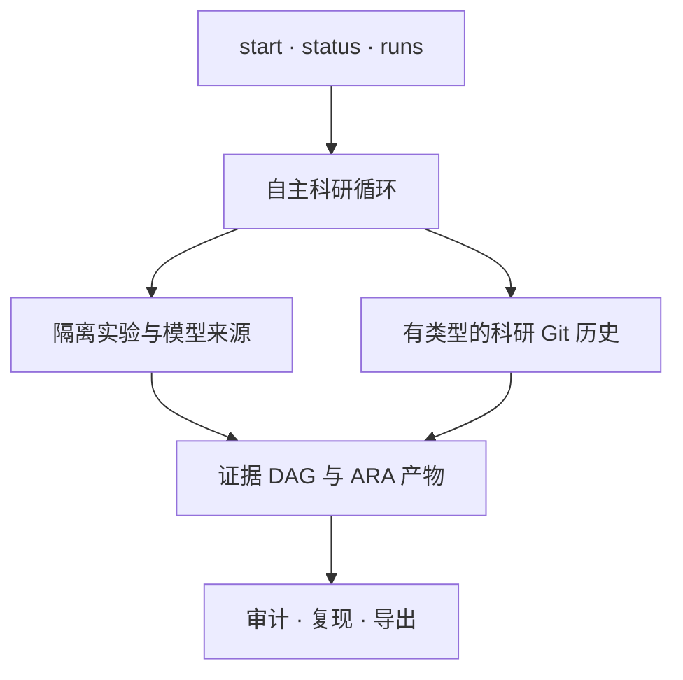

<p align="center">
  
</p>

<h1 align="center">XScientist</h1>

<p align="center"><strong>能检查、能挑战、能复现的自主科研。</strong></p>

<p align="center">
  从一个可证伪问题开始，把假设、实验、失败、证据、评审和结论
  保存为一条有版本的科学历史。
</p>

<p align="center">
  <a href="https://pypi.org/project/xscientist/"></a>
  <a href="https://pypi.org/project/xscientist/"></a>
  <a href="https://github.com/smileformylove/XScientist/actions/workflows/smoke.yml"></a>
  <a href="https://github.com/smileformylove/XScientist/blob/main/LICENSE"></a>
</p>

<p align="center">
  <a href="#不配置模型先体验">快速体验</a> ·
  <a href="#运行自主研究">自主研究</a> ·
  <a href="#检查审计与复现">审计复现</a> ·
  <a href="#安装方式">安装</a> ·
  <a href="../README.md">English</a>
</p>

XScientist 既是本地优先的自主科研系统，也是一套开放科学协议。它可以比较竞争
解释、选择更有信息量的实验、在隔离边界内执行、主动批判结果，并把整个过程保存
为带类型、机器可读的科研对象。

> [!IMPORTANT]
> XScientist 目前是 Alpha 科研软件，不是科学事实机器。自主运行可能调用付费模型；
> 生成代码必须经过配置好的隔离执行器；机器生成的结论只有补齐证据和独立评审
> 门禁后，才能成为“已验证”。

本文描述 `main` 上的 `0.1.3` 候选版。PyPI 当前正式版是 `0.1.2`；如需使用下方
新流程，请从 `main` 安装。

## 不配置模型先体验

只需要 Python 3.10+ 和 Git。安装完成后，不需要 API Key、模型、Docker 或网络调用。

```bash
python -m pip install \
  "xscientist @ git+https://github.com/smileformylove/XScientist.git@main"
xscientist demo ./first-study --autopilot --lang zh --open
xscientist status ./first-study --lang zh
```

几秒钟后你会得到：

- 一项有版本记录的研究，包含失败尝试、支持证据和反驳证据；
- 一张可离线浏览的证据 DAG，以及精确复现回执；
- `$0.00` 模型成本，且不会执行生成代码；
- 一个可以直接复制的下一步动作。

演示会诚实停在“运行完成，仍需补充证据”。因为留出结果挑战了过度宽泛的结论。
保留冲突是正确的科学行为，不是程序失败。

日常只看 `status` 即可。需要分支、流水线、Token 或后台任务细节时再加
`--verbose`；自动化程序使用 `--json`。

## 运行自主研究

先查看当前可用的模型来源。这个命令不要求已有工作区，也能发现正在运行的本地
Ollama 服务：

```bash
xscientist provider list
```

### 本地模型

```bash
python -m pip install \
  "xscientist[research,openai-compatible] @ git+https://github.com/smileformylove/XScientist.git@main"
xscientist start ./local-study
```

交互流程只询问缺失的信息：问题、Provider/模型、证据来源、本地科研身份和可选
预算。如果只发现一个可用 Provider，会自动选择，不要求用户重复确认。

### 托管模型

安装科研运行时，再只安装一个需要的 Provider 客户端：

```bash
python -m pip install \
  "xscientist[research,openai] @ git+https://github.com/smileformylove/XScientist.git@main"
export OPENAI_API_KEY="..."
xscientist start ./hosted-study
```

客户端 extra 包括 `openai`、`anthropic`、`zhipu`、`bedrock`、`vertex` 和
`openai-compatible`。最后一个也覆盖 Ollama、DeepSeek、Gemini、OpenRouter 和
自定义兼容端点。

脚本和 CI 应显式写出所有重要选择：

```bash
xscientist start ./ood-study \
  --question "为什么检索增强反思在分布外失效？" \
  --provider openai \
  --model openai/gpt-4.1 \
  --user YOUR_NAME \
  --autopilot discovery \
  --data-dir ./data \
  --max-cost-usd 10 \
  --non-interactive
```

只有明确做探索性研究时，才用 `--allow-synthetic-data` 替代 `--data-dir`。输入
数据会先做内容哈希，再以只读方式挂载。启用成本上限后，未知模型价格会安全失败。

### 隔离与就绪检查

生成的实验代码不会静默运行在宿主 Python 进程里。模型实验需要 Docker 和版本
匹配的执行器：

```bash
xscientist executor prepare --workspace ./ood-study
xscientist provider check --workspace ./ood-study --max-cost-usd 10
xscientist doctor --workspace ./ood-study --deep
```

检查会区分客户端、凭据、本地模型、Docker CLI、Docker daemon 和执行器镜像等
问题，并按顺序给出修复命令；检查本身不会发起付费模型请求。

### 长任务

```bash
xscientist start ./ood-study \
  --question "机制会在哪里失效？" \
  --allow-synthetic-data --max-cost-usd 10 --detach

xscientist runs list --workspace ./ood-study
xscientist runs watch RUN_ID --workspace ./ood-study
xscientist runs logs RUN_ID --workspace ./ood-study --tail 100
xscientist runs cancel RUN_ID --workspace ./ood-study
xscientist runs resume RUN_ID --workspace ./ood-study
```

`status` 会优先显示运行中或失败的后台任务。失败态返回非零退出码，但 `--json`
仍会输出完整结构，便于自动诊断和恢复。

## 简单入口不会削弱自主科研

默认入口虽然精简，内部科研循环仍会根据 profile：

1. 提出竞争假设和零假设，而不是只维护第一个想法；
2. 提前锁定预测，并按预期信息价值选择实验；
3. 执行有边界的实验，保留失败和负结果；
4. 主动扫描异常、矛盾、证据质量和迁移边界；
5. 运行独立评审、有限修复，并在硬门禁处停止；
6. 打包论文、证据 DAG、来源信息和精确续研上下文。

| Profile | 适用场景 | 侧重点 |
| --- | --- | --- |
| `balanced` | 第一次完整研究 | 有界搜索和标准评审 |
| `discovery` | 发现机制与边界 | 竞争假设、反驳压力、分支多样性 |
| `publication` | 论文候选 | 多角色独立评审和更严格门禁 |

深入策略能力仍在 `xscientist research` 下，但第一次使用无需学习几十个命令。详见
[深度科研协议](DEEP_RESEARCH_PROTOCOL.md)和[方法发现协议](METHOD_DISCOVERY_PROTOCOL.md)。

## 检查、审计与复现

科研 Git 保存的是有明确科学含义的对象，不要求用户从日志目录猜测上下文。Git 是
当前的本地存储适配器；无需 GitHub 账号或远端，XScientist 也不会自行推送研究。

```bash
xscientist research log --repo ./first-study --limit 20
xscientist research show HEAD --repo ./first-study
xscientist research diff HEAD~1 HEAD --repo ./first-study --deep
xscientist research objects --repo ./first-study --kind evidence
xscientist research context @latest:claim \
  --repo ./first-study --intent continue --budget 8000 --record
```

审计会严格区分三个问题：

- `trace`：结论是否都能追溯到证据和决策？
- `replay`：代码、数据、环境、随机种子和命令是否足以重跑？
- `verify`：是否经过了要求的独立验证门禁？

```bash
xscientist research audit --repo ./first-study --level trace
xscientist research audit --repo ./first-study --level replay
xscientist research audit --repo ./first-study --level verify
xscientist research reproduce HEAD --repo ./first-study --execute --record \
  --reproduces @latest:claim

xscientist research bundle --repo ./first-study --dest ./study-backup
xscientist research export --repo ./first-study --dest ./exchange
```

生成的 DAG 是可随时重建的视图，不是科学源数据；重建它不会污染 checkpoint，也
不会阻止打包。真正的科研改动、已跟踪编辑或暂存内容仍必须先审查。

如果要挑战一个结论而不抹掉原历史：

```bash
xscientist research branch challenge/boundary --repo ./first-study --switch
xscientist research plan @latest:hypothesis --repo ./first-study \
  "寻找反例" --test "一个可复现失败将反驳当前机制"
xscientist research switch main --repo ./first-study
xscientist research merge challenge/boundary --repo ./first-study --preview
```

## 小入口，透明分层



| 需求 | 日常命令 |
| --- | --- |
| 验证安装 | `xscientist demo` |
| 运行或继续研究 | `xscientist start` |
| 理解当前状态 | `xscientist status` |
| 修复配置 | `xscientist doctor --deep` |
| 管理长任务 | `xscientist runs` |
| 审计科研历史 | `xscientist research` |

公开编排层位于 `xscientist/`，实验工作流位于 `ai_scientist/`，版本化协议位于
`ai_scientist/protocol/`。更多细节见[架构文档](ARCHITECTURE.md)。

## 安装方式

| 渠道 | 命令 |
| --- | --- |
| PyPI 正式版 0.1.2 | `python -m pip install "xscientist==0.1.2"` |
| 0.1.3 候选版 | `python -m pip install "xscientist @ git+https://github.com/smileformylove/XScientist.git@main"` |
| 贡献者 | `python -m pip install -e ".[research,openai,dev]" -c requirements/constraints-ci.txt` |

需要实验严格复现时，请固定 commit，不要跟随变化中的 `main`。

| Extra | 用途 |
| --- | --- |
| `research` | 端到端自主科研运行时 |
| Provider extra | 一个模型客户端或兼容路由 |
| `plot`、`pdf`、`pdf-layout`、`ml` | 按需安装的专业实验能力 |
| `service` | FastAPI/Uvicorn 服务 |
| `trust` | 可选签名能力 |
| `full` | 向后兼容的全量环境 |

核心协议和 CLI 支持 Python 3.10–3.13。自主实验还取决于具体 Provider、Docker 和
研究所需的实验栈。

## 产物与边界

自主项目会分别保存配置、想法、实验、论文、运行日志与 ARA 移交产物。完整布局见
[输出目录](guides/OUTPUT_DIRECTORIES.md)。

| 边界 | 默认行为 |
| --- | --- |
| 生成代码 | 隔离执行；严格模式不满足条件即停止 |
| 实验网络 | 严格隔离时关闭 |
| 密钥 | 私有环境文件、Git 忽略、诊断脱敏 |
| 远端发布 | 从不自动进行 |
| 结论 | 补齐证据和独立门禁前保持草稿 |
| 负结果 | 作为一等科研历史保留 |
| 自我演化 | 影子候选 → 密封评估 → Canary → 签名晋级 |

敏感领域应把 XScientist 视为科研基础设施，而不是领域专家、伦理审查或合规验证的
替代品。

## 文档与项目状态

| 需求 | 文档 |
| --- | --- |
| 第一个项目与恢复 | [入门](GETTING_STARTED.md) · [长任务指南](LONG_RUNNING_GUIDE.md) |
| 科研历史与协议 | [本地科研 Git](LOCAL_RESEARCH_GIT.md) · [协议 v2](RESEARCH_PROTOCOL_V2.md) |
| 科研诚信与策略 | [科研诚信](RESEARCH_INTEGRITY.md) · [科学宪法](SCIENCE_CONSTITUTION.md) |
| SDK、HTTP API 与适配器 | [SDK/API](guides/SDK_AND_API.md) · [DAG/适配器](RESEARCH_DAG_AND_ADAPTERS.md) |
| 配置与运维 | [配置](CONFIG_REFERENCE.md) · [运维清单](OPERATIONS_CHECKLIST.md) |

日常命令看 `xscientist --help`；完整科研协议命令看
`xscientist research --help`。

项目处于积极开发的 Alpha 阶段。贡献需包含测试，保持协议和 schema 兼容，并且
不能削弱来源追踪、隔离、成本或科学门禁。参见
[CONTRIBUTING.md](../.github/CONTRIBUTING.md)和[CHANGELOG.md](../CHANGELOG.md)。

论文：[XScientist: Towards an AI-Driven Scientific Research Ecosystem](https://arxiv.org/abs/2607.12301)。

许可证：Apache-2.0，见 [LICENSE](../LICENSE)。
