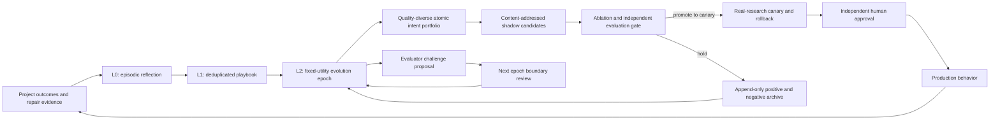

# Controlled Self-Evolution Architecture

XScientist treats self-evolution as a scientific program, not as permission for
an agent to rewrite itself. The system may generate improvement hypotheses and
run shadow experiments autonomously. It may not silently change the science
constitution, evaluation rules, production behavior, or accumulated evidence.

## Three adaptation levels

| Level | Purpose | Persistence | Allowed effect |
|---|---|---:|---|
| L0 episodic | Reflect and recover inside one research run | No | Current-run sandbox only |
| L1 playbook | Aggregate recurring lessons across projects | Yes | Advisory defaults only |
| L2 system | Change prompts, tools, scaffolds, routing, search, allocation, or recovery | Yes | Shadow candidate; production requires the evolution gate |

This distinction prevents a local repair, a persuasive self-review, or one
unusual project from becoming a global system update. The legacy paper-level
evolution engine is therefore L0. Its self-scored strategies and patterns are
written to `quarantined_learning_candidates.jsonl`, not to trusted global
knowledge. Batch runs initialize this L0 engine and the external-agent
orchestrator only when an evolution API is first used; ordinary adaptive
generation does not pay their model-client, history-loading, or memory cost.

## Organization model



The implementation has five planes:

1. **Signal plane** — `self_evolution.json` converts review, repair, and stage
   failures into typed lessons. Repeated observations are deduplicated by risk,
   stage, and focus.
2. **Program plane** — `evolution_program.json` creates one bounded epoch. It
   selects no more than six active intents, no more than two per component, and
   reserves exploration capacity so one familiar failure mode cannot consume
   the entire research budget.
3. **Experiment plane** — each intent has one component, one logical scope, one
   causal mechanism, a hypothesis, a falsifier, target metrics, and required
   evidence. Bundled multi-cause mutations are invalid.
4. **Release plane** — candidates remain shadow-only until attributed ablation,
   sealed and prospective paired tests, independent evaluator stacks, a real
   canary, verified rollback, and human approval all pass.
5. **Memory plane** — playbooks, program epochs, and gate outcomes are
   append-only. Repeated holds force a new exploratory branch; approvals provide
   weak supporting evidence but never bypass a fresh gate.

## Fixed-utility epochs

An epoch freezes its evaluation-policy hash. The system may challenge an
evaluator, but that challenge is stored separately and can only be considered
at the next epoch boundary under human review. It cannot improve its apparent
fitness by weakening a metric while candidates are competing.

This creates two coupled but separated loops:

- the **research-system loop** proposes and tests system candidates under the
  current utility;
- the **evaluation loop** audits blind spots and proposes next-epoch evaluation
  changes without judging candidates under rules it just authored.

The separation follows the fixed-evaluator-within-epoch idea explored by the
[Red Queen Gödel Machine](https://arxiv.org/abs/2606.26294), while the diverse
archive and empirical candidate validation are informed by the
[Darwin Gödel Machine](https://arxiv.org/abs/2505.22954) and
[AlphaEvolve](https://deepmind.google/blog/alphaevolve-a-gemini-powered-coding-agent-for-designing-advanced-algorithms/).
The L0/L1 memory split is related to episodic reflection in
[Reflexion](https://arxiv.org/abs/2303.11366), and the separation of generation,
reflection, ranking, and evolution authorities follows the specialization used
by the [AI co-scientist](https://arxiv.org/abs/2502.18864).

## Portfolio selection

Lessons receive priority from severity, cross-project recurrence, independent
support count, novelty, and prior gate outcomes. Selection then enforces:

- a hard active-intent budget;
- a per-component budget;
- a minimum exploration fraction;
- both recurring-problem exploitation and new-mechanism exploration;
- quality diversity across prompts, tools, search, recovery, allocation, and
  agent scaffolds;
- retention of rejected and failed attempts.

A repeated failure is not evidence that the same mutation deserves more
retries. Two prior gate holds for the same failure class switch the next intent
to exploration, encouraging a different causal mechanism.

## Evidence and authority rules

- A producer's self-score is advisory and is never sufficient for persistent
  learning.
- Feedback-derived patterns enter quarantine until an external project outcome
  or independent evaluation confirms them.
- Raw evidence, epistemic history, sealed tests, evaluator policy, identities,
  safety boundaries, and the science constitution are protected components.
- Program and gate artifacts are constitution-bound and semantically
  reconstructed during validation, so recomputing an outer hash cannot conceal
  a policy rewrite.
- System candidates and evaluator challenges are separate artifact types.

## Artifact flow

| Artifact | Role |
|---|---|
| `self_evolution.json` | Current project's normalized lessons and L0/L1 boundary |
| `knowledge_base/self_evolution_history.jsonl` | Cross-project lesson history |
| `knowledge_base/self_evolution_playbook.json` | Advisory recurring defaults |
| `evolution_program.json` | Current fixed-utility epoch and active L2 intents |
| `evolution_program_history.jsonl` | Append-only epoch archive |
| `evolution_gate.json` | Latest shadow/canary/promotion decision |
| `evolution_gate_history.jsonl` | Candidate outcomes feeding later portfolios |
| `evolution/quarantined_learning_candidates.jsonl` | Unconfirmed legacy/self-scored learning proposals |

## Operational invariant

The only valid path to production is:

```text
lesson -> playbook signal -> evolution intent -> content-addressed candidate
       -> ablation -> sealed/prospective evaluation -> canary -> rollback proof
       -> independent approval -> production
```

Skipping any arrow is a failed evolution, even when the proposed change looks
useful. Scientific reliability is the fitness floor; speed and autonomy are
optimized only above that floor.

Operators can inspect the current epoch, active intent mix, exploration versus
exploitation balance, and pending evaluator challenges with:

```bash
xscientist manager evolution-board --top 20
```
